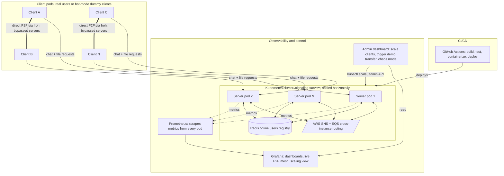

# Aperture

A distributed chat and peer-to-peer file-sharing platform. Chat and file-transfer *signaling* run through a horizontally-scalable Java backend; the actual file bytes never touch the backend — they move directly between users via [Iroh](https://iroh.computer), a QUIC-based P2P transport with built-in NAT traversal and relay fallback.

## Why this exists

Most chat-with-file-sharing apps route every file through a central server. Aperture's server only ever sees small coordination messages (who's online, who wants to send what to whom) — the file itself flows peer-to-peer, so server bandwidth and storage costs stay flat regardless of how large or how many files users share.

## Architecture



- **Chat & signaling**: plain TCP, an event-driven pipeline (EventBus to subscribers to MessageDispatcher to ChatRoom).
- **Shared state**: Redis holds the online-user registry (username to Iroh endpoint ID, username to server instance), so any server instance can look up where a user actually is.
- **Cross-instance routing**: AWS SNS + SQS. Broadcasts (chat, join/leave) fan out to every server instance; targeted messages (file-transfer signaling) route to the one instance that needs them, using SNS message-attribute filtering.
- **File transfer**: a Rust binary (peer-app, built on Iroh) runs as a subprocess of each client, handling the actual QUIC connection, NAT hole-punching attempts, relay fallback, and chunked transfer with live progress reporting.
- **Scaling model**: the server side scales horizontally as stateless pods behind a Kubernetes Service, coordinated through Redis and SNS/SQS rather than in-memory state, so any pod can be added, removed, or restarted without losing track of who's online. The client side scales the same way — real users or autonomous "bot mode" dummy clients can be run as independent pods, each registering and behaving like any other user, useful for load testing the signaling layer at scale.
- **Observability**: every server pod exposes a Prometheus metrics endpoint (online users, message counts, joins/leaves, transfer counts); Grafana dashboards visualize these live, including the P2P transfer mesh and direct-vs-relay ratio.
- **Admin dashboard**: a lightweight control surface on top of Grafana's read-only view, letting a demo or an operator scale the number of client pods, trigger a file transfer between two specific clients, or kill a pod to watch the system recover (chaos mode).
- **CI/CD**: GitHub Actions builds and tests the Java and Rust components on every push, builds and pushes Docker images, and deploys the updated images to the Kubernetes cluster automatically.

## What's been verified

- Full chat and file-transfer signaling working across two independent, containerized server instances, with Redis and SNS/SQS correctly routing messages regardless of which instance a user is connected to.
- End-to-end P2P file transfers verified byte-for-byte correct (SHA-256) at multiple sizes, including cross-instance transfers.
- Real NAT traversal confirmed: a direct QUIC connection (no relay) established between a home-network client and a cloud instance with no NAT, verified from Iroh's own connection-path logs.
- Graceful degradation: when a message fails to reach a user, or a dependency (Redis, Iroh's discovery service) is briefly unavailable, the server reports it clearly instead of corrupting state.

## Tech stack

Java 17, Rust, Iroh (QUIC/P2P), Redis, AWS SNS/SQS, Docker, Kubernetes, Prometheus, Grafana, GitHub Actions

## Project structure

```
Network_lab/          Java signaling server + client (this repo)
├── src/
├── Dockerfile.server
├── Dockerfile.client
└── pom.xml

peer-app/              Rust P2P transfer binary (separate repo)
```

## Running locally

Prerequisites: JDK 17, Maven, Docker, an AWS account with an SNS topic created, a running Redis instance, and the compiled peer-app binary.

```bash
# Build
mvn clean package

# Run the server
export REDIS_HOST=localhost
export SNS_TOPIC_ARN=<your-topic-arn>
export AWS_REGION=<your-region>
java -jar target/Network_lab-0.0.1-SNAPSHOT.jar

# Run a client
java -cp target/Network_lab-0.0.1-SNAPSHOT.jar com.shobhit.Network_lab.Client localhost
```

### Client commands

```
<message>                      send a chat message
/send <username> <file_path>   send a file to a user
```

## Roadmap

- [ ] Kubernetes deployment (Redis + server, scaled replicas)
- [ ] Autonomous "bot" clients for load testing
- [ ] Grafana dashboards: live P2P transfer topology, direct-vs-relay ratio, scaling metrics
- [ ] CI/CD pipeline (build, containerize, deploy on push)
- [ ] Chunked/swarm transfer for large files across multiple peers

## Path to real users

Everything above is built and tested as a distributed-systems exercise, using dummy and bot-driven clients. Turning it into something real users could install and use would mean:

- **A real client application**: today's client is a terminal program; a real one needs a packaged desktop app (or mobile app) with a proper UI, bundling the Rust P2P binary so a user never sees a command line.
- **Persistent accounts**: today usernames are ephemeral, chosen at connect time. Real users need durable identities — a signup/login flow, and Redis's ephemeral registry would sit alongside a real user database rather than replacing it.
- **User consent for file transfers**: the current auto-accept behavior exists for automated testing; a real client needs to actually show the incoming-file prompt and wait for the user to accept or reject.
- **Self-hosted relay**: relying on Iroh's public relay is fine for testing, but a production deployment would run its own relay to remove that third-party dependency and its associated privacy and reliability considerations.
- **Security hardening**: today's setup uses broad AWS permissions and a root account for convenience; a real deployment needs scoped IAM roles, encrypted credentials, and message-level encryption for chat, not just transport-level security.
- **Chunked, resumable transfers**: swarming a large file across multiple peers, and resuming an interrupted transfer instead of restarting it, matters much more once real users are sending real, possibly large, files over unreliable networks.
