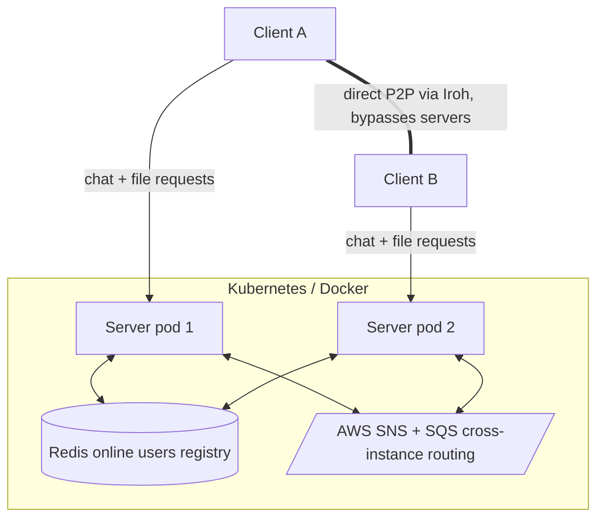

# Aperture

A distributed chat and peer-to-peer file-sharing platform. Chat and file-transfer *signaling* run through a horizontally-scalable Java backend; the actual file bytes never touch the backend — they move directly between users via [Iroh](https://iroh.computer), a QUIC-based P2P transport with built-in NAT traversal and relay fallback.

## Why this exists

Most chat-with-file-sharing apps route every file through a central server. Aperture's server only ever sees small coordination messages (who's online, who wants to send what to whom) — the file itself flows peer-to-peer, so server bandwidth and storage costs stay flat regardless of how large or how many files users share.

## Architecture



- **Chat & signaling**: plain TCP, an event-driven pipeline (EventBus to subscribers to MessageDispatcher to ChatRoom).
- **Shared state**: Redis holds the online-user registry (username to Iroh endpoint ID, username to server instance), so any server instance can look up where a user actually is.
- **Cross-instance routing**: AWS SNS + SQS. Broadcasts (chat, join/leave) fan out to every server instance; targeted messages (file-transfer signaling) route to the one instance that needs them, using SNS message-attribute filtering.
- **File transfer**: a Rust binary (peer-app, built on Iroh) runs as a subprocess of each client, handling the actual QUIC connection, NAT hole-punching attempts, relay fallback, and chunked transfer with live progress reporting.
- **Metrics**: Prometheus-instrumented (online users, message counts, joins/leaves), exposed on a dedicated port.

## What's been verified

- Full chat and file-transfer signaling working across two independent, containerized server instances, with Redis and SNS/SQS correctly routing messages regardless of which instance a user is connected to.
- End-to-end P2P file transfers verified byte-for-byte correct (SHA-256) at multiple sizes, including cross-instance transfers.
- Real NAT traversal confirmed: a direct QUIC connection (no relay) established between a home-network client and a cloud instance with no NAT, verified from Iroh's own connection-path logs.
- Graceful degradation: when a message fails to reach a user, or a dependency (Redis, Iroh's discovery service) is briefly unavailable, the server reports it clearly instead of corrupting state.

## Tech stack

Java 17, Rust, Iroh (QUIC/P2P), Redis, AWS SNS/SQS, Docker, Prometheus

## Project structure

```
Network_lab/          Java signaling server + client (this repo)
├── src/
├── Dockerfile.server
├── Dockerfile.client
└── pom.xml

peer-app/              Rust P2P transfer binary (separate repo)
```

## Running locally

Prerequisites: JDK 17, Maven, Docker, an AWS account with an SNS topic created, a running Redis instance, and the compiled peer-app binary.

```bash
# Build
mvn clean package

# Run the server
export REDIS_HOST=localhost
export SNS_TOPIC_ARN=<your-topic-arn>
export AWS_REGION=<your-region>
java -jar target/Network_lab-0.0.1-SNAPSHOT.jar

# Run a client
java -cp target/Network_lab-0.0.1-SNAPSHOT.jar com.shobhit.Network_lab.Client localhost
```

### Client commands

```
<message>                      send a chat message
/send <username> <file_path>   send a file to a user
```

## Roadmap

- [ ] Kubernetes deployment (Redis + server, scaled replicas)
- [ ] Autonomous "bot" clients for load testing
- [ ] Grafana dashboards: live P2P transfer topology, direct-vs-relay ratio, scaling metrics
- [ ] CI/CD pipeline (build, containerize, deploy on push)
- [ ] Chunked/swarm transfer for large files across multiple peers
