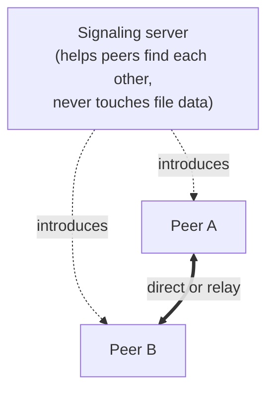
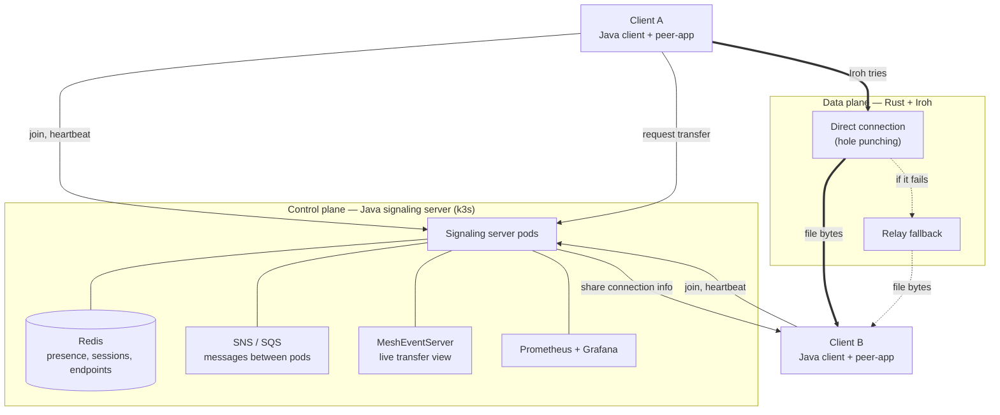

# Aperture

**A learning lab for peer-to-peer connectivity and reliability.**

Aperture is a small P2P system I built to understand how peer-to-peer connections really work with [Iroh](https://iroh.computer): when two machines can connect directly, when they need a relay, how reliable that is on real networks, and which parts of a "decentralized" system still need a central server. Chat and file transfer are the traffic that drives the experiments; the interesting part is watching how the connections behave, break, and recover.

<!-- TODO: add a screenshot or GIF of the mesh view here -->

---

## At a glance

- **Control plane:** Java signaling server running as multiple pods on k3s, with Redis for presence and AWS SNS/SQS between pods
- **Data plane:** Rust `peer-app` on Iroh — direct connections via hole punching, relay fallback
- **Reliability work:** reconnects across server pods, heartbeat-based failure detection, crash-safe presence — each investigated and documented with before/after evidence
- **Observability:** live mesh view of transfers (direct vs relay), Prometheus metrics, Grafana

---

## Questions I'm exploring

- **How does P2P actually connect?** How do two machines behind different routers reach each other, and when does that fail?
- **How reliable is it on real networks?** WiFi drops, NATs, machines on different networks — not just localhost.
- **Direct vs relay:** how often is a relay needed, and what does it cost in speed and setup time?
- **What still has to be central?** Discovery, presence and coordination — and what goes wrong when those are spread over several servers.
- **How do you know what's really happening?** Reporting what the system actually observed, instead of guessing from silence.

---

## How it works

A central server helps peers find each other. The file bytes don't go through it: once two peers are introduced, they connect directly when possible, or through a relay when not.


```mermaid
flowchart TB
    S["Signaling server<br/>(helps peers find each other,<br/>never touches file data)"]
    A["Peer A"]
    B["Peer B"]
    S -. "introduces" .-> A
    S -. "introduces" .-> B
    A <== "direct or relay" ==> B
```

### Architecture


```mermaid
flowchart TB
    subgraph CP["Control plane — Java signaling server (k3s)"]
        S["Signaling server pods"]
        Redis[("Redis<br/>presence, sessions, endpoints")]
        SNS["SNS / SQS<br/>messages between pods"]
        Mesh["MeshEventServer<br/>live transfer view"]
        Prom["Prometheus + Grafana"]
        S --- Redis
        S --- SNS
        S --- Mesh
        S --- Prom
    end

    A["Client A<br/>Java client + peer-app"]
    B["Client B<br/>Java client + peer-app"]

    A -- "join, heartbeat" --> S
    B -- "join, heartbeat" --> S
    A -- "request transfer" --> S
    S -- "share connection info" --> B

    subgraph DP["Data plane — Rust + Iroh"]
        direction LR
        Direct["Direct connection<br/>(hole punching)"]
        Relay["Relay fallback"]
    end

    A == "Iroh tries" ==> Direct
    Direct -. "if it fails" .-> Relay
    Direct == "file bytes" ==> B
    Relay -. "file bytes" .-> B
```

More detail in `docs/architecture/`.

---

## What I built vs. what Iroh provides

| Iroh provides | I built |
|---|---|
| Peer identity and encrypted QUIC connections | The signaling server: discovery, presence, endpoint exchange |
| Hole punching and relay fallback | Multi-pod coordination with Redis and SNS/SQS |
| Public relay servers (n0) | The file-transfer protocol on top of Iroh streams (headers, progress, atomic writes, hash checks) |
| | Session handling and reconnect logic across server pods |
| | Failure reporting, the mesh view, metrics |
| | Deployment on k3s, Docker images, test bots |

---

## What works so far

- Direct P2P transfers with hole punching, and relay fallback when that fails
- Transfers between machines on different networks, verified with file hashes
- Failed transfers don't leave half-written files
- Transfer failures are reported when they happen, not guessed from silence
- Several server pods sharing state through Redis and SNS/SQS
- Chat reconnects across server pods: dropped connections are detected by a heartbeat, replaced sessions clean themselves up, and a crashed server pod doesn't leave users stuck as "online"

These work in my test setup (a few peers, one cloud machine, my laptop). They haven't been tested at any real scale.

---

## What I found so far

Each of these has a write-up in `docs/problems/` and `docs/fixes/`:

- **TCP connections can die silently.** After a network drop, the server kept a dead session alive for **1200+ seconds**. With an application heartbeat, drops are now detected in **~60 s**, and a replaced session is removed in **~0–13 s** once the client reconnects.
- **Cleanup across servers can delete the wrong thing.** One pod's cleanup erased a user that was still connected through another pod. Fixed by only deleting what the session still owns.
- **"Online" has to expire on its own.** When a server pod crashes, nothing is left to mark its users offline. Presence is now a lease renewed by heartbeats; after a forced pod crash, the stale user disappeared within ~75 s.
- **Guessing failure from silence gives false alarms.** Slow transfers looked dead. Explicit failure events replaced the timeout-based guess.

---

## Still open

- `peer-app` sometimes logs "authentication failed" from QUIC — cause not found yet (`docs/problems/`)
- I haven't measured yet how often relay is needed across different networks, or how much slower it is
- Nothing here has been tested beyond a handful of peers

---

## Next experiments

Designed, not built — see `docs/future-plans/`:

- **Measure direct vs relay properly:** setup time, speed, success rate, across different network setups
- **A control dashboard:** scale bots and server pods with buttons, generate traffic, compare direct vs relay live
- **Swarm-style distribution:** many peers sharing pieces of one file
- Keeping the same session across reconnects
- DHT-based peer discovery, a self-hosted Iroh relay, chat over Iroh instead of TCP

---

## Tech I learned through this

| Area | Tools |
|---|---|
| P2P / networking | Iroh, QUIC, NAT traversal, relays |
| Languages | Java (sockets, threads), Rust |
| Shared state / messaging | Redis (Lua scripts, expiring keys), AWS SNS/SQS |
| Deployment | Docker, Docker Hub, Kubernetes (k3s), EC2 |
| Observability | Prometheus, Grafana, structured session logs |

---

## Documentation

```text
docs/
├── architecture/     — how the system works today
├── problems/         — issues I hit, and what I found
├── fixes/            — what I changed, and how I checked it worked
├── decisions/        — tradeoffs and why I chose them
├── future-plans/     — ideas designed but not built
├── pending-tasks/    — work in progress
└── learning-notes/   — concepts I studied along the way
```
