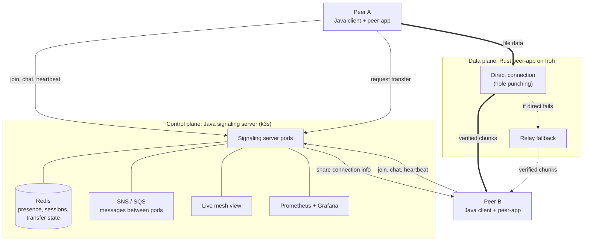

# Aperture

**A learning lab for peer-to-peer networking.**

What happens when two computers try to talk to each other directly, with no server in the middle? Sometimes it just works. Sometimes routers get in the way, Wi-Fi drops, or one side disappears halfway through. Aperture is where I explore that: a small P2P system that I keep breaking on purpose to see how it behaves, and then make more reliable.

---

## Architecture

```mermaid
flowchart TB
    subgraph CP["Control plane: Java signaling server (k3s)"]
        S["Signaling server pods"]
        Redis[("Redis<br/>presence, sessions,<br/>transfer state")]
        SNS["SNS / SQS<br/>messages between pods"]
        Mesh["Live mesh view"]
        Prom["Prometheus + Grafana"]
        S --- Redis
        S --- SNS
        S --- Mesh
        S --- Prom
    end

    A["Peer A<br/>Java client + peer-app"]
    B["Peer B<br/>Java client + peer-app"]

    A -- "join, chat, heartbeat" --> S
    B -- "join, chat, heartbeat" --> S
    A -- "request transfer" --> S
    S -- "share connection info" --> B

    subgraph DP["Data plane: Rust peer-app on Iroh"]
        direction LR
        Direct["Direct connection<br/>(hole punching)"]
        Relay["Relay fallback"]
    end

    A == "file data" ==> Direct
    Direct -. "if direct fails" .-> Relay
    Direct == "verified chunks" ==> B
    Relay -. "verified chunks" .-> B
```

The **control plane** helps peers find each other and keeps track of who's online. The **data plane** moves the files, peer to peer. File data never passes through the server.

---

## Iroh, in short

[Iroh](https://iroh.computer) is a Rust library for connecting devices directly.

- **Every peer has an ID** (a public key). You connect to an ID, not to an IP address.
- **It tries to connect directly** first, punching through home routers (NAT traversal).
- **If that fails, it uses a relay**, a server that only forwards encrypted data it can't read.
- **Connections are encrypted** end to end (QUIC).

---

## How file transfer works

1. The sender **offers** a file. The file gets a fingerprint (a BLAKE3 hash).
2. The receiver **asks for it** and pulls it in small pieces.
3. **Every piece is checked** against the fingerprint, so a changed or broken file can't slip through.
4. If something breaks halfway (a restart, a crash, the sender going offline), the pieces already received are kept, and the transfer **continues from where it stopped**.

---

## What's inside

- **A signaling server** (Java) running as several pods on Kubernetes, sharing state through Redis and AWS messaging
- **A peer app** (Rust, on Iroh) that does the actual connecting and file moving
- **Bots** that join, chat and send files to each other, so the system is always busy
- **A live mesh view** showing who's talking to whom, and whether it went direct or through a relay

---

## How it grew

```mermaid
flowchart LR
  C[Reconnects] --> A[Honest transfers] --> M[Live mesh] --> I[Persistent identity] --> B[Resumable transfers] --> N[...]
```

Each step started with something that broke, and ended with a test proving it was fixed.

---

## Questions I'm still chasing

- How often do two peers really manage to connect directly?
- What does falling back to a relay cost?
- What still needs a central server in a "decentralized" system?
- What would it take for this to keep working when the network is having a bad day?

---

## Built with

Rust · Iroh · Java · Redis · AWS SNS/SQS · Docker · Kubernetes (k3s) · Prometheus · Grafana

---

## Learn more

The full story (problems, fixes, decisions, experiments) lives in [`docs/`](docs/). The [roadmap](docs/roadmap.md) shows where it's heading next.

*Tested with a handful of peers across my laptop and a cloud machine. Not production software, and not trying to be.*
