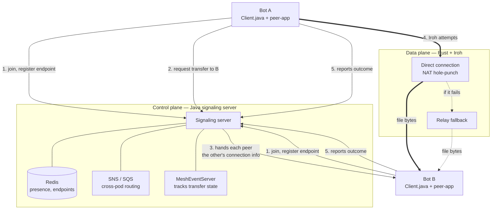

# Aperture

A peer-to-peer chat and file-transfer platform, with a live dashboard
that shows exactly how each transfer actually happened — direct,
relayed, or failed — instead of just whether it eventually finished.

---

## What Aperture does

Two users chat and send files to each other. A central server helps them
find one another, but the files themselves never pass through it — once
two peers are introduced, the actual bytes travel directly between them
whenever possible, falling back to a relay only when a direct connection
genuinely can't be established.

```text
     signaling server
    (finds peers, never
     touches file data)
       ↙          ↘
   Peer A ────────── Peer B
        direct or relay
```

This is the same architectural shape used by real, production P2P
systems — the signaling/discovery layer is centralized for simplicity,
while the actual data transfer is decentralized for privacy, speed, and
to avoid the server ever becoming a bandwidth bottleneck.

---

## The three things Aperture is actually built to prove

**1. Real peer-to-peer transfer works, even across real distance and real
NATs.** Not simulated on one machine — tested with bots on genuinely
separate networks.

**2. A live dashboard can tell the truth about what's happening, not
just guess.** Early versions of the mesh view inferred failure from
silence — "no update in 60 seconds, must be dead." That produced false
positives on transfers that were simply slow. The current version tracks
real signals — explicit failure events and live progress updates —
and only reports what it actually knows.

**3. Distributed systems fail in specific, findable ways, and the fixes
are documented, not just patched and forgotten.** Every real bug this
project hit — a stale relay assignment, a message-parsing regression, an
intermittent TCP disconnect — got investigated with actual evidence
before being fixed. That investigation trail lives in `docs/`.

---

## Architecture

```mermaid
flowchart TB
    subgraph CP["Control plane — Java signaling server"]
        S["Signaling server"]
        Redis[("Redis<br/>presence, endpoints")]
        SNS["SNS / SQS<br/>cross-pod routing"]
        Mesh["MeshEventServer<br/>tracks transfer state"]
        S --- Redis
        S --- SNS
        S --- Mesh
    end

    BotA["Bot A<br/>Client.java + peer-app"]
    BotB["Bot B<br/>Client.java + peer-app"]

    BotA -- "1. join, register endpoint" --> S
    BotB -- "1. join, register endpoint" --> S
    BotA -- "2. request transfer to B" --> S
    S -- "3. hands each peer<br/>the other's connection info" --> BotB

    subgraph DP["Data plane — Rust + Iroh"]
        direction LR
        Direct["Direct connection<br/>NAT hole-punch"]
        Relay["Relay fallback"]
    end

    BotA == "4. Iroh attempts" ==> Direct
    Direct -. "if it fails" .-> Relay
    Direct == "file bytes" ==> BotB
    Relay -. "file bytes" .-> BotB

    BotA -- "5. reports outcome" --> S
    BotB -- "5. reports outcome" --> S

```

- **Control plane (Java)** — a TCP-based signaling server. Tracks who's
  online (Redis), routes messages across multiple server instances
  (AWS SNS/SQS), and hands two peers each other's connection details so
  they can talk directly.
- **Data plane (Rust, via Iroh)** — each client spawns a `peer-app`
  subprocess built on [Iroh](https://iroh.computer), a QUIC-based P2P
  library. This is what actually attempts the direct connection, falls
  back to relay, and streams the file.
- **Mesh dashboard** — a live WebSocket-driven view of every active
  transfer: which peers, which path (direct/relay), and real-time
  progress.


---

## What's real vs. what's planned

**Built and verified:**
- Direct P2P connection with NAT hole-punching, relay fallback
- Real cross-region transfer, hash-verified
- Atomic file writes — a failed transfer never leaves a corrupted file
- Explicit, immediate failure reporting (not inferred from silence)
- Cross-pod mesh state sync via SNS/SQS
- An application-level heartbeat that measurably extends chat connection
  stability (verified with a controlled before/after comparison)

**Documented, not yet built** — see `docs/future-plans/`:
- Self-hosted Iroh relay (reduce dependency on n0's shared infrastructure)
- Swarm-style, many-to-many file distribution
- DHT-based peer discovery
- Moving the chat channel onto Iroh/QUIC instead of plain TCP

---

## Documentation

```text
docs/
├── architecture/     — how the system actually works today
├── problems/         — real incidents, investigated with real evidence
├── fixes/            — completed, verified fixes
├── decisions/        — tradeoffs made, and why
├── future-plans/     — designed but not yet built
└── learning-notes/   — the underlying concepts this project draws on

