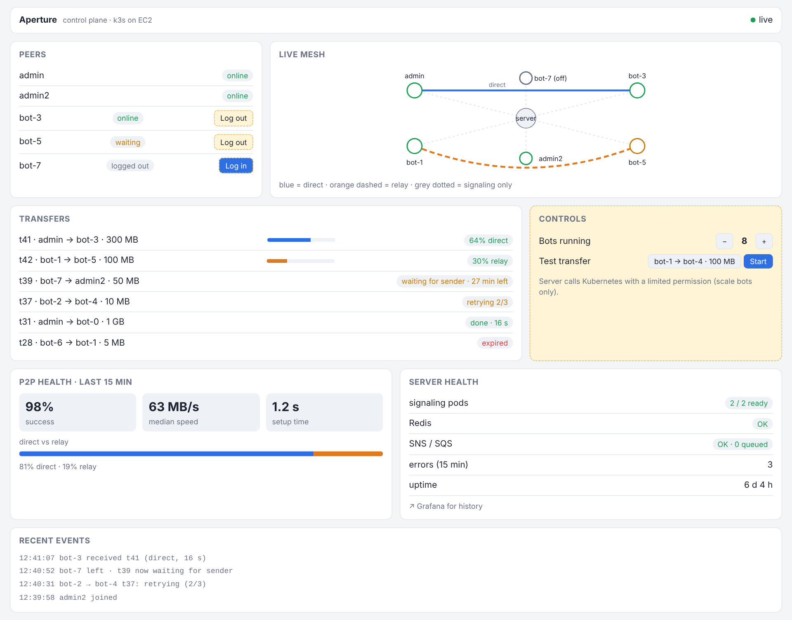
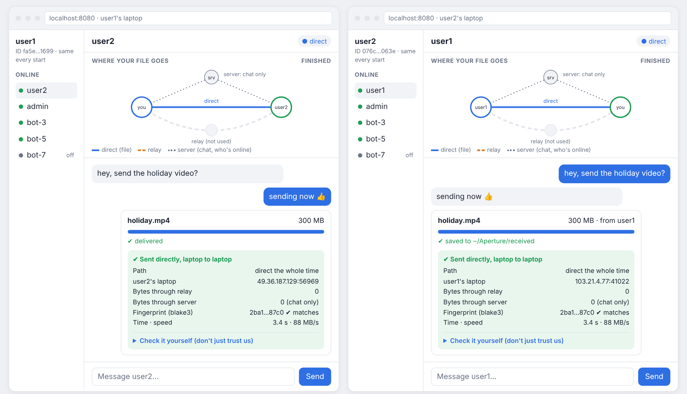
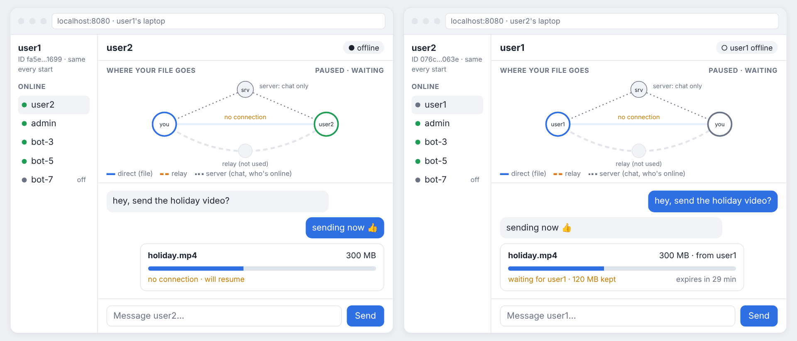
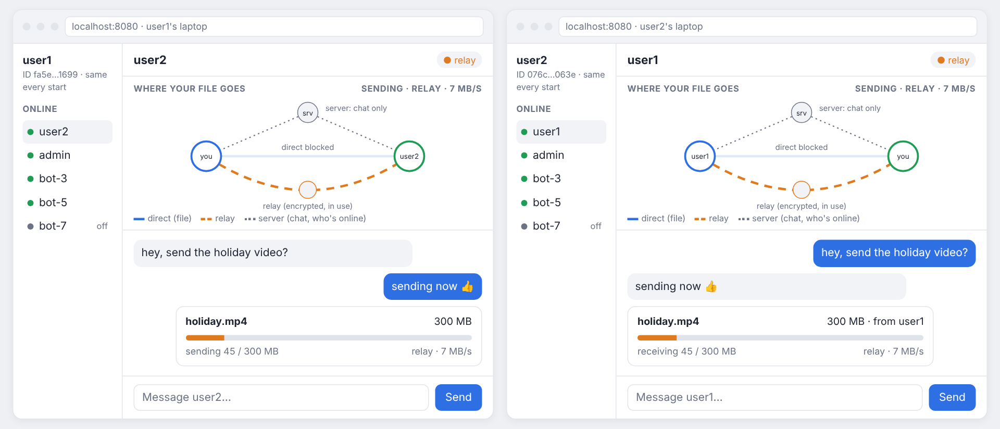
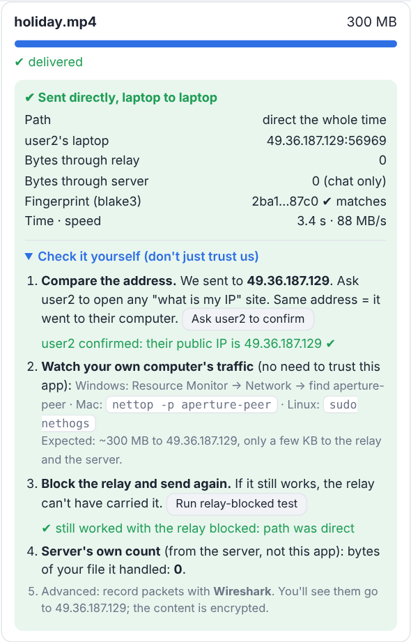

# Aperture: Control Plane & User App Design

Status: design only (no code yet)
Build order: B3 → D1 → B4 → D2–D3 → B5 → D4 → CI/CD → Phase U

---

## 1. Overview

Aperture gets two screens. Both use the same peer-app, the same signaling server and the same events, but they are for different people.

| | Control plane (dashboard) | User app |
|---|---|---|
| Who | me (operator), demo videos | any user |
| Runs where | page served by the Java server (k3s) | user's own laptop, `localhost:8080` |
| Shows | the whole system: all peers, all transfers, server health | only my chats, my files, my path |
| Can do | log bots out/in, scale bots, make a bot send a file, chat | chat, send files directly, check the path |
| Login | none (port-forward or one password) | username + key from B0 (no accounts) |

```
                  ┌──────────── signaling server (Java, k3s) ────────────┐
                  │  who's online · chat · transfer info · events        │
                  └───▲──────────────▲──────────────────▲────────────────┘
                      │ WebSocket    │                  │
          ┌───────────┴───┐   ┌──────┴──────┐    ┌──────┴──────┐
          │ Control plane │   │  user1 app  │    │  bot-3      │
          │ (my browser)  │   │ browser ↔   │    │ Java client │
          └───────────────┘   │ peer-app    │    │ + peer-app  │
                              └──────┬──────┘    └──────┬──────┘
                                     └── files: DIRECT P2P (blobs) ──┘
```

The server never carries file data. Files go peer to peer (direct, or through the n0 relay, encrypted).

---

## 2. Is this possible? Yes. What we already have

Most of the hard parts are already built and tested.

| Needed | Status |
|---|---|
| P2P connection between peers (Iroh, direct + relay fallback) | ✅ done (Phase A) |
| Same ID on every start (key file / seed) | ✅ done (B0) |
| File transfer with hash check (iroh-blobs share / allow / fetch) | ✅ done (B2a) |
| Survive restarts and crashes, resume from where it stopped | ✅ done (B2b-1) |
| Quick tries, waiting, `retry`, `cancel`, 30-min expiry | ✅ done (B2b-2) |
| Reports path (direct/relay), speed, fingerprint | ✅ done (`CONNECTION_PATH`, `TRANSFER_PATH`, `TRANSFER_TIMING`, `FILE_HASH`) |
| Signaling server: who's online, chat, Redis, SNS/SQS, on k3s | ✅ done |
| Prometheus + Grafana | ✅ done |
| Live mesh view | ✅ done (`mesh.html`) |
| Java uses blobs instead of META3 | ⏳ B3 |
| Bots with stable names + logout/login | ⏳ B4 |
| Dashboard page + controls | 🆕 D1–D4 |
| Web server inside peer-app + user page | 🆕 U1 |
| Bytes-per-path counter, server byte count | 🆕 U3 (small) |
| Desktop installers (Tauri) | 🆕 U5 |

The new work is mostly screens and connecting existing pieces, not new networking.

---

## 3. Control plane (dashboard)



*Mockup, example data. Yellow dashed = controls (log out/in, scale, test transfer).*

### 3.1 Goal
One live screen to watch the whole system and run the B4 tests (log a bot out, scale, test transfer) without kubectl, plus chat and "make a bot send a file" for demos.

### 3.2 Decisions

| Question | Decision |
|---|---|
| Scope | watch everything + safe controls + chat + bot sends file |
| Tech | plain HTML + JS page served by the Java server; live data over WebSocket |
| History graphs | stay in Grafana (linked from the page) |
| mesh.html | becomes the "Live mesh" panel |
| Access | only me: `kubectl port-forward` or one shared password; not public |
| Not included | uploading files from the browser, restarting pods, editing settings (these stay in kubectl / config) |

Why no browser upload: a browser can't run peer-app, so an uploaded file would have to pass through a helper on the server. That breaks "the server never touches file data". Bots and users send their own files instead.

### 3.3 Options considered

| | 1. Watch + few controls (chosen) | 2. Watch only | 3. Full control |
|---|---|---|---|
| See everything live | ✔ | ✔ | ✔ |
| Log bots out/in, scale, test transfer | ✔ | — | ✔ |
| Chat, bot sends file | ✔ (added) | — | ✔ |
| Upload from browser, settings, restart pods | — | — | ✔ |
| Login system needed | no | no | yes |
| Effort | medium | low | high |

### 3.4 Panels

| Panel | Shows | Actions |
|---|---|---|
| Peers | every user and bot: online / waiting / offline / logged out, endpoint ID | Log out / Log in (bots) |
| Live mesh | who sends to whom: direct (blue), relay (orange), signaling only (dotted) | none |
| Transfers | active %, speed, path; waiting for sender (time left); retrying n/3; done; expired; cancelled | Cancel (later) |
| P2P health | success %, median speed, setup time, direct vs relay share (last 15 min) | none |
| Server health | signaling pods ready, Redis, SNS/SQS, errors, uptime | link to Grafana |
| Controls | bots running (− N +); "bot A sends file F to B" | Scale, Send |
| Chat | chat as `web-admin` with everyone | Send message |
| Recent events | joins, leaves, transfers, failures, expiries, control actions | none |

### 3.5 Where the data comes from

| Data | Source |
|---|---|
| peers, transfers, events, chat | Java server (it already knows), pushed over WebSocket |
| transfer states (waiting / retrying / expired) | peer-app events (B2b-2) → Java client → server (B3) |
| numbers over time | Prometheus |
| scaling bots | Kubernetes API, called by the server with a ServiceAccount that may only scale the bot StatefulSet (RBAC) |

### 3.6 Messages (proposal)

Server → page:
- `peer_update {name, state, endpointId}`
- `transfer_update {id, from, to, size, pct, speed, path, state, secondsLeft}`
- `event {time, text}`
- `chat {from, text}`
- `health {pods, redis, queue, errors}`

Page → server:
- `bot_logout {bot}` / `bot_login {bot}`
- `scale_bots {replicas}`
- `bot_send {from, to, file}`
- `chat {text}`

### 3.7 What earlier steps must deliver
- **B3:** client reports transfer states to the server; server tracks "waiting for sender" and tells receivers when a sender is back (the client then sends `retry`).
- **B4:** bots as a StatefulSet with stable names (bot-0, bot-1, …), seed + volume per bot, real `logout` / `login` commands.

### 3.8 Build steps

| Step | Content | After |
|---|---|---|
| D1 | page + WebSocket; Peers, Live mesh, Transfers, Events, Chat | B3 |
| D2 | P2P health + Server health (+ Grafana link) | D1 |
| D3 | Controls: log out/in, scale (RBAC), bot sends file | B4 |
| D4 | polish: phone width, dark mode, empty states, error messages | B5 |

### 3.9 Security
- Not exposed publicly; reached through port-forward or behind one password.
- The server's Kubernetes permission covers only "scale the bot StatefulSet" (least privilege).
- Every control action appears in Recent events (what and when).

---

## 4. User app ("Aperture for users", Phase U)



*Mockup, example data. Left: user1's screen. Right: user2's screen. The file went directly laptop to laptop.*

### 4.1 Goal
Anyone downloads one file, opens the browser, chats with other users and bots, and sends files **directly laptop to laptop**, and can see and check for themselves that it went direct.

### 4.2 Options considered

| | Local app + browser screen (chosen first) | Desktop app (Tauri) | Browser-only (WebAssembly) |
|---|---|---|---|
| Direct transfers | ✔ | ✔ | ✘ always relay (browsers can't open UDP) |
| Install needed | one file | installer | none |
| Resume after restart | ✔ | ✔ | ✘ (tab closed = lost) |
| Big files | ✔ | ✔ | limited (held in browser memory) |
| Reuses peer-app | almost all | almost all | needs a WebAssembly build |
| When | U1 | U5 | maybe later |

### 4.3 How it works

```
user1's laptop                                   user2's laptop
┌───────────────────────┐                        ┌───────────────────────┐
│ browser (localhost)   │                        │ browser (localhost)   │
│        │              │      DIRECT P2P        │        ▲              │
│ peer-app + web page ──┼───────────────────────►┼── peer-app + web page │
└───────────┬───────────┘ (relay only if direct  └──────────┬────────────┘
            │              is blocked)                       │
            └──── chat + who's online via the server ────────┘
```

- peer-app gets a small built-in web server that serves the page and a local API.
- It listens on **127.0.0.1 only**, so nobody else on the network can control it.
- Identity: username + key file (B0), same ID every start.
- Transfers: blobs with resume, quick tries, waiting, expiry (B2).
- Works with bots and Java users, because it's the same peer-app.

### 4.4 What the user does
1. Download `aperture-peer` (one file) and run it. The browser opens `localhost:8080`.
2. Pick a username. The ID stays the same every time.
3. See who's online (users and bots) and chat.
4. Drag a file onto a person. It goes directly, and the screen shows direct or relay and the speed.
5. If the Wi-Fi drops, the transfer waits and resumes from where it stopped.

### 4.5 Screens

| Area | Content |
|---|---|
| Sidebar | my name + ID; online list (users, bots), each name shown with its short ID |
| Chat | messages with the selected person |
| "Where your file goes" | small mesh: you, the other person, server (chat only), relay; a moving line shows the real path |
| File card | progress, speed, direct / relay; waiting / resuming / expired |
| Proof card | after a transfer: path, other side's address, bytes through relay, bytes through server, blake3 match, time, speed |
| Check it yourself | compare the address; watch traffic with OS tools; relay-blocked test; Wireshark tip |

### 4.6 States the user sees

| State | Screen |
|---|---|
| direct | blue line between the laptops, "direct · 88 MB/s" |
| relay | orange path through the relay, "relay (encrypted)" |
| other side offline | "waiting for user1 · 120 MB kept · expires in 29 min" |
| back online | "resuming from 120 MB" |
| expired / cancelled | clear message, partial data removed |



*user1's Wi-Fi dropped at 40%: user2 keeps the 120 MB already received and waits; the transfer resumes when user1 is back.*



*Strict network: direct is blocked, so the file goes through the relay (orange). The app says so honestly; the relay only forwards encrypted data.*

### 4.7 How a user can trust "direct"



1. **Live mesh:** while sending, the moving line goes straight from laptop to laptop; server dotted (chat only), relay grey.
2. **Proof card:** path, the other laptop's address, bytes through relay = 0, bytes through server = 0.
3. **Hash check:** blake3 fingerprint matches on both sides.
4. **Check it yourself** (no need to trust the app):
   - Compare the address: the other user opens a "what is my IP" site; it must match.
   - Watch traffic: Windows Resource Monitor → Network; Mac `nettop -p aperture-peer`; Linux `sudo nethogs`. Expect almost all bytes to the other user's address.
   - Block the relay in the firewall and send again: if it still works, it was direct.
   - Wireshark: packets go to the other user's address (content encrypted).
   - Server's own count of file bytes handled: 0.
5. **Honest fallback:** on strict networks it says "relay", and that the relay only forwarded encrypted data.

"Direct" means no relay or server in the middle; the data still crosses normal internet routers.

### 4.8 Proof data: where it comes from

| Item | Source |
|---|---|
| path (direct / relay) | `CONNECTION_PATH`, `TRANSFER_PATH` (exists) |
| speed, time | `TRANSFER_TIMING` (exists) |
| fingerprint | `FILE_HASH` (exists) |
| other side's address | iroh remote info (exists, needs exposing) |
| bytes through relay | **new**: per-path byte counts from iroh |
| bytes through server | **new**: server reports file bytes it handled (always 0) |

### 4.9 Local API (proposal)
- `GET /` → the page
- `WS /events` → live peer-app events (progress, path, chat, presence)
- `POST /send {to, path}`, `POST /retry {id}`, `POST /cancel {id}`
- `POST /chat {to, text}`

### 4.10 Build steps

| Step | Content |
|---|---|
| U1 | web server in peer-app + page: login, online list, chat, send/receive |
| U2 | "Where your file goes" mesh |
| U3 | proof card (+ per-path bytes, server byte count) |
| U4 | "Check it yourself" panel |
| U5 | desktop app with Tauri (Windows/Mac/Linux installers) |
| maybe later | browser-only peer (WebAssembly): no install, but always relay |

### 4.11 Honest limits
- Direct isn't always possible (strict office/mobile networks). Then it uses the relay, and the app says so.
- The user must download and run one program (U1); the Tauri app (U5) makes this feel normal.

### 4.12 What data is kept

No accounts, passwords, emails or user database.

| Data | Where | How long |
|---|---|---|
| Key (the user's identity) | user's laptop (`~/.aperture/<name>/secret.key`, B0) | until the user deletes it |
| Transfers in progress | user's laptop (`offers.json`, `fetches.json`, B2b) | until done or expired (30 min) |
| Received files | user's laptop | the user's |
| Who's online (name + endpoint ID) | server (Redis) | only while connected; removed when the user leaves |
| Transfer info (hash, size, sender, receiver) | server | until the transfer finishes or expires |
| Chat | server passes it on | live only, not stored |
| Files | never on the server | — |

**Names aren't protected (no accounts).** Anyone could pick the name "user2". So:
- The app shows every name with its short ID (e.g. `user2 · 076c…063e`). A real user's ID never changes (B0), so an impostor with a different ID is visible.
- Optional later: the server locks a name to the first public key that used it (`user2 → 076c…063e`) and refuses other keys. This stores only a public key, no personal data.

---

## 5. Timeline

At 6–8 focused hours a day (~2 sessions/day):

| Days | Work |
|---|---|
| 1–3 | B3: Java uses blobs |
| 4–5 | D1: first live dashboard |
| 6–8 | B4: bots StatefulSet, kill/logout tests |
| 9–10 | D2 + D3: health + controls |
| 11–12 | B5 + D4 |
| next ~1 week | CI/CD: build, test, Docker push, deploy |
| next ~2 weeks | Phase U: U1–U4 |
| next ~1–1.5 weeks | U5: Tauri desktop app |

| Milestone | About |
|---|---|
| First live dashboard | ~5 days |
| Phase B + full dashboard | ~2 weeks |
| + CI/CD (good point to show recruiters) | ~3 weeks |
| + user app (U1–U4) | ~5 weeks |
| + desktop app | ~6–6.5 weeks |

Risks: Kubernetes debugging in B4 (volumes, 20 bots), low disk space on the laptop, new tools (WebSocket UI, Kubernetes RBAC, Tauri).

---

## 6. Open questions
- Dashboard: password, or port-forward only?
- Keep chat history (Redis) or live only?
- User app: default folder for received files (`~/Aperture/received`)?
- Should users see bots in their online list?
- Lock names to the first key that used them, or only show short IDs?
- Phase U before or after CI/CD?
