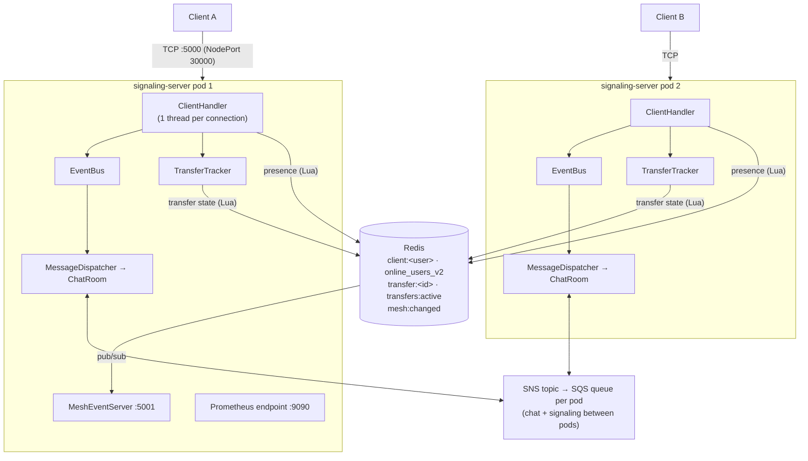
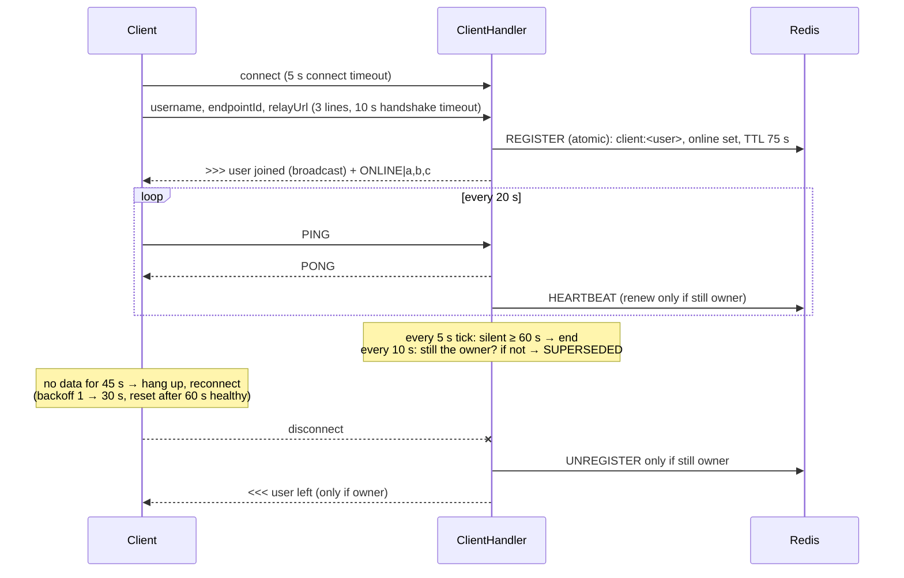
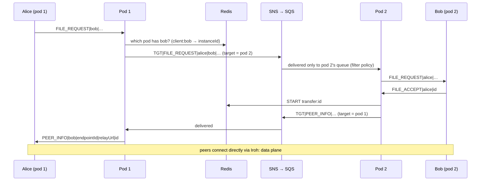

# Control Plane

> The Java signaling server: who is online, who wants to talk to whom, and what happened to every transfer.
> It never carries file bytes.

*Last updated: 2026-10-06 (after PR #2). Matches the code on `main`.*
Back to the [overview](overview.md).

---

## 1. What it does

| Job | How |
|---|---|
| **Sessions** | One TCP connection per client; heartbeat, timeouts, one owner per username |
| **Presence** | Who is online, across all pods: Redis with a 75 s TTL |
| **Signaling** | Routes `FILE_REQUEST` / `FILE_ACCEPT` / `PEER_INFO` between users, even on different pods |
| **Chat** | Broadcasts chat, join and leave lines to everyone |
| **Transfer tracking** | Keeps every transfer's state in Redis, counted once ([Mesh v2](../fixes/mesh-v2.md)) |
| **Observability** | Prometheus metrics on `:9090`, live mesh WebSocket on `:5001` |

## 2. Shape

Inside a pod:

- **`ClientHandler`**: one per connection. Handshake, heartbeat, timeouts, ownership checks, parsing client lines.
- **`EventBus`**: passes each message to its subscribers: the dispatcher (routing), the console logger, metrics, and file storage of chat messages.
- **`ChatRoom`**: the pod's local users. `sendTo(user)` delivers locally if the user is on this pod; otherwise it publishes to the user's pod through SNS.
- **`TransferTracker` / `TransferStore`**: transfer events → Redis (atomic Lua), "peer left" handling, the 120 s backup sweep, and counting once.
- **`MeshEventServer`**: serves the live mesh from Redis.
- **`RedisClientRegistry`**: presence and ownership scripts.

## 3. Session lifecycle

| Timer | Value | Side |
|---|---|---|
| Heartbeat (`PING`) | every 20 s | client |
| Client read timeout | 45 s | client |
| Server idle limit | 60 s (checked on a 5 s tick) | server |
| Ownership check | every 10 s | server |
| `SUPERSEDED` grace | 5 s | server |
| Presence TTL | 75 s | Redis |
| Reconnect backoff | 1, 2, 4, 8, 16, 30 s (no give-up; resets after 60 s healthy) | client |

**One owner per username, newest wins.** A new session with the same name takes over:

- **Same pod:** the old session is told `SUPERSEDED` at once.
- **Other pod:** the old session's 10 s ownership check notices.

The losing client process prints why and **exits with code 3**; it doesn't reconnect ([process ownership](../fixes/chat-reconnect/Process-ownership.md)). A session that didn't own the name when it ended announces **no LEAVE**.

## 4. Protocol (one text line per message)

**Client → server**

| Line | Meaning |
|---|---|
| *(3 handshake lines)* | username, endpointId, relayUrl |
| `PING` | heartbeat |
| `FILE_REQUEST\|<to>\|<filename>\|<size>\|<id>` | sender asks to send a file |
| `FILE_ACCEPT\|<sender>\|<id>` | receiver accepts; this **creates the transfer record** |
| `FILE_REJECT\|<sender>` | receiver declines |
| `TRANSFER_EVENT\|id=..\|state=..\|path=..\|pct=..\|reason=..` | transfer update, see [Mesh v2](../fixes/mesh-v2.md) |
| anything else | a chat message |

Old v1 lines (`CONNECTION_PATH`, `TRANSFER_METRIC`, `TRANSFER_PROGRESS`) are **ignored**, so an old client never shows them as chat.

**Server → client**

| Line | Meaning |
|---|---|
| `[<user>] <text>` | chat |
| `>>> <user> joined the chat` / `<<< <user> left the chat` | presence |
| `ONLINE\|a,b,c` | everyone online (all pods), sent right after join |
| `FILE_REQUEST\|<from>\|<filename>\|<size>\|<id>` | incoming offer |
| `FILE_ACCEPT\|<receiver>\|<id>` / `FILE_REJECT\|<receiver>` | answer to an offer |
| `PEER_INFO\|<receiver>\|<endpointId>\|<relayUrl>\|<id>` | where to connect (sent to the sender after accept) |
| `PONG` | heartbeat reply |
| `SUPERSEDED` | another process took your username; stop |

## 5. Signaling across pods

- Each pod creates its own SQS queue (`chat-instance-<instanceId>`) subscribed to one SNS topic with a **filter policy**: it receives only `broadcast` messages and messages targeted at itself.
- Payloads: `BCAST|type|sender|content` for everyone, `TGT|type|sender|target|content` for one pod.
- Queue retention is 300 s, with a 20 s long poll.
- Since Mesh v2, **SNS/SQS carries only chat and signaling**. Transfer state goes through Redis.

## 6. Redis data

| Key | Type | Holds | Written by |
|---|---|---|---|
| `client:<user>` | hash, TTL 75 s | endpointId, relayUrl, instanceId, sessionId | `REGISTER` / `HEARTBEAT` / `UNREGISTER_IF_OWNER` |
| `online_users_v2` | sorted set | username → last-seen ms; trimmed to the TTL on read | same scripts |
| `transfer:<id>` | hash | from, to, state, path, pct, reason, timestamps | `TransferStore` (Lua) |
| `transfers:active` | sorted set | active transfer IDs by last update | `TransferStore` |
| `mesh:changed` | pub/sub | "transfer changed" pings | `TransferStore` |

Every multi-step change is **one Lua script**, using **Redis's own clock** (`TIME`), so pods never race and their clocks never matter.

- **`HEARTBEAT` returns:** `1` = renewed, `2` = record was missing and was re-created, `0` = someone else owns the name (touch nothing).
- **`UNREGISTER_IF_OWNER`** deletes only if the caller still owns the name, so an old session can never erase a new one.

## 7. How it got here

| Stage | Problem | Change | Read more |
|---|---|---|---|
| v0 (Aug 31) | — | Java server, Redis presence (plain set), SNS/SQS between pods | [decision 001](../decisions/001-java-signaling.md), [002](../decisions/002-redis-presence.md) |
| PR #1 (Sep 25) | Presence updates were several separate Redis calls; mesh out of sync | Atomic presence, reconnect logic, k8s manifests | [transfer state vs mesh state](../problems/transfer-state-vs-mesh-state.md) |
| Reconnect step 1–2 (Sep 27–30) | Cleanup by **username** let an old session erase a new one; null handshake crashed | Session IDs in logs; check-and-delete by session; handshake timeout | [investigation](../problems/chat-reconnect-investigation.md), [redesign](../fixes/chat-reconnect/chat-reconnect-Fixed-design-plan.md) |
| Step 3 | Client never closed failed sockets, retried 5 times then quit, no connect timeout | Backoff 1 → 30 s with no give-up, reset after 60 s healthy, 5 s connect timeout | [step 3](../fixes/chat-reconnect/reconnect-step3-fix.md) |
| Step 4 | Silent connections never noticed; Redis presence never expired | PING/PONG, 45 s / 60 s timeouts, ownership check, `SUPERSEDED`, TTL presence (`online_users_v2`) | [redesign](../fixes/chat-reconnect/chat-reconnect-Fixed-design-plan.md), [heartbeat fix](../fixes/chat-heartbeat-fix.md) |
| Step 5 | Clients' user lists went stale after reconnect | `ONLINE\|…` sent on join | same |
| Process ownership (Oct 2) | Two windows with one name took it from each other forever | Loser exits with code 3; no reconnect | [process ownership](../fixes/chat-reconnect/Process-ownership.md) |
| Mesh v2 (Oct 4–6) | Mesh state in each pod's memory, synced over SNS; doubled counts | Transfer state in Redis, `TRANSFER_EVENT`, counted once; `MESH\|…` SNS messages removed | [Mesh v2](../fixes/mesh-v2.md), [decision 006](../decisions/006-transfer-state-in-redis.md) |

## 8. Known limits

| Limit | Effect | Possible fix |
|---|---|---|
| **No authentication** | Anyone who can reach port 30000 can join as any username, including taking over `admin` (newest wins) | A shared token or keys per user; later TLS |
| **Plain TCP, no TLS** | Chat and signaling can be read on the network | TLS, or chat over Iroh/QUIC |
| **SQS queues pile up** | Every pod start creates `chat-instance-<random>` plus an SNS subscription, and nothing deletes them | Delete the queue on shutdown, or use stable names per pod |
| **Session = TCP connection** | A short drop means a new session plus LEAVE/JOIN, and chat sent during the gap is lost | [Session resumption (parked)](../future-plans/Chat-reconnect/) |
| **One thread per connection** | Fine for tens of clients, heavy for thousands | NIO / virtual threads |
| **AWS dependency for chat** | SNS/SQS adds latency and needs AWS credentials in the cluster | Redis pub/sub for chat too ([mesh evolution](../future-plans/mesh-evolution-plan.md)) |

## 9. Failure boundaries

| Failure | What happens |
|---|---|
| A client's network drops | Client notices within 45 s and reconnects with backoff; server ends the session within 60 s; presence expires within 75 s |
| A server pod dies | Its clients reconnect to the other pod; Redis presence expires by TTL; transfers continue peer-to-peer, and the mesh recovers from Redis |
| Redis restarts | Heartbeats re-create presence records (`HEARTBEAT` returns 2); active transfer records are lost (the mesh shows them again only if new events arrive) |
| SNS/SQS unavailable | Cross-pod chat and signaling stop; same-pod users still work; ongoing transfers aren't affected |
| Same username from two processes | Newest wins; the older process exits with code 3 |
