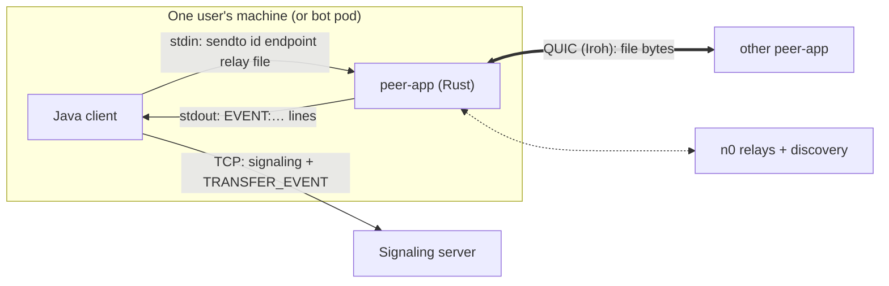
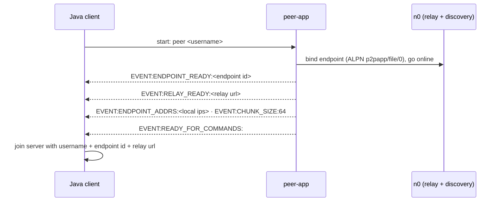
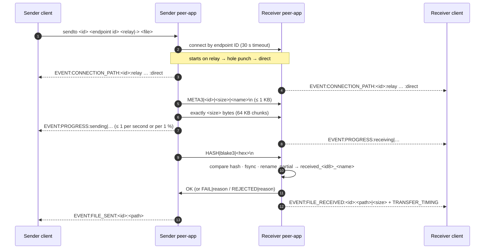
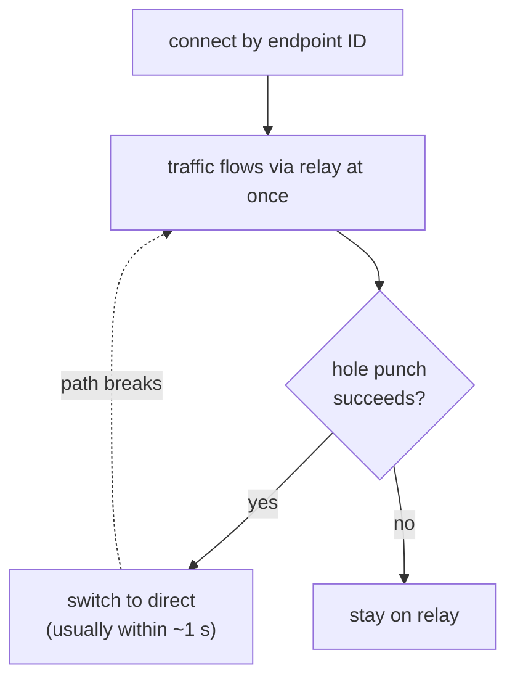

# Data Plane

> The Rust `peer-app` on Iroh: the only part of Aperture that touches file bytes.
> Direct when possible, through a relay when not, and always one honest result per transfer.

*Last updated: 2026-10-06 (after PR #2). Matches `peer-app/src/main.rs` on `main` (Iroh 1.0.2).*
Back to the [overview](overview.md). Message formats: [peer-app protocol](peer-app-protocol.md).

---

## 1. What it does

| Job | How |
|---|---|
| **Identity** | Each peer-app is an Iroh endpoint; its **endpoint ID** (a public key) is its address |
| **Finding peers** | `presets::N0`: n0's discovery finds an endpoint by ID; no IP addresses needed |
| **Connecting** | QUIC via Iroh: starts through a relay, then hole-punches to a direct path when it can |
| **Moving bytes** | One QUIC stream per transfer: header, data, BLAKE3 hash, reply |
| **Checking** | Exact size, BLAKE3 hash, `fsync` before rename, safe file names |
| **Reporting** | `EVENT:` lines to its Java client: path, progress, exactly one result |

The Java client and peer-app are **two processes on the same machine**. The client starts peer-app and talks to it over stdin/stdout:

## 2. Startup

- The **endpoint ID is new on every start**, since there's no saved key yet. A restarted client has a new ID, so the server always hands out the current one at join. Persistent identity is Phase B step B0.
- The relay URL is only a **hint** (it can be `-`). Discovery finds the peer by ID even if the relay changed (fixed in A4, bug 10).

## 3. One transfer on the wire

**Exactly one result per side.**

- **Sender:** `FILE_SENT`, `FILE_SEND_FAILED` (the receiver said no) or `TRANSFER_FAILED` (it couldn't finish).
- **Receiver:** `FILE_RECEIVED` or `TRANSFER_FAILED`.

The Java clients turn these into `TRANSFER_EVENT` messages for the server ([Mesh v2](../fixes/mesh-v2.md)).

### Limits and timers

| Setting | Value | Why |
|---|---|---|
| Connect timeout | 30 s | dial by ID can take a while through discovery and relay |
| Stall timeout | 40 s without data | a silent stream fails instead of hanging forever |
| Reply wait (sender) | 60 s | receiver needs time to hash, `fsync` and rename large files |
| Header | ≤ 1 KB, name ≤ 100 chars, ID ≤ 64 chars `[A-Za-z0-9-_]` | a bad peer can't send an endless or dangerous header |
| Trailer (`HASH` line) | ≤ 100 bytes, within 10 s | same |
| Chunk size | 64 KB (env `PEER_CHUNK_KB`) | measured; changing it didn't help much |
| Progress | at most once per second or per 1 % step | was ~16,000 lines for 1 GB (bug 11) |

### Files on the receiver

1. Data goes into `received_<id>.partial`, created with `create_new`, so two transfers can't share a file.
2. After the hash matches: `fsync`, then rename to `received_<first 8 chars of id>_<cleaned name>`, adding `_2`, `_3`, … if that name exists.
3. On any failure, the partial file is deleted.

## 4. Direct vs relay

- Iroh **always connects first and improves later**: data starts on the relay, then moves to a direct path when hole punching works.
- `paths_stream()` gives the current path list **immediately** and then on each change. peer-app turns it into `EVENT:CONNECTION_PATH`, so the mesh shows the right colour from the first second.
- The earlier `path_events()` only reported *changes after* subscribing, and missed the first path; fixed in Mesh v2 step S1.

**Measured** (300 MB, our setup):

| Pair | Path | Speed |
|---|---|---|
| admin2 → admin (WSL ↔ WSL) | direct | ~37 MB/s |
| admin → admin2 | direct | ~7–11 MB/s (not yet explained) |
| script `peer → peer`, same machine | direct | ~50 MB/s |
| WSL admin ↔ bot pod (Docker Desktop) | relay | ~0.4 MB/s |

Why admin ↔ bot always uses the relay: both have the same public IP, the router has no hairpin NAT, and their private networks can't reach each other. See [networking](networking.md).

## 5. How it got here

| Stage | Problem | Change |
|---|---|---|
| v0 (Aug 31) | — | `META\|name\|size\|id`, raw bytes, receiver replies `ACK` ([decision 003](../decisions/003-iroh-data-plane.md)) |
| Sep 22–25 | Transfers slow; direct connections failed; stale relay URLs | Measured and documented ([slow transfers](../problems/slow-transfers.md), [relay fallback](../problems/relay-fallback.md), [direct connection gap](../problems/direct-connection-gap.md)) |
| Oct 2 | Log noise: "authentication failed" | Explained as harmless Iroh/QUIC noise ([note](../problems/peer-app-authentication-failed.md)) |
| **A1** (Oct 3) | Receiver said `ACK` even on failure; sender errors invisible; double counting | **One result per transfer**: `OK` / `FAIL\|reason` |
| **A2** | Same name from two senders corrupted files; no `fsync`; `\|` in names broke parsing; endless header | **META2** (name last), per-transfer `.partial`, `fsync` before rename, cleaned names, 1 KB header, `REJECTED` |
| **A3** | No integrity check | **META3** + `HASH\|blake3\|…` after the data |
| **A4** | 16,000 progress lines per GB; file changing mid-send; stale relay hint | Throttled progress; stop if the file shrinks; relay hint optional; timing and address events |
| **Mesh v2 S1** (Oct 4) | Path unknown until the end | `path_events()` → `paths_stream()`: path reported at start |

Bug numbers refer to the [file-transfer bug log](../problems/file-transfer-bugs.md). The full protocol history is in [peer-app protocol](peer-app-protocol.md).

## 6. Known limits

| Limit | Effect | Plan |
|---|---|---|
| **No resume** | Any failure throws away everything received (bug 13) | Phase B: iroh-blobs (verified chunks, resume) |
| **Sender pushes** | The receiver can't pull, choose sources or fetch from several peers | Phase B: receiver fetches by hash; later swarm |
| **Anyone with the endpoint ID can push a file** | No check that the server introduced the sender (bug 9) | Phase B: tickets / allow-list of introduced peers |
| **New identity every start** | Peers can't recognise each other across restarts | Phase B step B0: key file |
| **Depends on n0's public relays** | Relay speed and availability aren't ours to control | [self-hosted relay plan](../future-plans/self-hosted-relay-plan.md) ([decision 005](../decisions/005-self-hosted-relay.md)) |
| **Both sides must run the same build** | A META2 peer can't talk to a META3 peer (clear error, no silent failure) | Phase B replaces the protocol anyway |

## 7. Failure boundaries

| Failure | What the user sees |
|---|---|
| Can't connect within 30 s | Sender: `TRANSFER_FAILED … timed out` |
| Connection lost mid-transfer | Receiver: `read error at X/Y bytes: connection lost`; sender gets an error too |
| Sender's file changes size | Sender stops the stream: `file changed while sending` |
| Hash mismatch | Receiver: `FAIL\|hash mismatch …`; partial file deleted |
| Receiver disk full / can't write | `FAIL\|…` with the OS error |
| Different peer-app versions | `different header version (both sides must run the same peer-app build)` |
