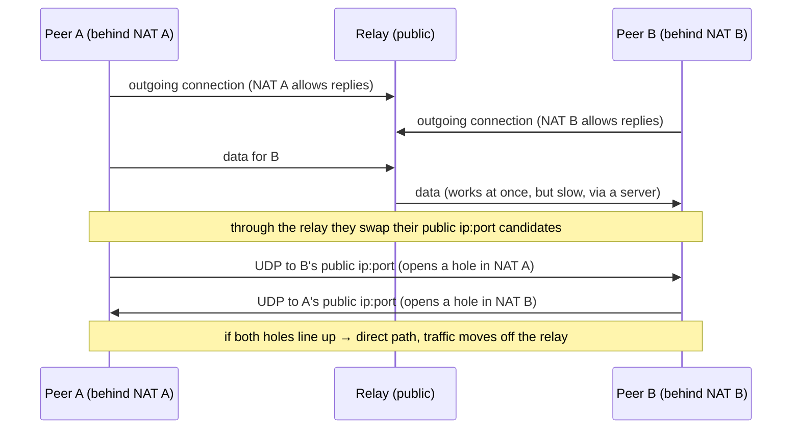
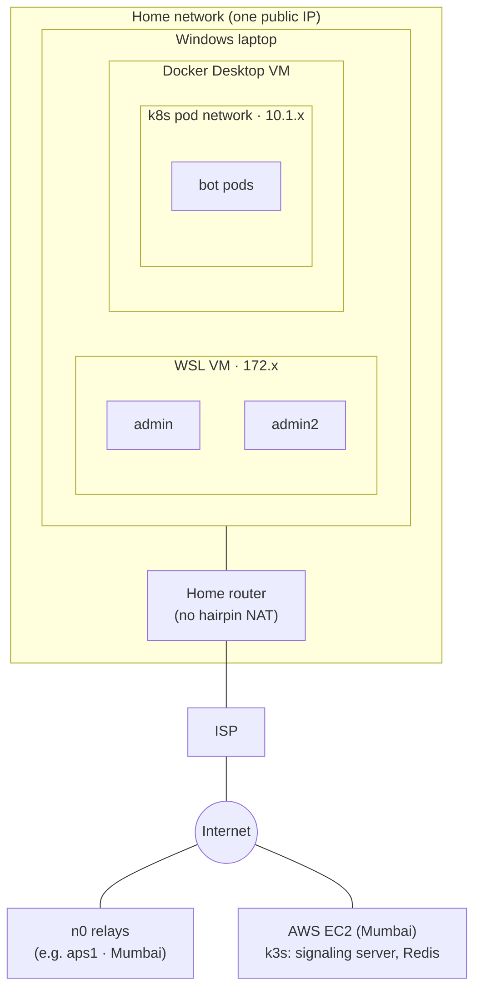
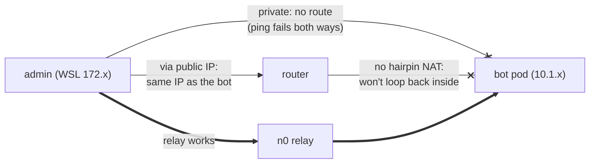

# Networking

> How two peers find each other, how they get through NAT, and what we actually measured.
> Finding a peer and reaching a peer are different problems.

*Last updated: 2026-10-06 (after PR #2).*
Back to the [overview](overview.md). Related: [data plane](data-plane.md), [deployment](deployment.md).

---

## 1. Four separate problems

| Problem | Question | In Aperture |
|---|---|---|
| **Signaling** | Who do I want to talk to, and do they agree? | Java server: `FILE_REQUEST` → `FILE_ACCEPT` → `PEER_INFO` ([control plane](control-plane.md)) |
| **Discovery** | Endpoint ID → where is it right now? | n0 discovery (`presets::N0`); the server only passes the ID plus a relay hint |
| **Connectivity** | Can packets get through the NATs? | Iroh: relay first, then hole punching |
| **Transport** | How do the bytes move reliably? | QUIC streams (Iroh), META3 protocol on top ([data plane](data-plane.md)) |

Each can succeed while the next fails. The most common case in our tests: **found** the peer fine, but couldn't **reach** it directly.

## 2. NAT and hole punching in one picture

- A NAT lets **replies** in, not unsolicited traffic. Two peers behind NATs can't simply dial each other.
- A **relay** always works, because both sides dial *out* to it. But every byte then goes through a server.
- **Hole punching**: both sides send to each other at the same time, so each NAT sees "a reply" and lets it through.
- It fails with **symmetric NAT / CGNAT** (the port changes per destination), and when there's **no hairpin NAT** for two peers behind the *same* router (section 4).

Iroh does all of this itself: connect via relay, exchange candidate addresses over that connection, try direct, and switch when direct works. peer-app just watches the result (`paths_stream()` → `EVENT:CONNECTION_PATH`).

## 3. Our test topology

Each bot sits behind **several layers of NAT**: pod → Docker Desktop VM → Windows → home router → ISP.

## 4. What we measured

| Pair | Same machine? | Result | Speed (300 MB) |
|---|---|---|---|
| admin ↔ admin2 (both in WSL) | yes, same VM | **relay → direct within ~1 s**; later connections direct at once | ~37 MB/s one way, ~7–11 MB/s the other (unexplained) |
| `peer` ↔ `peer` test script (WSL) | yes | direct | ~50 MB/s |
| WSL admin ↔ bot pod | yes, different VMs | **relay only** | ~0.4 MB/s |
| bot ↔ bot (pods) | same pod network | direct | not measured |
| laptop ↔ EC2 peer | no | **not tested yet** | — |

### Why WSL admin ↔ bot stays on the relay

1. **Private addresses can't reach each other.** The WSL network (`172.x`) and the pod network (`10.1.x`) are separate VMs with no route between them; `ping` fails both ways.
2. **The public address doesn't help.** Both have the **same public IP**. Sending to your own public IP needs **hairpin NAT** on the router, and ours doesn't do it.
3. **So only the relay works**, and at ~0.4 MB/s through a public relay it's about 100× slower than direct.

Two peers on the same VM (admin ↔ admin2) have neither problem: they reach each other on local addresses.

## 5. How the understanding evolved

| When | What we thought | What we found | Read more |
|---|---|---|---|
| Sep 22 | Same-host Linux namespace tests show P2P works | Same-host tests can't show real NAT behaviour; they often go local or hairpin | [direct connection failure](../problems/direct-connection-failure.md) |
| Sep 22 | Relay = something broke | Relay is the designed fallback; measure it separately | [relay fallback](../problems/relay-fallback.md) |
| Sep 24 | Transfers stay on relay because peer-app dials with **only a relay address** | **Not the cause.** Iroh exchanges direct candidates over the relay connection and hole-punches by itself; with the path watcher fixed we saw relay → direct within ~1 s | [direct connection gap](../problems/direct-connection-gap.md) (hypothesis, superseded) |
| Oct 3 (A4) | The stored relay URL must be right | It's only a hint: discovery finds the peer by ID even with a wrong URL; `-` = no hint | [data plane](data-plane.md) |
| Oct 4 (S1) | Path unknown until the end | `path_events()` missed the first path; `paths_stream()` gives it immediately | [Mesh v2](../fixes/mesh-v2.md) |
| Oct 5 | Bots are "slow" | They *find* fine but can't *reach* directly: separate VM networks + no hairpin NAT | [finding vs reaching](../learning-notes/Kademlia-DHT_routing_algorithm/finding-vs-reaching-peers.md) |

## 6. Ports and endpoints

| What | Where | Port | Protocol |
|---|---|---|---|
| Chat + signaling | EC2 NodePort | 30000 → 5000 | TCP |
| Mesh WebSocket | EC2 NodePort | 30001 → 5001 | TCP (WebSocket) |
| Mesh page | EC2 | 8080 | HTTP |
| Server metrics | EC2 NodePort | 30090 → 9090 | HTTP |
| Grafana / Prometheus | EC2 NodePort | 30300 / 30900 | HTTP |
| peer-app ↔ peer-app | anywhere | random UDP ports | QUIC (ALPN `p2papp/file/0`) |
| peer-app ↔ n0 relay | n0 servers | 443 | HTTPS / WebSocket |

peer-app needs **no inbound ports** opened anywhere. Everything starts as outgoing traffic, which is the point of relays and hole punching.

## 7. Open experiments

- [ ] **Laptop ↔ EC2 peer:** a real hole punch across two different networks.
- [ ] **WSL mirrored networking** (`networkingMode=mirrored`): does WSL ↔ bot go direct?
- [ ] **`hostNetwork: true` for bot pods:** removes one NAT layer.
- [ ] **Why admin → admin2 is slower than the reverse:** compare with the script speed test.
- [ ] **Self-hosted relay** in Mumbai on EC2: relay speed under our control ([plan](../future-plans/self-hosted-relay-plan.md)).
- [ ] **Two regions** (Mumbai ↔ Singapore): distance and relay placement.

## 8. Principles

- **Finding is not reaching.** Discovery can work while connectivity fails.
- **Same-host tests are not Internet tests.** Record the topology with every result.
- **Relay is a fallback, not a failure**, but always measure and report it separately.
- **Change one variable at a time** (path, size, chunk size, machines).
- **Report the path with every transfer.** It's part of the result, not a detail.
