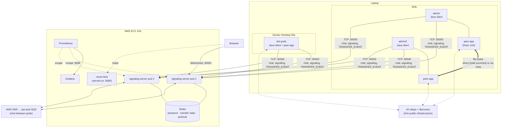
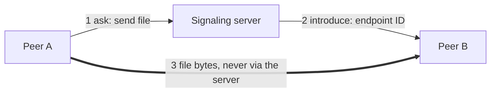
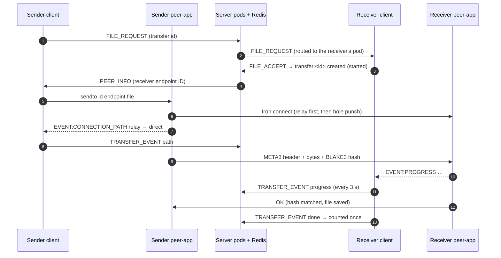
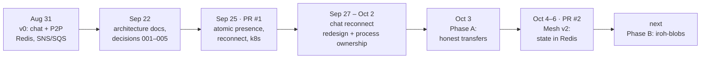
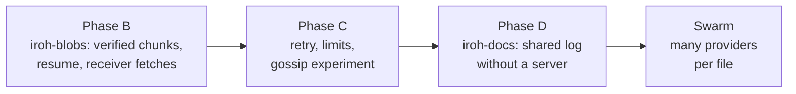

# Aperture Architecture Overview

> **A learning lab for peer-to-peer connectivity and reliability.**
> Signaling is centralized; file data is peer-to-peer.

This page is the map: what the system is **today**, how the parts fit, and **how it got here**.
Each part has its own page:

- [control plane](control-plane.md)
- [data plane](data-plane.md)
- [networking](networking.md)
- [observability](observability.md)
- [deployment](deployment.md)

*Last updated: 2026-10-06 (after PR #2: Phase A + Mesh v2).*

---

## 1. Purpose

Aperture exists to learn, by building and measuring:

- how two machines behind different routers actually connect (direct vs relay);
- how reliable that is on real networks (Wi-Fi drops, NAT, separate networks);
- which parts of a "decentralized" system still need a central server;
- how to know what's really happening: report what was observed instead of guessing from silence.

Chat and file transfer are the traffic that drives the experiments.

## 2. The system today

### Components

| Component | What it does | Tech | Details |
|---|---|---|---|
| **Java client** | Chat UI, file-transfer queues (1 send + 1 receive), reconnects, starts and drives `peer-app` | Java, TCP line protocol | [control plane](control-plane.md) |
| **peer-app** | Moves file bytes peer-to-peer; reports path, progress and result as `EVENT:` lines | Rust, Iroh 1.0 (`presets::N0`) | [data plane](data-plane.md) |
| **Signaling server** (2 pods) | Sessions, presence, routing requests between users, transfer tracking, mesh WebSocket, metrics | Java | [control plane](control-plane.md) |
| **Redis** | Single source of truth: who is online (TTL 75 s), every transfer's state (Lua scripts), `mesh:changed` pings | Redis | [decision 006](../decisions/006-transfer-state-in-redis.md) |
| **SNS/SQS** | Delivers chat and signaling messages to the pod where the target user is connected | AWS | [control plane](control-plane.md) |
| **Iroh relays + discovery** | Finds peers by ID; relays traffic when direct fails | n0 public infrastructure | [networking](networking.md) |
| **Prometheus + Grafana** | Counters (messages, joins, transfers direct/relay/failed), online users | — | [observability](observability.md) |
| **Mesh page** | Live view of every transfer, coloured by path | HTML + WebSocket | [observability](observability.md) |

### The one rule

The server coordinates and observes. File bytes go only between peers, directly when possible, through a relay when not.

## 3. One transfer, end to end

## 4. How we got here

| When | Stage | Problem that pushed it | What changed | Read more |
|---|---|---|---|---|
| Aug 31 | **v0** | — | Java signaling + Rust/Iroh peer-app; Redis presence; SNS/SQS between pods | decisions [001](../decisions/001-java-signaling.md), [002](../decisions/002-redis-presence.md), [003](../decisions/003-iroh-data-plane.md) |
| Sep 22–25 | **First measurements** | Mesh showed wrong states; direct connections failed; transfers slow | Documented direct-connection gap, relay fallback, slow transfers; **PR #1**: atomic presence updates, reconnect logic, k8s manifests | [problems/](../problems/) |
| Sep 27 – Oct 2 | **Chat reconnect redesign** | Zombie sessions, false "left the chat", two windows fighting over a name | Session IDs, PING/PONG heartbeat, timeouts, supersede (same + other pod), presence TTL in Redis, online list on join, **process ownership** (newest wins, loser exits) | [fixes/chat-reconnect/](../fixes/chat-reconnect/) |
| Oct 3 | **Phase A: honest file transfer** | Transfers reported "done" when they failed; partial files; no integrity check | One result per transfer (OK / FAIL), safe saving, BLAKE3 hash check, throttled progress, stop if the file changes | [file-transfer bugs](../problems/file-transfer-bugs.md), [protocol](peer-app-protocol.md) |
| Oct 4–6 | **Mesh v2** | Mesh line grey until the end; pods disagreed; counts doubled; slow transfers marked "timed out" | Path reported at start (`paths_stream`), 1 + 1 client queues, `TRANSFER_EVENT`, **transfer state in Redis** with atomic Lua, counted once, old v1 mesh removed; **PR #2** | [Mesh v2](../fixes/mesh-v2.md), [decision 006](../decisions/006-transfer-state-in-redis.md) |

What each stage taught:

- **v0 → measurements:** a system that *looks* like it works isn't the same as one that reports the truth. Measure the path, the time and the result.
- **Reconnect:** "connected" is a belief, not a fact. Both sides need heartbeats, timeouts and one owner per name.
- **Phase A:** silence is not success. Every transfer ends with exactly one explicit result.
- **Mesh v2:** with several servers, shared state needs **one source of truth** and **atomic updates**. Per-pod memory synced by messages drifts.

## 5. Known limits today

| Limit | Why | Where it's tracked |
|---|---|---|
| WSL admin ↔ local bots always use the relay (~0.4 MB/s) | Same public IP, no hairpin NAT, separate private networks | [networking](networking.md) |
| A short disconnect still means a new session plus LEAVE/JOIN | Session = one TCP connection | [session resumption (parked)](../future-plans/chat-session-resumption-plan.md) |
| Interrupted transfers restart from zero | Custom stream protocol, no chunk resume | Phase B (iroh-blobs) |
| One sender per file | No swarm yet | [swarm plan](../future-plans/swarm-distribution-plan.md) |
| Mesh drawing works up to ~50 users | One dot per user on a ring | [mesh evolution](../future-plans/mesh-evolution-plan.md) |
| EC2 IP changes on restart | No Elastic IP | [roadmap](../roadmap.md) side tracks |

## 6. Where it's going

Details and order: [roadmap](../roadmap.md) and the [file-transfer improvement plan](../future-plans/file-transfer-improvement-plan.md).

## 7. Principles

- **Separate coordination from data.** The server never carries file bytes.
- **Prefer direct, measure relay.** The relay solves reachability; it's not the goal.
- **One source of truth for shared state**, with atomic updates (Redis + Lua).
- **Report what was observed.** Explicit results, not timeouts guessed from silence.
- **Measure before optimizing.** Path, time, throughput, retries.
- **Write it down.** Problems, decisions and evidence are documented with before/after.

## 8. Documentation map

| Folder | What's inside |
|---|---|
| [architecture/](.) | How the system works today (this page and its neighbours) |
| [decisions/](../decisions/) | Why we chose things (001–006) |
| [problems/](../problems/) | Investigations with evidence |
| [fixes/](../fixes/) | Finished designs: chat reconnect, Mesh v2 |
| [future-plans/](../future-plans/) | Not built yet |
| [learning-notes/](../learning-notes/) | Background: BLAKE3, Kademlia, TCP, roadmaps |
| [roadmap.md](../roadmap.md) | The ordered plan |
