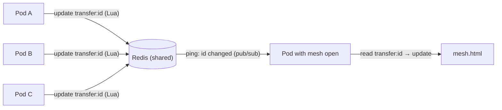

# 003: Transfer State in Redis

**Status:** Accepted (Mesh v2, step S3)
**Related:** [002-redis-presence](002-redis-presence.md) ·
[mesh-v2 plan](../future-plans/mesh-v2-transfer-events.md) ·
[transfer-state-vs-mesh-state](../problems/transfer-state-vs-mesh-state.md)

## Context

The mesh must show every transfer correctly and live — no matter how many
users or server pods there are.

Before (v1), each server pod kept its **own copy** of the mesh in memory and
synced it with other pods through SNS → SQS:

- pods could disagree, and a restarted pod started with an empty mesh;
- SNS → SQS adds up to ~1 s of delay between pods;
- done/failed were matched by user pair, not transfer ID;
- failures were guessed with short timers (see the "timed out" incident).

Users can be connected to **different pods**. Example: admin on pod A sends to
bot-3 on pod B, while bot-7 on pod C sends to admin. Events about one transfer
therefore arrive at **different pods**.

## Decision

**Redis is the single source of truth for transfer state.**
Pods keep no mesh state of their own; they write events into Redis and read
from it.



### Keys

| Key | Type | Holds | Lifetime |
|---|---|---|---|
| `transfer:<id>` | hash | from, to, state, path, pct, reason, updated_at | until ~10 s after done/failed |
| `transfers:active` | sorted set | active transfer IDs, score = updated_at (ms) | removed when done/failed |
| `mesh:changed` | pub/sub channel | "this ID changed" pings | not stored |

### Atomic updates (Lua)

Every event is applied with **one Lua script**, so it is atomic even when
several pods write the same transfer at the same moment. The script:

1. Ignores the event if the transfer is already `done` or `failed` (final).
2. Applies the new state / path / pct / reason and sets `updated_at`.
3. On `done` / `failed`: removes the ID from `transfers:active` and sets a
   short expiry on `transfer:<id>`.
4. Returns whether anything changed (and whether this call made it `done`).

Same technique as presence (002): Redis runs a Lua script as one step,
so no other command can run in the middle.

### Who writes what

| Event | Written by (pod of…) |
|---|---|
| `started` (from, to) | the receiver — the pod that gets `FILE_ACCEPT` |
| `path` | sender and receiver |
| `progress` | receiver |
| `done` | receiver |
| `failed` | whichever side knows; also the pod of a user who disconnects ("peer left") |

### Rules that keep it correct across pods

| Rule | How |
|---|---|
| Identified only by transfer ID | key `transfer:<id>` |
| `done` / `failed` are final | checked inside the Lua script |
| Counted once in Grafana | only the pod whose Lua call made the **first** `done` increments the counter |
| Lost ping can't leave the mesh wrong | the mesh re-reads `transfers:active` every 10 s |
| Silent client (crash, power cut) | any pod may check for transfers silent > 120 s; the Lua script makes sure only one marks it failed |

### What does NOT go through Redis

- **Finding each other** (`FILE_REQUEST` / `FILE_ACCEPT` / `PEER_INFO`) —
  unchanged, routed between pods as before.
- **File data** — goes peer to peer (or via the Iroh relay), never through
  server pods.

## Alternatives considered

| Option | Why not |
|---|---|
| Keep v1 (memory per pod + SNS/SQS) | Pods disagree, ~1 s lag, state lost on restart |
| Redis pub/sub only, each pod keeps a full copy | Every pod does all the work; N pods = N duplicate timers; restart = empty mesh |
| Redis Streams (event log) | Useful later for history/replay; more than needed now |
| A separate mesh service | Cleanest at large scale; an extra deployment we don't need yet |

## Consequences

**Good**
- Any number of pods show the same mesh; pods can restart or scale freely.
- Pod-to-pod delay drops from ~0.1–1 s (SNS/SQS) to a few milliseconds.
- One clear place to look when debugging: `HGETALL transfer:<id>`.

**Costs / risks**
- **Redis is a single point of failure.** If it is down, the mesh stops
  updating (presence breaks too). Fine for the lab; in production use a
  replica with failover (Redis Sentinel, or a managed service like ElastiCache).
- One more Lua script to maintain and test.

## Useful commands

```bash
# inside the redis pod
redis-cli ZRANGE transfers:active 0 -1 WITHSCORES   # active transfers
redis-cli HGETALL transfer:<id>                     # one transfer's state
redis-cli SUBSCRIBE mesh:changed                    # watch pings live
```
