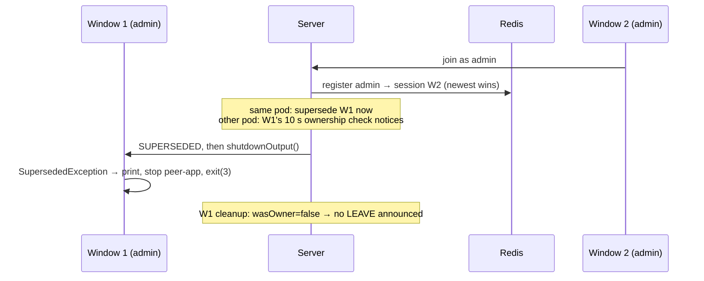

# Process Ownership: Same Username, Two Processes

**Status: Done.** Part of the Chat Reconnect Redesign; completes step 4's "older is told to stop".
Built in commit `e479966` ("process ownership").

---

## The problem

Two separate client processes using the same username (e.g. two `admin` windows) took the name from each other forever:

```text
f989d0ad → superseded by 1baab78f (13s)
1baab78f → superseded by b4c22ec6 (13s)
b4c22ec6 → superseded by 1f23acf3 (13s)
...
```

The server correctly told the older session `SUPERSEDED` and closed it, but the client didn't recognise `SUPERSEDED`. It treated the close as a normal disconnect, and step 3's reconnect loop brought it straight back as the newest session.

The server side already worked. **The client didn't obey.**

## Decisions

| Question | Decision |
|---|---|
| Who keeps the name when a second process uses it? | **Newest wins.** |
| What does the losing process do? | **Exits cleanly**: prints why, stops `peer-app`, ends the process. No reconnect. |

Rejected: *first wins* (`NAME_IN_USE`). It needs a per-process ID and a join-or-reject script, and can lock a user out for ~45–75 s after a crash. It can be revisited with [session resumption](../../future-plans/chat-session-resumption-plan.md), where a resume token identifies the process.

## Key guarantee: a reconnect never receives SUPERSEDED

A process always closes its old socket (step 3's `finally`) **before** opening a new one. So `SUPERSEDED` can only reach a connection that is still alive, which means a **different** process. Exiting on `SUPERSEDED` never kills a normal reconnecting client.

The server sends `SUPERSEDED` only on positive proof that a different session owns the name. A missing record or a Redis error never triggers it.

## How it works



### Server (unchanged from step 4)

- **Same pod:** the new session's join supersedes the old one immediately, after registering.
- **Other pod:** the old session's ownership check (every 10 s) notices.
- **Both:** send `SUPERSEDED`, then `shutdownOutput()`, then end after a 5 s grace. Cleanup has `wasOwner=false`, so no LEAVE is announced.

### Client (`Client.java`)

1. The read loop recognises `SUPERSEDED` and throws `SupersededException`.
2. `main` catches it **before** the generic `IOException`, so the reconnect loop is never entered.
3. Clean exit:
   - prints `Username '<name>' is now in use by another session. Exiting.`;
   - stops `peer-app` (`destroy()`, short wait, `destroyForcibly()`);
   - exits with code **3** (`EXIT_CODE_SUPERSEDED`), so logs and Kubernetes show why.

## Behaviour

| Case | Result |
|---|---|
| Second window, same pod | First window exits **immediately** |
| Second window, other pod | First window exits within **~10–15 s** |
| Same process reconnecting (Wi-Fi drop) | Unaffected: never sees `SUPERSEDED` |
| Ctrl+C, then restart | Normal new session |
| `kill -9`, then restart | New process takes the name immediately; the old session is cleaned up by step 4 |
| Bots | Unaffected: each pod has a unique name (`HOSTNAME`) |

## Tests

| Test | Pass condition | Result |
|---|---|---|
| Two windows, same pod | Window 1 exits at once; server log: `superseded`, `wasOwner=false`, no LEAVE; no back-and-forth | ✅ |
| Two windows, different pods | Same, within ~15 s | ✅ |
| `peer-app` cleanup | `ps aux \| grep peer` shows only window 2's peer-app | ✅ |
| Wi-Fi drop, single window | Reconnects normally, no superseded message | ✅ |
| Window 2 after takeover | Chat and one small file transfer work | ✅ |

## Interaction with Mesh v2 (added later)

- When window 1 exits, any transfer it was part of loses its peer-app. The other side reports `failed` ("connection lost") itself.
- The server's **peer-left** check doesn't apply here: it only runs when the *owner* leaves, and the username is still online (window 2 owns it).
- If neither side reports, the **120 s no-response** backup marks the transfer failed.

## Out of scope

- First wins / `NAME_IN_USE`: see session resumption, open decisions.
- Session resumption itself.
