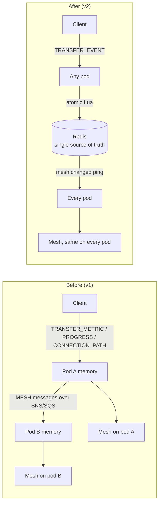
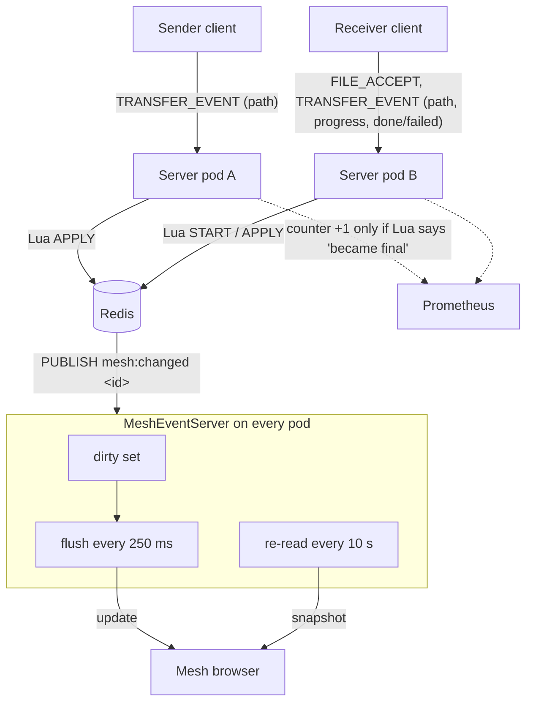
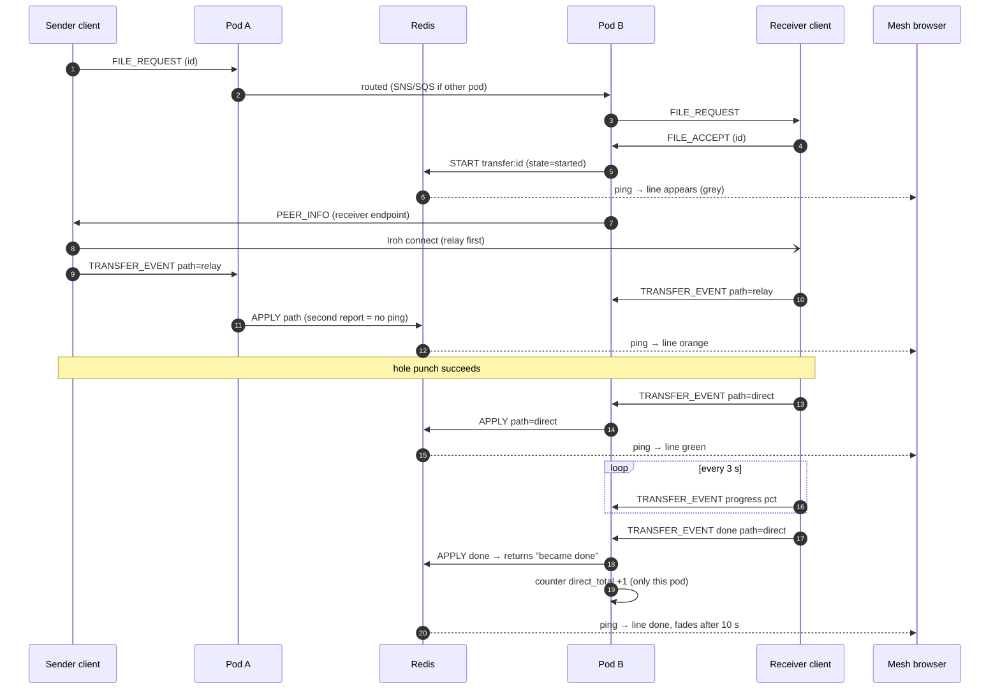
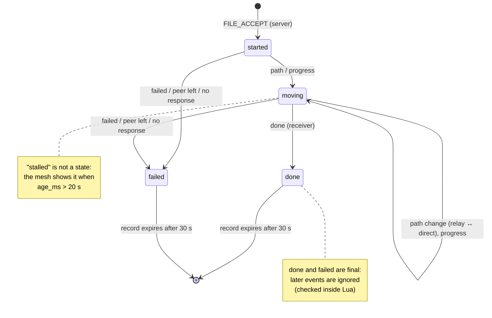
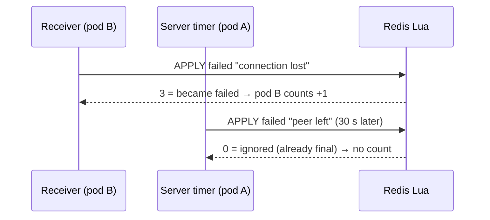
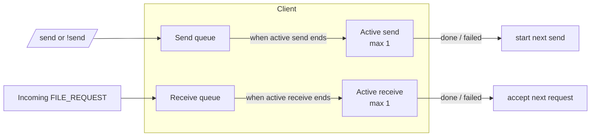

# Mesh v2: Live Transfer Tracking + Client Limits

**Status: Done.** Built in steps S1–S6, merged to `main` in PR #2.
Scale tests (20 bots, 3 pods) are still pending; see [Tests](#tests).
Related: [decision 006: transfer state in Redis](../../decisions/006-transfer-state-in-redis.md), [mesh evolution plan](../../future-plans/mesh-evolution-plan.md).

## Goals

1. Each client: **at most 1 sending + 1 receiving** at the same time. Extra transfers wait in a queue.
2. The mesh shows **every transfer correctly and live**, no matter how many users or server pods there are.

Not in scope:

- Swarm distribution (one file from many peers): later, with Phase B.
- Autoscaling (HPA), moving chat off SNS/SQS: a separate DevOps task.

## Problems this fixed

| Problem | Effect |
|---|---|
| Path event fired before peer-app listened | Mesh line grey until the end |
| Client kept pending sends by username | Two sends to the same user got mixed up |
| No limit on transfers per client | `!send all all` with 20 bots = 380 transfers at once |
| Done/failed had no transfer ID, matched by user pair | Two transfers between the same pair could be mixed up |
| Mesh state lived in each pod's memory, synced by SNS/SQS | Slow, and pods could disagree or lose state on restart |
| Server guessed failure with short timers | Slow but healthy transfers showed "timed out" |

### Before and after



## Design



- **Transfer state lives in Redis**, one record per transfer ID. Pods keep no mesh state of their own, so any number of pods show the same thing.
- A pod that changes a transfer sends a small ping (Redis pub/sub, channel `mesh:changed`) with the ID.
- Pods with a mesh browser open read the record and send the update (batched every 250 ms).
- Safety net: the mesh re-reads all active transfers every 10 s, so a lost ping can never leave it wrong for long.

### One transfer, step by step



### Event message (client → server)

```
TRANSFER_EVENT|id=<id>|state=<state>|path=<path>|pct=<0-100>|reason=<text>
```

`key=value` fields: order doesn't matter and unknown fields are ignored, so new fields can be added later without breaking anything.

| state | Fields | Sent by |
|---|---|---|
| `started` | from, to | **server**, when the receiver accepts (`FILE_ACCEPT`) |
| `path` | path = `direct` / `relay` | sender and receiver |
| `progress` | pct | receiver only, at most every 3 s |
| `done` | path | receiver |
| `failed` | reason | whichever side knows |

### Redis keys

| Key | Holds |
|---|---|
| `transfer:<id>` (hash) | id, from, to, state, path, pct, reason, created_at, updated_at |
| `transfers:active` (sorted set) | active IDs, scored by `updated_at` (ms, Redis clock) |
| `mesh:changed` (pub/sub channel) | "this ID changed" pings |

A finished transfer keeps its record for **30 s** (the mesh shows it for 10 s), then it expires. Any record expires after at most 1 day.

### Transfer states



### State rules

- Keyed only by transfer ID.
- **Only the two participants** (`from` / `to`) can change a transfer.
- `done` and `failed` are **final**, checked inside one atomic Redis step (Lua), so this holds even when several pods write at once.
- **Counted once:** the Lua script returns *ignored / changed / became done / became failed*, and only the pod whose call made it final increments the counter (`chat_file_transfers_direct_total` / `_relay_total` / `_failed_total`).
- **Peer left:** when a user disconnects, the server waits **30 s** (short reconnects are common). If the user isn't back online, their active transfers are marked failed ("peer left").
- **Backup:** no event for **120 s** → failed ("no response"). Every pod checks every 15 s; the atomic step makes sure it happens only once.
- The mesh shows **stalled** (visual only) after 20 s of silence, keeping the last known path colour. The server sends `age_ms` so the page doesn't guess.

### How "counted once" works with two reporters



## Client limits (1 + 1)



| Situation | What the client does |
|---|---|
| Wants to send while already sending | Puts it in the send queue, starts it when the current send ends |
| Gets a file request while already receiving | Puts it in the receive queue, accepts it when the current receive ends |
| Any transfer ends (done or failed) | Starts the next one from that queue |

- Everything inside the client is keyed by transfer ID, never by username.
- Timeouts: the receiver must accept within 60 s; a queued request expires after 15 min.
- The admin terminal stays usable: it can receive while sending. `/status` shows active and queued transfers.

## Steps (as built)

| Step | What | Files | Commit |
|---|---|---|---|
| S1 | Path known at transfer start: `path_events()` → `paths_stream()` | `peer-app/src/main.rs` | 27dfd64 |
| S2 | Client: track by ID, 1 + 1 limit with queues, send `TRANSFER_EVENT`, `/status` | `Client.java` | d3a7b35 |
| S3 | Server: Redis state with Lua, events, peer left, 120 s backup, count once | new `TransferStore.java`, new `TransferTracker.java`, `ClientHandler.java`, `PrometheusMetricsServer.java`, `Server.java` | d3a7b35 |
| S4 | Mesh server: snapshot from Redis, pub/sub pings, 250 ms batching, 10 s re-read | `MeshEventServer.java` | d3a7b35 |
| S5 | New mesh page: live colours, finished lines stay 10 s, stalled, failure reason in the log | `mesh.html` | 472346d |
| S6 | Removed the old mesh path: `CONNECTION_PATH` / `TRANSFER_PROGRESS` / `TRANSFER_METRIC` messages, `MESH\|…` over SNS, no-op methods, `ProgressBarRender` | `ChatRoom`, `MessageBroker`, `MessageDispatcher`, `MessageType`, `MetricsSubscriber`, `ClientHandler`, `MeshEventServer`, `Server` | 96a7d8d |

## Tests

| Test | Expect | Result |
|---|---|---|
| Admin → admin2, 300 MB | Colour at start, relay → direct switch shown live | ✅ started, relay, relay → direct all within 1 s |
| Both directions (150 + 170 MB) | Two separate curves | ✅ |
| Hashes | Sent = received | ✅ 5, 30, 300 MB match |
| Sender closed mid-transfer | Line red, counted once as failed | ✅ "connection lost" after ~15 s; peer-left check ignored (already final) |
| Grafana counts | Each transfer +1 exactly once | ✅ 6 done + 1 failed matched the log exactly; after S6: +1 |
| Two files to the same peer quickly | Second waits, both arrive | ⏳ pending |
| Admin → bot (relay) | Orange within ~1–2 s | ⏳ pending |
| Delete a bot pod mid-transfer | Failed ("peer left") within ~30–45 s | ⏳ pending |
| 3 server pods, mesh open on each | All show the same | ⏳ pending |
| 20 bots, `!send all all small` | 380 transfers; each bot ≤ 1 + 1; none stuck; Grafana +380 | ⏳ pending |
| Delete a server pod mid-test | Clients reconnect; mesh recovers from Redis | ⏳ pending |

## Known issues

- admin → admin2 is slower (~7–11 MB/s) than admin2 → admin (~37 MB/s). Not yet explained; compare with the script speed test.
- The WSL admin and bot pods share one public IP with no hairpin NAT, so that pair always uses the relay (~0.4 MB/s).

## Future ideas

- Swarm: a transfer with several legs (one per provider) and `providers:<hash>` in Redis, with Phase B.
- Redis Streams for an event log / replay.
- Mesh at larger scale: see the [mesh evolution plan](../../future-plans/mesh-evolution-plan.md).
