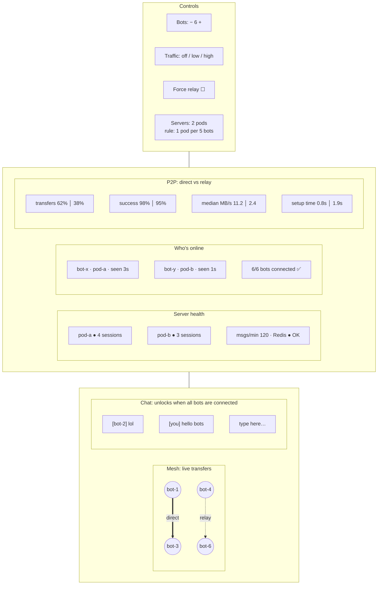
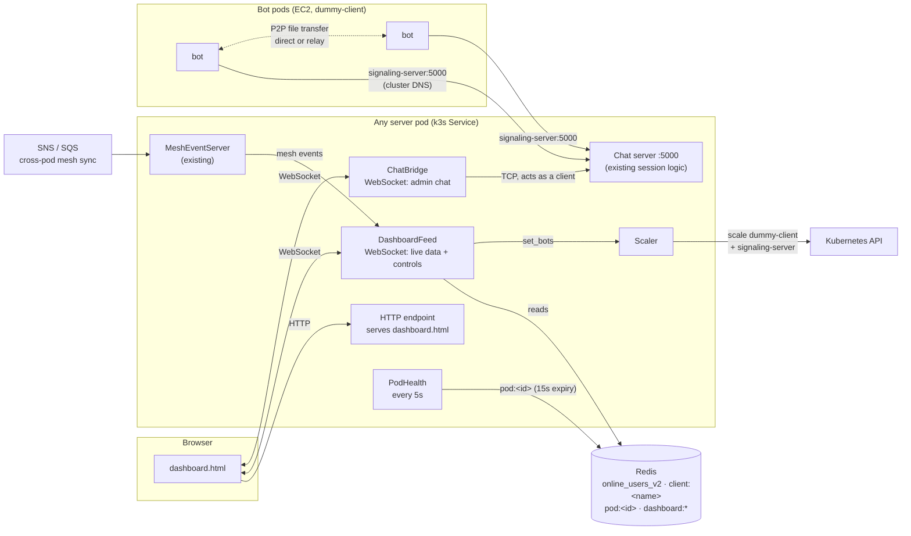
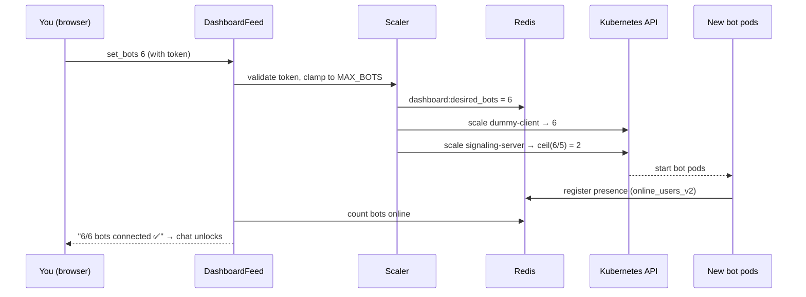
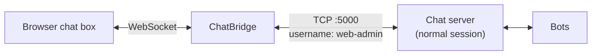
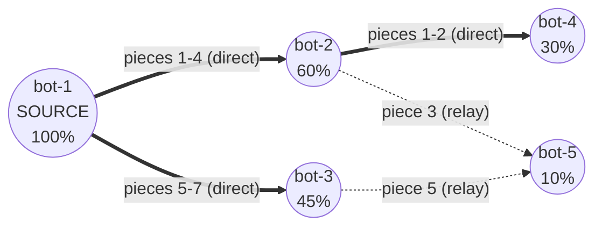
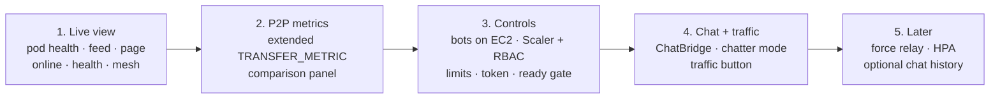

# Aperture Dashboard Plan

Status: **Planned, not started.**

A single live page that lets you **scale the system with buttons**, **watch it react**, **chat with the bots to generate traffic**, and **compare direct vs relay P2P transfers**.

---

## Decisions

| Question | Decision |
|---|---|
| Where do scalable bots run? | **EC2**, in the same k3s cluster as the servers |
| How do server pods scale? | **Simple rule first:** server pods = ceil(bots / BOTS_PER_POD). Real autoscaling (HPA) later |
| Existing `mesh.html` | **Kept as is.** The dashboard is a new page (`dashboard.html`) |
| Chat history | **Not stored.** Metrics come from Prometheus counters; the chat window shows messages since the page was opened |

---

## Goals

1. **Control:** buttons to set the number of bots and the traffic level; server pods follow automatically.
2. **Observe:** who's online, server health per pod, live transfers (mesh), message rate.
3. **Compare P2P paths:** direct vs relay: count, success rate, speed, connection setup time.
4. **Interact:** once all bots are connected, an admin chat window opens in the browser.
5. **Stay truthful:** show data age, show "unknown" instead of fake zeros, never rely on deltas alone (README goal 2).

---

## Layout

---

## Architecture

Everything the dashboard shows lives in **Redis** or arrives via **SNS**, so **any server pod can serve the full picture**. The browser doesn't care which pod it hits.

---

## Scaling flow

---

## Components

### 1. Pod health (new)

- Each server pod writes `pod:<instanceId>` to Redis every **5s** with a **15s expiry**: local sessions, uptime, messages/min, error count, Redis OK.
- A crashed pod's card **disappears within ~15s**. Same idea as user presence (75s expiry, Part A of reconnect step 4).

### 2. DashboardFeed (new, WebSocket)

- On connect: sends a **full snapshot** (pods, online users, desired bots, mesh state, P2P stats).
- Then pushes updates every **2s**, plus mesh events as they happen.
- Receives control commands from the page: `set_bots`, `set_traffic`, `set_force_relay`.
- Lives next to the existing `MeshEventServer`. Existing mesh messages are unchanged, so `mesh.html` keeps working.

### 3. Serving the page (new)

- A small HTTP endpoint on the server pods serves `dashboard.html`.
- Exposed through a k3s Service NodePort (e.g. one port for the page plus the WebSockets).

### 4. Scaler (new)

- `set_bots N` →
  1. clamp N to `0..MAX_BOTS`
  2. write `dashboard:desired_bots = N` to Redis
  3. scale `dummy-client` to N
  4. scale `signaling-server` to `clamp(ceil(N / BOTS_PER_POD), MIN_PODS, MAX_PODS)`
- Talks to the Kubernetes API from inside the cluster, using the pod's **ServiceAccount token** (`PATCH …/deployments/<name>/scale`).
- Needs a **Role + RoleBinding** that allows only `get` / `patch` on `deployments/scale` for those two deployments.
- Proposed defaults: `BOTS_PER_POD = 5`, `MIN_PODS = 1`, `MAX_PODS = 3`, `MAX_BOTS = 10` (to be adjusted after checking EC2 memory).

**Behavior to show honestly on the dashboard:**

- **New server pods start empty.** Existing bot connections stay where they are; only new connections go to new pods.
- **Scaling down kills server pods.** Their bots reconnect elsewhere, which exercises the reconnect plan live.
- **Scaling down bots kills bot pods.** Their presence expires and a LEAVE is announced (or expires after 75s).

### 5. "All bots connected" gate

- Ready when `bots in online_users_v2 == dashboard:desired_bots`.
- The chat window unlocks only then, with a "6/6 bots connected" indicator.

### 6. ChatBridge (new, WebSocket)

- The browser can't open raw TCP, so the bridge opens a normal chat connection to `:5000` **on behalf of the browser** (username e.g. `web-admin`).
- **All existing session logic is reused unchanged:** ownership, PING/PONG, expiry, online list.
- Web admin can chat and send `!chat` / `!send` commands. It can't send files itself (no `peer-app`).

### 7. Bot chatter mode (client change)

- Bots reply to messages and post random lines at a configurable rate.
- Traffic level `off / low / high` is broadcast as a chat command (e.g. `!traffic low`), which bots already know how to receive.
- Generates real message traffic for the metrics.

### 8. P2P metrics (client + server change)

The client already knows each transfer's path, size and timing. It adds them to the existing `TRANSFER_METRIC` line:

| Field | Why |
|---|---|
| path: `direct` / `relay` / `relay→direct` | Core comparison; Iroh can upgrade relay to direct mid-transfer |
| bytes, duration_ms → **MB/s** | Is direct actually faster? |
| setup_ms | How long hole-punching takes vs relay |
| result + reason | Reliability per path |
| sender → receiver | Spot pairs that never go direct |

The server records them as Prometheus counters/histograms (Grafana keeps history) and keeps a rolling window for the live comparison panel.

### 9. Force relay (peer-app change, to investigate)

- Bots on the same EC2 node will almost always connect **directly**, so relay would barely appear.
- A **force-relay** switch makes transfers use the relay path on purpose, giving a fair side-by-side comparison.
- Requires a `peer-app` option to disable direct paths (Iroh supports relay-only operation; exact API to be checked).

---
## Future: swarm distribution on the mesh

Depends on: `docs/future-plans/swarm-distribution-plan.md` (pieces, who-has-what, scheduler). **Not buildable until the swarm exists.** The dashboard is designed now so swarm events plug in later without a redesign.

### What it shows

| Visual | Meaning |
|---|---|
| Flash along an edge per piece | A piece moved between two peers |
| Node fill / ring | % of the file that peer holds |
| Highlighted source | Original sender; should stop being the bottleneck |
| Piece availability bar | One cell per piece, darker = more copies; rarest-first in action |
| **Upload share** | % of bytes sent by the source vs by other peers (key swarm metric) |
| Completion timeline | When each peer finished; compare against one-to-one |
| Edge color | Direct (green) vs relay (orange), same as one-to-one transfers |

### Events

| Event | Fields |
|---|---|
| `SWARM_START` | jobId, file, size, pieceCount, source |
| `PIECE_DONE` | jobId, piece, from, to, bytes, path, ms |
| `PEER_PROGRESS` | jobId, peer, piecesHeld |
| `SWARM_DONE` | jobId, per-peer finish times |

- The feed **batches piece events about once per second**; the page animates from each batch. One message per piece would flood the browser.
- **Design rule from phase 1:** all transfer events carry optional `jobId` and `piece` fields, empty for one-to-one transfers, so swarm events reuse the same feed and mesh.

### Swarm vs one-to-one comparison (demo)

Send the same file to N bots twice — once one-to-one, once as a swarm — and compare:

- total time until every bot has the file
- source upload bytes (one-to-one: N × file size; swarm: much less)
- upload share across peers

---

## Truthfulness rules

- **Snapshot on connect**, then updates. Never rely only on deltas.
- **Show age:** "pod-a seen 3s ago", "bot-x seen 12s ago".
- **Expiry, not guesses:** pods disappear after 15s without health updates; users after 75s without heartbeats.
- **"unknown", not 0,** when Redis or a pod can't be reached.
- **Dashboard disconnect banner:** "Disconnected — data may be stale", with automatic reconnect and a fresh snapshot.
- **Label forced-relay transfers** so they're never mixed into natural direct/relay stats.

---

## Security

- The buttons scale real pods on a public IP. **Protect the page:** a token or password checked by DashboardFeed for control commands (read-only view can stay open, or also be protected).
- RBAC limits the server to scaling **only** the two deployments.
- Hard maximums (`MAX_BOTS`, `MAX_PODS`) so no button can overload EC2.

---

## Build phases

| Phase | Done when |
|---|---|
| **1. Live view** | Page shows pods, users and transfers live; a pod crash removes its card in ~15s |
| **2. P2P metrics** | Direct vs relay numbers update after each transfer |
| **3. Controls** | `+` / `−` changes bot and server pod counts; ready indicator works |
| **4. Chat + traffic** | Chat unlocks when ready; message rate rises with traffic level |
| **5. Later** | Force relay, HPA autoscaling, optional chat history (capped Redis list) |

---

## Test plan

| Test | Pass condition |
|---|---|
| Open dashboard | Snapshot shows correct pods, users and recent transfers |
| Bots 2 → 6 | `dummy-client` = 6, `signaling-server` = 2; ready shows 6/6; chat unlocks |
| Bots 6 → 2 | Bot pods removed; their users disappear; server pods scale down; displaced bots reconnect |
| Kill a server pod | Its card disappears in ~15s; its users reconnect or expire |
| Traffic off → high | msgs/min rises; Prometheus counter agrees |
| `!send all all small` | Mesh shows transfers; P2P panel updates |
| Force relay on (phase 5) | New transfers labelled relay; comparison shows the difference |
| Dashboard network drop | Banner shows; reconnects with a fresh snapshot |
| Bad / missing token | Control commands rejected; view still works (if read-only is open) |
| Max limits | `+` stops at `MAX_BOTS`; server pods never exceed `MAX_PODS` |

---

## Open questions

- EC2 instance size and memory: sets realistic `MAX_BOTS` / `MAX_PODS` (each bot = JVM + `peer-app`; each server pod = JVM). JVM memory limits (`-Xmx`) should be set in the manifests.
- One NodePort for page + both WebSockets, or separate ports?
- Read-only view public, or everything behind the token?
- Force relay: exact Iroh / `peer-app` option.

## Relationship to other documents

- Builds on the Chat Reconnect Redesign: presence expiry (`online_users_v2`, 75s) and the online list (step 5).
- Scaling down exercises the reconnect plan live.
- Extends the existing mesh (`mesh.html`, `MeshEventServer`) without changing it.
- Grafana stays the place for **history**; this dashboard is for **now**.
