# DevOps Roadmap

Status: **Planned, not started.** A step-by-step plan for running Aperture the way a small production service would be run: automated builds and deploys, infrastructure as code, packaged releases, monitoring with alerts, and documented recovery.

---

## Why

Aperture already runs on real infrastructure (k3s on EC2, Docker Hub, Redis, SNS/SQS, Prometheus/Grafana), but almost everything around it is done **by hand**. Building it taught me a lot of the problems DevOps tools exist to solve, because I hit each one manually first.

This roadmap turns those manual steps into automated, repeatable ones, one phase at a time. Each phase starts from a problem I've actually run into.

---

## Where things stand today

| Area | Today | Problem it caused |
|---|---|---|
| Builds | `mvn package` and `docker build` on my laptop | Easy to deploy something that doesn't match the repo; GitHub code drifted behind the docs |
| Image tags | Everything is `:latest` | Pods kept running the old image (`IfNotPresent` + cached `:latest`); needed `crictl rmi` and manual pod deletes |
| Deploys | `kubectl delete pods` by hand | Slow, error-prone, no history, no rollback |
| Infrastructure | EC2, security groups, ports set up in the AWS console | Public IP changed after a restart and broke every client; firewall rules forgotten (ports 6001–6002) |
| Kubernetes manifests | Hand-edited YAML | Server IP hard-coded in the bot manifest |
| Resources | No requests/limits, no health probes | Nothing stops a JVM from using all of EC2's memory; k8s can't tell if a pod is healthy |
| AWS credentials | Access keys in a Kubernetes secret | Long-lived keys; better handled by an IAM role |
| Monitoring | Metrics and Grafana, but no alerts | I only noticed failures by watching logs |
| Logs | `kubectl logs` | A deleted or crashed pod takes its logs with it |
| Recovery | Knowledge in my head and chat history | No written steps for "pod crashed", "Redis down", "stale image" |

---

## Phases

```mermaid
flowchart LR
    P0["0. Basics<br/>limits · probes<br/>Elastic IP · namespace"] --> P1["1. CI<br/>build + test<br/>on every push"]
    P1 --> P2["2. CD<br/>SHA-tagged images<br/>automated deploy"]
    P2 --> P3["3. Terraform<br/>EC2 · SG · EIP<br/>SNS/SQS · IAM"]
    P3 --> P4["4. Helm<br/>one chart for<br/>server · bots · Redis"]
    P4 --> P5["5. Observability<br/>alerts · dashboards as code<br/>central logs"]
    P5 --> P6["6. Reliability<br/>HPA · graceful shutdown<br/>chaos tests"]
    P6 --> P7["7. Security<br/>image scanning · non-root<br/>secrets · network policies"]
    P7 --> P8["8. Runbooks<br/>written recovery steps"]
```

Phases 0–3 matter most. Later phases are worth doing, but each one stands on its own.

---

### Phase 0 — Basics

**Fixes:** no limits or probes, changing public IP, everything in the `default` namespace.

- Add **resource requests and limits** to the server, bot and Redis manifests, and set JVM memory (`-Xmx`) to fit inside them.
- Add **readiness and liveness probes**:
  - server: TCP check on 5000, or HTTP check on the metrics port (9090)
  - Redis: `redis-cli ping`
- Attach an **Elastic IP** to the EC2 instance.
- Bots connect to the server through **cluster DNS** (`signaling-server:5000`) when they run in the same cluster, not through the public IP.
- Move everything into its own **namespace** (e.g. `aperture`).

**Done when:** pods show resource limits in `kubectl describe`; a hung server pod is restarted by its liveness probe; restarting EC2 doesn't change the server address.

---

### Phase 1 — Continuous Integration

**Fixes:** builds only on my laptop; repo and running code drifting apart.

- GitHub Actions workflow on every push and pull request:
  - `mvn package` (compile and run tests)
  - `cargo build` for `peer-app`
- Add a first set of **unit tests**, e.g. message parsing, and the Redis registry scripts against a Redis service container.
- Build-status badge in the README.

**Done when:** every push shows a green or red check in GitHub; a broken build can't go unnoticed.

---

### Phase 2 — Continuous Delivery

**Fixes:** `:latest` confusion, manual image pushes, manual pod deletes, no rollback.

Detailed in [`CI-CD_plan.md`](CI-CD_plan.md) (separate server and client builds, path filtering, SHA tags). Summary:

- Build and push images **tagged with the git commit SHA** (plus `:latest` for convenience).
- Deploy by **changing the image tag** in the manifests, so Kubernetes rolls out new pods by itself. No more `crictl rmi` or `kubectl delete pods`.
- **Rollback** = deploy the previous SHA.

Two ways to deploy, to decide:

| Option | How | Trade-off |
|---|---|---|
| **Push-based** | GitHub Actions runs `kubectl` / `helm upgrade` against the cluster | Simple, but the cluster's credentials must be stored in GitHub |
| **Pull-based (GitOps)** | Argo CD or Flux runs in the cluster and applies whatever the repo says | No cluster credentials leave the machine; deploy history is the git history |

**Done when:** pushing to `main` results in new pods running the new commit, with no manual steps; rolling back takes one command or one revert.

---

### Phase 3 — Infrastructure as Code (Terraform)

**Fixes:** console click-ops, forgotten firewall rules, IP changes, long-lived AWS keys.

- Terraform for:
  - EC2 instance (with k3s installed through user-data or a script)
  - security group rules (SSH, NodePorts, metrics)
  - Elastic IP
  - SNS topic and SQS queues
  - **IAM role / instance profile** so pods use temporary credentials instead of stored access keys
- Remote state (e.g. S3 bucket), and `terraform plan` run in CI.

**Done when:** the whole environment can be destroyed and recreated with `terraform apply`, and no AWS access keys are stored in Kubernetes.

---

### Phase 4 — Packaging (Helm)

**Fixes:** hand-edited YAML, hard-coded values.

- One Helm chart with server, bots and Redis.
- Values for replicas, image tags, resource limits, server address, bot settings.
- Separate values files if a second environment is ever added.

**Done when:** `helm install aperture ./chart` brings up the whole system, and a change is a values edit plus `helm upgrade`.

---

### Phase 5 — Observability

**Fixes:** no alerts, logs lost when pods die, dashboards built by hand.

- **Alert rules** (Prometheus + Alertmanager), sent to email, Slack or Discord. For example:
  - a server pod is down
  - online users dropped to 0
  - transfer failure rate above a threshold
  - frequent session timeouts (`read timeout` / `superseded`)
- **New metrics** from the reconnect work: session end reasons, takeovers, presence re-registrations.
- **Grafana dashboards saved as code** (JSON in the repo, loaded automatically).
- **Central logs** with Loki (or similar), so logs survive pod deletion and can be searched across pods.

**Done when:** killing a server pod triggers an alert within a minute; logs from a deleted pod are still searchable.

---

### Phase 6 — Reliability and scaling

**Fixes:** abrupt pod shutdowns, manual scaling, untested failure modes.

- **Graceful shutdown:** on `SIGTERM`, the server stops accepting connections and closes sessions cleanly, so rolling updates don't look like crashes.
- **Rolling update settings** and a **PodDisruptionBudget** so at least one server pod is always up.
- **HPA autoscaling** for server pods (ties into the dashboard plan).
- **Chaos tests**, scripted and repeatable: kill a server pod, kill Redis, cut network. One has already been done by hand (force-deleting a pod; stale presence cleared in ~75 s).

**Done when:** a deploy causes no "left the chat" storms; scaling happens without manual commands; chaos tests run from a script with expected results written down.

---

### Phase 7 — Security

**Fixes:** default container settings, unscanned images, open ports.

- **Image scanning** (e.g. Trivy) in CI; fail the build on critical vulnerabilities.
- Containers run as **non-root**, with read-only filesystems where possible.
- **Kubernetes NetworkPolicies:** only the server talks to Redis.
- Secrets handled properly (no credentials in YAML; IAM roles from phase 3).
- Authentication on the dashboard's control buttons (see the dashboard plan).

**Done when:** CI blocks images with critical vulnerabilities; Redis is unreachable from bot pods.

---

### Phase 8 — Runbooks

**Fixes:** recovery steps that only live in my memory and chat history.

Short, step-by-step guides in `docs/runbooks/`:

- a server pod crashed or won't start
- Redis is down or was restarted
- a deploy is running the wrong (stale) image
- clients can't connect (security group, IP, port-forward checks)
- how to roll back a deploy

Each one: symptoms → commands to check → fix → how to confirm it's fixed.

**Done when:** someone else could recover the system using only the runbooks.

---

## What each phase is worth in interviews

| Phase | Skill it shows |
|---|---|
| 0 | Kubernetes fundamentals: limits, probes, namespaces |
| 1–2 | CI/CD, versioned releases, rollbacks, GitOps |
| 3 | Terraform, AWS IAM, reproducible environments |
| 4 | Helm packaging |
| 5 | Monitoring, alerting, log aggregation |
| 6 | Reliability engineering, autoscaling, chaos testing |
| 7 | DevSecOps basics |
| 8 | Operational documentation |

---

## Decisions to make

- Push-based deploy from GitHub Actions, or GitOps with Argo CD / Flux?
- Keep everything on one EC2 instance, or split server and bots across instances?
- Where alerts go: email, Slack or Discord?
- How much to spend: keep EC2 small (and set low limits), or size up for scaling tests?

## Out of scope

- Multiple environments (staging/production) — maybe later
- Managed Kubernetes (EKS) — k3s is enough to learn the same concepts at lower cost
- Jenkins — reasoned through in `CI-CD_plan.md`; not needed while code and CI both live on GitHub

## Relationship to other documents

- **`CI-CD_plan.md`** — detailed design for phase 2.
- **Dashboard plan** — scaling buttons, HPA and auth overlap with phases 6 and 7.
- **Chat Reconnect Redesign** (`docs/fixes/chat-reconnect/`) — source of the new metrics and the first chaos test.
- **`docs/problems/`** — real incidents that become runbooks in phase 8.
