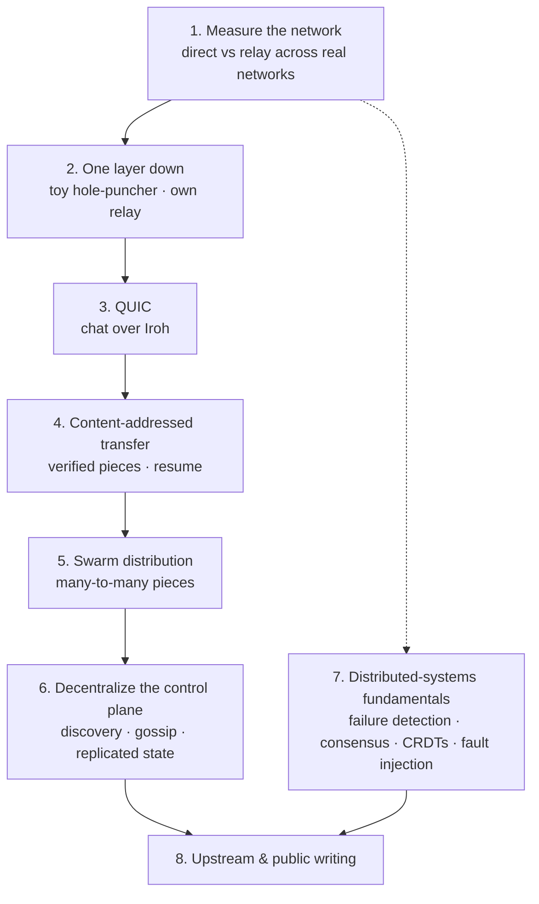

# Networking & Distributed Systems Roadmap

Status: **Planned, not started.** A long-term learning path for Aperture, focused on peer-to-peer networking and distributed systems: understanding the layers Iroh provides, measuring how P2P really behaves, and replacing central parts of Aperture with decentralized ones, one step at a time.

---

## Why

Today Aperture uses [Iroh](https://iroh.computer) mostly as a black box: call it, and a connection appears (direct or relayed). The control plane (Java server, Redis, SNS/SQS) is fully central.

This roadmap is about going deeper:

- **Measure** how P2P behaves on real networks, instead of assuming.
- **Understand** each layer by building a small version of it, then comparing it to Iroh.
- **Decentralize** Aperture piece by piece, and write down what each step costs.

It complements the [DevOps roadmap](devops-roadmap.md): that one makes the system easier to run; this one makes it more interesting to run.

---

## Principles

- **Measure before claiming.** Every stage produces numbers, not just features.
- **Build a toy version first.** Understand a mechanism by implementing a minimal one, then read how Iroh does it.
- **One central piece at a time.** Replace, measure, document the trade-off, then move on.
- **Write it down.** Each stage ends with a write-up in `docs/` (and optionally a blog post).

---

## Stages

Stage 7 runs alongside the others. It's study and experiments rather than a single build step.

---

### Stage 1 — Measure the network

**Question:** how often does a direct connection actually work, and what does relay cost?

- For every transfer, record:
  - path: direct / relay / relay → direct (upgraded)
  - time to establish the connection
  - throughput (MB/s) and duration
  - success / failure and reason
  - which network each peer was on
- Test across genuinely different networks: home WiFi, phone hotspot (often CGNAT), cloud (EC2), other people's networks, university/office WiFi.
- Classify NAT behavior where possible.

Builds on the P2P metrics in the dashboard plan (phase 2).

**Done when:** a write-up with real numbers, e.g. "across N network pairs, direct succeeded X% of the time; relay was Y× slower; hole punching took Z s on average; it failed mostly when…"

---

### Stage 2 — One layer down

**Question:** what is Iroh actually doing to get two peers connected?

- Build a **toy hole-puncher** in Rust:
  - a tiny rendezvous server that tells each peer the other's public address (STUN-like)
  - both peers send UDP packets to each other at the same time
  - record when it works and when it doesn't
- Read how Iroh does it (address discovery, its relay protocol, how it switches from relay to direct) and compare with the toy.
- **Run my own relay** — see [`self-hosted-relay-plan.md`](self-hosted-relay-plan.md).
- Watch real traffic with Wireshark / tcpdump (QUIC handshakes, relay traffic).

**Done when:** the toy hole-puncher connects two peers on different networks at least sometimes, with a write-up of why it fails when it does; Aperture runs against my own relay.

---

### Stage 3 — QUIC: chat over Iroh

**Question:** what does QUIC solve that my TCP chat had to solve by hand?

- Move the chat channel from plain TCP to QUIC streams over Iroh.
- Explore **connection migration**: a connection surviving an IP change (the exact problem the WiFi tests kept hitting).
- Compare with the TCP reconnect machinery (heartbeats, timeouts, zombie sessions): what QUIC handles for free, what still needs application logic.

**Done when:** chat works over Iroh; a write-up compares TCP + reconnect logic vs QUIC behavior under the same WiFi-drop tests.

---

### Stage 4 — Content-addressed, verifiable transfer

**Question:** how do you transfer data you can verify piece by piece and resume?

- Identify files by their **hash**, split into pieces that are verified as they arrive (e.g. `iroh-blobs`, BLAKE3 verified streaming).
- **Resumable transfers** — see [`transfer-resume-plan.md`](transfer-resume-plan.md).

**Done when:** an interrupted transfer resumes from where it stopped; a corrupted piece is detected and re-fetched.

---

### Stage 5 — Swarm distribution

**Question:** how much does many-to-many sharing help over one-to-one?

- Pieces, "who has what", rarest-first scheduling, receivers becoming senders.
- Shown live on the dashboard's mesh (see the dashboard plan's swarm section).
- Full design: [`swarm-distribution-plan.md`](swarm-distribution-plan.md).

**Done when:** a comparison of the same file to N peers, one-to-one vs swarm: total time, source upload bytes, upload spread across peers.

---

### Stage 6 — Decentralize the control plane

**Question:** how decentralized can Aperture get, and what does each step cost?

Replace one central piece at a time:

| Central today | Decentralized replacement | Concepts |
|---|---|---|
| Server introduces peers | DHT or DNS-based discovery — see [`dht-future-plan.md`](dht-future-plan.md) | Routing, lookups, churn |
| Chat broadcast via server + SNS/SQS | Gossip between peers (e.g. `iroh-gossip`) | Epidemic broadcast, overlay networks |
| Presence and state in Redis | Replicated documents (e.g. `iroh-docs`) or CRDTs | Eventual consistency, sync, conflicts |

After each replacement, document:

- what got simpler
- what got harder (consistency, spam/abuse, partitions, debugging, observability)
- what still needed a central piece, and why

**Done when:** at least one central component runs fully peer-to-peer, with a write-up of the trade-offs measured.

---

### Stage 7 — Distributed-systems fundamentals, applied

Runs alongside the other stages.

- **Failure detection:** the reconnect work uses fixed timeouts (45 s client, 60 s server). Study adaptive detectors (e.g. phi-accrual) and compare false positives on a flaky network.
- **Consensus:** implement Raft once (e.g. the MIT 6.5840 labs), then identify where Aperture would actually need it — and where it wouldn't.
- **CRDTs:** chat history that merges correctly across peers with no server.
- **Fault injection:** simulate partitions, delays and packet loss deterministically, instead of toggling WiFi by hand.

**Done when:** each topic has a short learning note in `docs/learning-notes/`, plus at least one experiment run against Aperture.

---

### Stage 8 — Upstream and public writing

- Contribute to Iroh: start with docs, examples and issue reproductions, then fixes.
- Turn the best findings (NAT measurements, reconnect design, TCP vs QUIC comparison) into blog posts.

---

## Supporting skills

| Skill | Why |
|---|---|
| Rust | The language of this space (Iroh, quinn, most new networking infrastructure) |
| Packet-level debugging | Wireshark / tcpdump to see what's really on the wire |
| Reading specs | QUIC (RFC 9000), STUN (RFC 5389), ICE (RFC 8445) |

## Reading list

- *Designing Data-Intensive Applications* — Martin Kleppmann
- Tailscale, "How NAT traversal works"
- Iroh documentation, protocol pages and the n0 blog
- MIT 6.5840 (Distributed Systems) lectures and labs

---

## Relationship to other documents

- **Dashboard plan** — provides the P2P metrics for stage 1 and the mesh view for stage 5.
- **DevOps roadmap** — keeps the infrastructure running so time goes into these stages.
- **Session resumption plan** — superseded in part by stage 3 if chat moves to QUIC.
- Existing future plans linked per stage: self-hosted relay, transfer resume, swarm distribution, DHT.
- **Chat Reconnect Redesign** (`docs/fixes/chat-reconnect/`) — the baseline for stage 3's TCP vs QUIC comparison and stage 7's failure-detection study.
