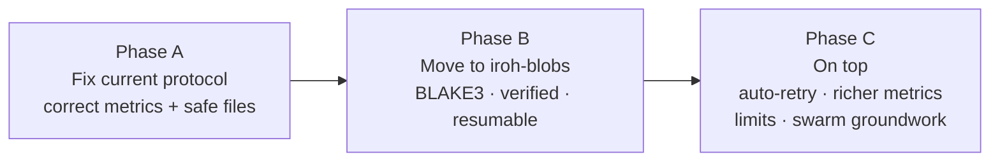
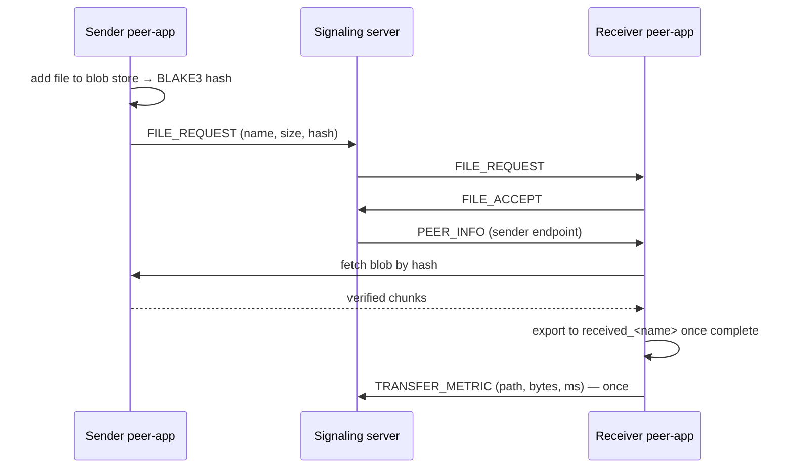

# File Transfer Improvement Plan

Status: **Planned, starting with Phase A.**

Fix the bugs in the current transfer protocol, then move to `iroh-blobs` for content-addressed, verified, resumable transfers. Bugs referenced by number are in [`docs/problems/file-transfer-bugs.md`](../problems/file-transfer-bugs.md).

---

## Phases

---

## Phase A — Fix the current protocol

Small changes, same overall design. Goal: **correct numbers and safe files** before any measurement or dashboard work.

| Change | Fixes |
|---|---|
| Receiver replies `OK` or `FAIL\|reason` instead of a bare `ACK`; sender reports `TRANSFER_FAILED` on `FAIL`, on any error, or on no reply | 1, 4 |
| **Only the receiver reports the final result** (path or failure), exactly once | 2, 3 |
| Sender-side errors emitted as `EVENT:TRANSFER_FAILED:<id>:<reason>` | 4 |
| Partial and final file names include the transfer ID (e.g. `received_<id>_<name>`) | 5 |
| `flush()` + `sync_all()` before rename | 6 |
| Hash (BLAKE3 or SHA-256) in the header, checked before rename; mismatch = failure | 7 |
| Keep only the base name of the filename; reject separators and control characters | 8 |
| Dial by endpoint ID (relay URL only as a hint), letting Iroh's discovery find current addresses | 10 |
| Progress output throttled (every ~250 ms or 1%) | 11 |
| Header length limit | 12 |

**Files:** `peer-app/src/main.rs`, `Client.java` (handle the new failure event; stop sending metrics from the sender side), `MetricsSubscriber.java` (if needed).

**Done when:**

- one transfer increments the direct/relay counter by exactly 1
- a failed transfer shows as failed on the mesh and is never counted as direct/relay
- `!send all all medium` with 3+ bots → every received file's hash matches the original
- a sender to an unreachable peer shows a failure on the mesh

---

## Phase B — Move to `iroh-blobs`

### Why

| `iroh-blobs` provides | Replaces / fixes |
|---|---|
| Files identified by BLAKE3 hash (content addressing) | `META\|name\|size` header |
| Verified streaming: each chunk checked on arrival | size-only check (7) |
| Resume and range requests | all-or-nothing transfers (13) |
| A blob store with safe writes | hand-written `.partial` + rename (5, 6) |
| Receiver **fetches** from a provider | sender pushes to anyone (9, 12) |
| Fetching ranges from several providers | groundwork for swarm |

Background: [`docs/learning-notes/BLAKE3-hashing.md`](../learning-notes/BLAKE3-hashing.md)

### New flow: share, then fetch

### Steps

1. **Spike:** find the `iroh-blobs` version that works with `iroh 1.0.x` (the API changed significantly around 0.90 — check before writing code). Run its basic provide/fetch example between two bots.
2. **New `peer-app` commands:** `share <file>` → prints the hash; `fetch <hash> <endpoint> <transferId> <name>`.
3. **Protocol change:** `FILE_REQUEST` carries the hash; the receiver starts the fetch after `PEER_INFO`.
4. **Events:** keep the existing `EVENT:PROGRESS` / `CONNECTION_PATH` / `TRANSFER_PATH` / `TRANSFER_FAILED` lines, emitted from the fetch side, so the mesh keeps working.
5. **Resume test:** cut the network mid-transfer, fetch again, confirm it continues from the verified chunks.

**Done when:** transfers run on `iroh-blobs`; a corrupted chunk is rejected; an interrupted transfer resumes instead of restarting.

---

## Phase C — On top

- **Auto-retry with resume** — see [`transfer-resume-plan.md`](transfer-resume-plan.md)
- **Richer metrics** for the dashboard: bytes, duration, setup time, relay→direct upgrades
- **Limits:** max parallel transfers, max file size
- **Swarm groundwork:** fetch ranges of one blob from several providers — see [`swarm-distribution-plan.md`](swarm-distribution-plan.md)

---

## Test plan

| Test | Phase | Pass |
|---|---|---|
| One transfer | A | Counter +1 exactly; mesh shows complete |
| Unreachable receiver | A | Mesh shows failed; no direct/relay count |
| Stalled transfer (network cut 40+ s) | A | Both sides report failure; sender doesn't print `FILE_SENT` |
| `!send all all medium`, 3+ bots | A | All received files' hashes match |
| Malicious filename (`../x`) | A | Saved as a safe base name |
| 1 GB file | A | Progress output stays light; transfer completes |
| Resume after network cut | B | Continues from verified chunks |
| Corrupted chunk | B | Rejected and re-fetched |

---

## Relationship to other documents

- Bugs: `docs/problems/file-transfer-bugs.md`
- Resume: `docs/future-plans/transfer-resume-plan.md`
- Swarm: `docs/future-plans/swarm-distribution-plan.md`
- Networking roadmap: stages 4–5 (`Distributed_systems-Networking-roadmap.md`)
- Dashboard: P2P metrics depend on Phase A's correct counts (`Aperture-Dashboard.md`)
