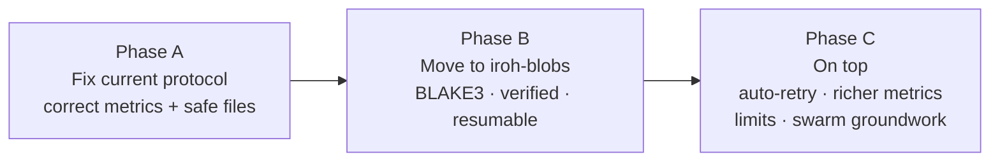
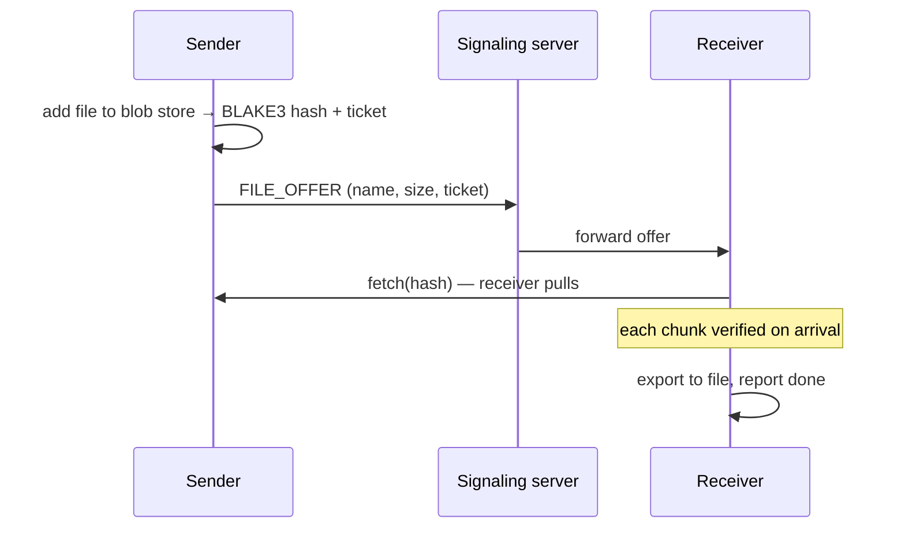

# File Transfer Improvement Plan

Status: **Planned, starting with Phase A.**

Fix the bugs in the current transfer protocol, then move to `iroh-blobs` for content-addressed, verified, resumable transfers. Bugs referenced by number are in [`docs/problems/file-transfer-bugs.md`](../problems/file-transfer-bugs.md).

---

## Phases

---

## Phase A — Fix the current protocol

Small changes, same overall design. Goal: **correct numbers and safe files** before any measurement or dashboard work.

| Change | Fixes |
|---|---|
| Receiver replies `OK` or `FAIL\|reason` instead of a bare `ACK`; sender reports `TRANSFER_FAILED` on `FAIL`, on any error, or on no reply | 1, 4 |
| **Only the receiver reports the final result** (path or failure), exactly once | 2, 3 |
| Sender-side errors emitted as `EVENT:TRANSFER_FAILED:<id>:<reason>` | 4 |
| Partial and final file names include the transfer ID (e.g. `received_<id>_<name>`) | 5 |
| `flush()` + `sync_all()` before rename | 6 |
| Hash (BLAKE3 or SHA-256) in the header, checked before rename; mismatch = failure | 7 |
| Keep only the base name of the filename; reject separators and control characters | 8 |
| Dial by endpoint ID (relay URL only as a hint), letting Iroh's discovery find current addresses | 10 |
| Progress output throttled (every ~250 ms or 1%) | 11 |
| Header length limit | 12 |

**Files:** `peer-app/src/main.rs`, `Client.java` (handle the new failure event; stop sending metrics from the sender side), `MetricsSubscriber.java` (if needed).

**Done when:**

- one transfer increments the direct/relay counter by exactly 1
- a failed transfer shows as failed on the mesh and is never counted as direct/relay
- `!send all all medium` with 3+ bots → every received file's hash matches the original
- a sender to an unreachable peer shows a failure on the mesh

**Status:** Phase A ✅ done (evidence: `docs/problems/evidence/`) · Phase B ⏳ planned · Phase C ⏳ later

---

## Phase B: iroh-blobs ("share, then fetch")

Status: **planned** — starts after Phase A is merged.

### Why

Phase A made the current protocol honest and safe, but some limits stay:

| Limit today (Phase A) | With iroh-blobs |
|---|---|
| Hash checked only at the end | Verified chunk by chunk as data arrives (BLAKE3 tree) |
| Connection drop = start again from 0% | Resume from the last verified chunk |
| Sender pushes — anyone can push to you (bug 9) | Receiver fetches — nothing arrives unless asked for |
| Same file sent twice = sent twice | Content-addressed: one hash, stored once |
| Only the sender can serve the file | Any peer that has it can serve it (start of swarming) |
| Our own protocol to maintain | n0's tested library |

### New flow

### Steps

| # | Step | Done when |
|---|---|---|
| B0 | **Persistent identity + `Router`**: save the endpoint secret key to a file (ID survives restarts); serve our ALPN and blobs through one `Router` | Same endpoint ID after restart; old transfers still work |
| B1 | **Spike**: small separate program — add file, print ticket, fetch from another process, kill mid-fetch and resume | Resume works; notes on the current iroh-blobs API written down |
| B2 | **peer-app commands**: `share <id> <path>` → `EVENT:SHARED:<id>:<ticket>`; `fetch <id> <ticket> <name>` → progress / `FILE_RECEIVED` / `TRANSFER_FAILED` | Script drives share + fetch between two peers |
| B3 | **Java**: offer carries the ticket; receiver starts the fetch on accept | Admin ↔ bot transfer via blobs, hash matches |
| B4 | **Test script**: resume test (kill connection mid-transfer, fetch continues), plus Phase A checks (1, 3, 5, 7, 8) on the new path | All pass |
| B5 | **Cleanup**: keep the old protocol for one release, then remove it | Only blobs path left |

### Open questions (answer during B1)

- Store: in-memory or on-disk blob store? (disk needed for resume after restart)
- Where do fetched files go — keep `received_<id>_<name>` naming?
- Progress events: what does iroh-blobs expose, and how to throttle them like A4?
- Who serves the blob after the sender goes offline (later: other peers)?

### After Phase B

- **Mesh v2** (`docs/future-plans/mesh-v2-transfer-events.md`) — designed after B,
  because B changes the flow to "receiver fetches".
- **Phase C**: retry with backoff, limits (max size, concurrent transfers), better metrics, gossip experiments.

---

## Phase C — On top

- **Auto-retry with resume** — see [`transfer-resume-plan.md`](transfer-resume-plan.md)
- **Richer metrics** for the dashboard: bytes, duration, setup time, relay→direct upgrades
- **Limits:** max parallel transfers, max file size
- **Swarm groundwork:** fetch ranges of one blob from several providers — see [`swarm-distribution-plan.md`](swarm-distribution-plan.md)

---

## Test plan

| Test | Phase | Pass |
|---|---|---|
| One transfer | A | Counter +1 exactly; mesh shows complete |
| Unreachable receiver | A | Mesh shows failed; no direct/relay count |
| Stalled transfer (network cut 40+ s) | A | Both sides report failure; sender doesn't print `FILE_SENT` |
| `!send all all medium`, 3+ bots | A | All received files' hashes match |
| Malicious filename (`../x`) | A | Saved as a safe base name |
| 1 GB file | A | Progress output stays light; transfer completes |
| Resume after network cut | B | Continues from verified chunks |
| Corrupted chunk | B | Rejected and re-fetched |

---

## Relationship to other documents

- Bugs: `docs/problems/file-transfer-bugs.md`
- Resume: `docs/future-plans/transfer-resume-plan.md`
- Swarm: `docs/future-plans/swarm-distribution-plan.md`
- Networking roadmap: stages 4–5 (`Distributed_systems-Networking-roadmap.md`)
- Dashboard: P2P metrics depend on Phase A's correct counts (`Aperture-Dashboard.md`)
