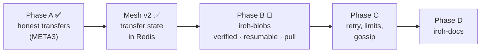
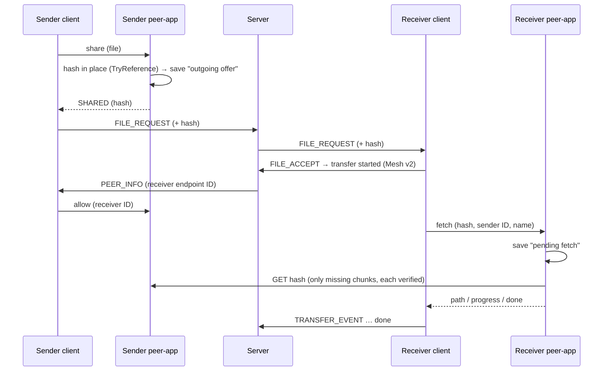

# File Transfer Improvement Plan

Status: **Phase A ✅ done · Mesh v2 ✅ done · Phase B 🔄 B1 spike done, B0 next.**

Fix the bugs in the current transfer protocol, then move to `iroh-blobs` for content-addressed, verified, resumable transfers. Bugs referenced by number are in [`docs/problems/File-transfer-bugs.md`](../problems/File-transfer-bugs.md).

---

## Phases

---

## Phase A: Fix the current protocol ✅

Done in October 2026 (PR #2). One result per transfer (`OK` / `FAIL`), safe saving, BLAKE3 check, throttled progress, stop if the file changes, relay hint optional.

- Protocol details: [peer-app protocol](../peer-app-protocol.md)
- Evidence: [`docs/problems/evidence/`](../problems/evidence/)

What Phase A could **not** fix, and Phase B does:

| Limit with META3 | With iroh-blobs |
|---|---|
| Hash checked only at the end | Every chunk verified on arrival (BLAKE3 tree) |
| Connection drop = start again from 0 % | Resume from the verified chunks already on disk |
| Sender pushes; anyone with your endpoint ID can push to you (bug 9) | Receiver pulls; the sender serves only peers it allowed |
| Only the original sender can serve the file | Any peer with the same hash can serve it (start of swarm) |
| Our own protocol to maintain | n0's library |

---

## Phase B: iroh-blobs ("share, then fetch")

### B1 spike results (done)

A separate test program proved the approach first. Full results: [B1 spike](../Experiments/iroh-blobs-phase-b1-spike.md).

| Question | Result |
|---|---|
| Works? | ✅ 300 MB and 400 MB, hashes match |
| Resume? | ✅ after a clean stop, run 2 fetched only the missing part; ⚠️ a hard kill can lose recent progress |
| Mesh path (relay / direct)? | ✅ visible via `endpoint.remote_info(peer)` on both sides |
| Reject unknown peers? | ✅ rejected in 0.9 s, 0 bytes, no file |
| Speed | ~80–95 MB/s direct, vs 7–37 MB/s with META3 on the same pair |
| Cost to share | `Copy`: 5–102 s for 300 MB; **`TryReference`: ~1 s for 400 MB** |

### Decisions

1. **iroh-blobs `=0.103.1`**, pinned (still 0.x; check release notes before upgrading).
2. **Share with `TryReference`**: hash the file in place, no copy. If the file changes later, verification fails, so a changed file is never delivered as correct.
3. **Receiver pulls by hash.** The offer carries the hash; the server already knows endpoint IDs.
4. **Allow-list per offer:** after `PEER_INFO`, the sender allows exactly that receiver's endpoint ID. Everyone else is rejected.
5. **Mesh path** from `endpoint.remote_info(peer)`: if `direct` is among the active paths → green. Mesh v2 events stay the same (`started → path → progress → done / failed`).
6. **Always shut the store down cleanly** (`store.shutdown()`) on Ctrl+C **and SIGTERM** (Kubernetes stops pods with SIGTERM).
7. **Persistent identity and state:** each peer keeps its key, store and pending lists in one data folder (on a volume for bots).

### New flow

### Surviving restarts (both directions)

Each side writes **its half** of the transfer to its data folder. The **receiver is the active side**: it retries; the sender only comes back and serves. Nobody polls the other.

| Side | Saves | After a restart |
|---|---|---|
| Sender | **outgoing offers**: hash, file path, allowed receiver IDs, expiry | Same ID → same store → re-allows the receivers → serves again |
| Receiver | **pending fetches**: hash, sender ID, file name, transfer ID, expiry | Same ID → same store → fetches again; already-verified chunks are skipped |

| Case | Expected |
|---|---|
| Network drop, both running | ✅ continues (store still open) |
| Receiver restarts | ✅ resumes from its pending list |
| Sender restarts | ✅ receiver's retries succeed once the sender is back |
| Both restart | ✅ order doesn't matter |
| Sender back after the receiver gave up | ❌ failed; sending again is fast if partial chunks remain |
| Sender's file changed or moved meanwhile | ❌ offer dropped at startup; receiver fails clearly; never a wrong file |
| Sender without a volume (new ID) | ❌ receiver can't find it; later: "who has this hash?" (swarm) |

**Rules:**

- **Expiry:** both lists expire (e.g. 30 min); expired entries are deleted.
- **Retry:** the receiver retries with growing waits (5 s, 10 s, 20 s …) until expiry.
- **Mesh:** while the receiver retries, the transfer shows **waiting for sender**, not "moving" or "failed". It becomes failed only when the receiver gives up.
- **Cleanup:** on done or expiry both sides delete their entry; the sender may drop the blob from its store.

**Bots:** survive a container crash with an `emptyDir` volume; survive pod deletion only with a **persistent volume per bot**. That means a StatefulSet (`bot-0`, `bot-1`, …), each with its own disk holding key, store and lists.

### Steps

| # | Step | Done when |
|---|---|---|
| B1 | ✅ Spike: share, fetch, resume, path, allow-list, speed | [Results](../Experiments/iroh-blobs-phase-b1-spike.md) |
| **B0** | **Persistent identity + `Router`**: key file in the data folder; one endpoint serves META3 now and blobs next | Same endpoint ID after restart; META3 transfers unchanged |
| B2 | **peer-app commands**: `share`, `allow`, `fetch` + events; outgoing offers and pending fetches saved and reloaded; clean shutdown on SIGTERM and Ctrl+C | Test script: share → allow → fetch between two peer-apps; restart either side mid-fetch → it completes |
| B3 | **Java flow**: hash in the offer, allow on `PEER_INFO`, receiver fetches and retries; mesh "waiting for sender" state | admin ↔ admin2 and admin ↔ bot via blobs; mesh correct; Grafana counts once |
| B4 | **Tests + bots as StatefulSet with volumes**: kill receiver / sender / both mid-transfer; change the file while the sender is down; wrong peer rejected; Phase A checks; speed table blobs vs META3; 20-bot scale test (also covers the pending Mesh v2 tests) | All pass; evidence saved |
| B5 | **Remove META3** | Only the blobs path left |

### Open questions

| Question | Options | Decide in |
|---|---|---|
| Receiver keeps the blob after export? | Delete (saves disk) / keep for a while to serve others (swarm start) | B2 |
| Data folder location | Next to peer-app / a fixed folder per user | B0 |
| How long the sender serves after a failure | 10 / 30 / 60 min | B2 |
| How the mesh links a resumed attempt to the first one | Same transfer ID with a "resumed" event / new ID linked by hash | B3 |

---

## Phase C: On top

- **Retry with backoff** beyond Phase B's receiver retries; see [`transfer-resume-plan.md`](transfer-resume-plan.md)
- **Richer metrics:** bytes, duration, setup time, relay → direct upgrades, resumed bytes
- **Limits:** max file size, max parallel transfers
- **Swarm groundwork:** "who has this hash?" and fetching from several providers; see [`swarm-distribution-plan.md`](swarm-distribution-plan.md)
- **iroh-gossip experiment:** broadcast an alert to all bots without the server

---

## Phase D: iroh-docs (idea)

**What:** a shared key-value document that several peers write to, synced peer to peer with no central server. It's built on iroh-blobs, iroh-gossip and range-based set reconciliation.

**Experiment idea: shared incident log.**

- Several bots write entries (status, notes, a photo as a blob).
- One bot goes offline while the others keep writing, then it comes back.
- Check: it catches up automatically, without the signaling server.

**Why:** coordination that keeps working when the central server or the internet fails, which is the core idea behind using P2P for disaster coordination.

**Before starting:** check the current iroh-docs version and API (latest `0.101.0`, built for iroh 1.x; less mature than iroh-blobs).

---

## Test plan

| Test | Phase | Pass |
|---|---|---|
| One transfer | A ✅ | Counter +1 exactly; mesh complete |
| Unreachable receiver | A ✅ | Mesh failed; not counted as direct/relay |
| Malicious filename (`../x`) | A ✅ | Saved as a safe name |
| Resume after a clean stop | B1 ✅ | Only missing chunks fetched; hash matches |
| Wrong peer | B1 ✅ | Rejected, 0 bytes |
| Receiver killed mid-transfer | B4 | Resumes after restart |
| Sender killed mid-transfer | B4 | Receiver retries, completes after sender returns |
| Both killed | B4 | Completes after both return |
| File changed while sender down | B4 | Clear failure, never a wrong file |
| 20 bots, `!send all all small` | B4 | All complete, hashes match, Grafana exact |

---

## Relationship to other documents

- Bugs: [`File-transfer-bugs.md`](../problems/File-transfer-bugs.md)
- B1 spike: [`iroh-blobs-phase-b1-spike.md`](../Experiments/iroh-blobs-phase-b1-spike.md)
- Mesh v2 (events reused by Phase B): [`mesh-v2.md`](../fixes/mesh-v2.md)
- Resume: [`transfer-resume-plan.md`](transfer-resume-plan.md)
- Swarm: [`swarm-distribution-plan.md`](swarm-distribution-plan.md)
- Order of everything: [`roadmap.md`](../roadmap.md)
