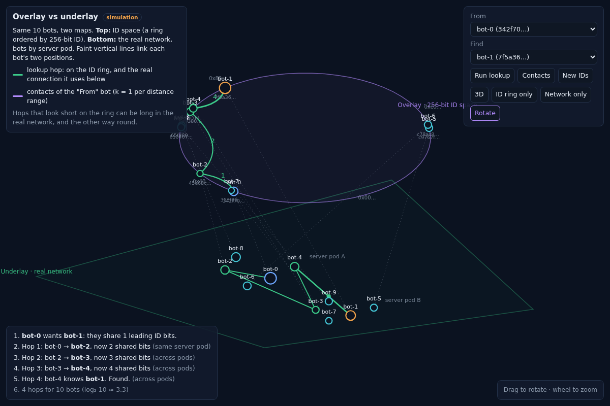
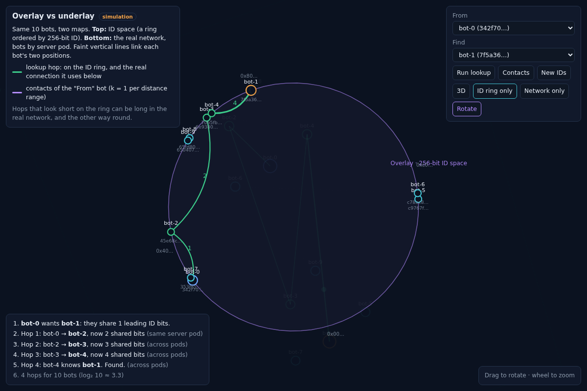
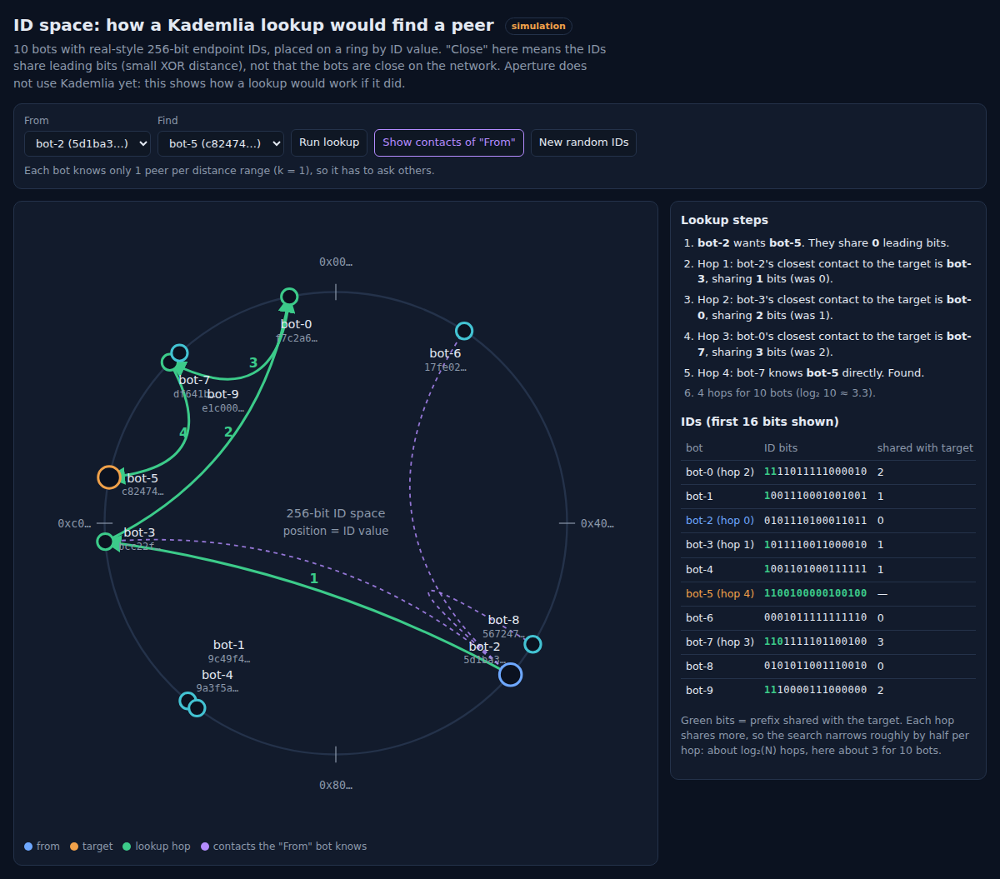

# ID-Space View: Overlay vs Underlay (Kademlia)

**Status: Idea, prototyped as a simulation.** Aperture doesn't use Kademlia yet. These views show how a lookup *would* work with real-style 256-bit IDs.
Planned for the dashboard phase as an extra view; it becomes **real** only with an own DHT (see section 7).
Related: [mesh 3D view](mesh-3d-view.md), [DHT future plan](dht-future-plan.md), [finding vs reaching peers](../learning-notes/Kademlia-DHT_routing_algorithm/finding-vs-reaching-peers.md).

| Overlay above underlay (3D) | ID ring only (focused) |
|---|---|
|  |  |

**Try it live:**

- [3D overlay vs underlay](https://htmlpreview.github.io/?https://github.com/shobhit157/Aperture/blob/main/docs/Experiments/kademlia-3d-overlay.html)
- [2D ID ring with step table](https://htmlpreview.github.io/?https://github.com/shobhit157/Aperture/blob/main/docs/Experiments/kademlia-id-ring.html)



---

## 1. Idea

Every peer-app has an **endpoint ID**: a 256-bit public key (e.g. `b497b54e…`). That ID is a **position in an ID space**, a second map of the same peers, separate from the real network.

| | **Underlay** (real network) | **Overlay** (ID space) |
|---|---|---|
| Position | where the peer is: pod, NAT, relay | its ID number |
| "Close" means | same network, low latency | IDs share many **leading bits** (small XOR distance) |
| Lines | real connections / transfers | **lookup hops**: who asks whom to find a peer |

The 3D view stacks both maps and links each bot's two positions, which shows that **"close in ID" has nothing to do with "close in the network"**.

## 2. Kademlia in 5 rules

1. **Distance** between two IDs = `A XOR B`, read as a number. Smaller = closer.
2. **Shared prefix:** the more leading bits two IDs share, the closer they are.
3. **k-buckets:** each node keeps up to *k* contacts for each distance range (one range per "first differing bit").
4. **Lookup:** to find X, ask the known contact **closest to X**. It answers with *its* closest contacts, and you repeat.
5. **Each hop matches at least one more leading bit**, so a lookup takes about **log₂(N)** hops:

| Peers | Typical hops |
|---|---|
| 10 | ~3 |
| 100 | ~7 |
| 1,000 | ~10 |
| 1,000,000 | ~20 |

## 3. The views

```
  y (height)
  ↑
  │   ○───○───○   y = +140   Overlay: ID ring (position = ID value)
  │   ┊   ┊   ┊   faint vertical lines link each bot's two positions
  │   ●───●───●   y = −140   Underlay: real network (bots by server pod)
```

| View | Shows |
|---|---|
| **2D ID ring** (`kademlia-id-ring.html`) | ring, numbered hops, a table of ID bits with the prefix shared with the target in green |
| **3D overlay** (`kademlia-3d-overlay.html`) | ring on top, network below; each hop drawn on **both**; the log says whether a hop stays in one server pod or crosses pods |
| **Focus "ID ring only" / "Network only"** | camera straight down; the other plane fades (same idea as the [mesh 3D focus mode](mesh-3d-view.md)) |

Colours: blue = from, orange = target, green = lookup hop, purple = contacts of the "from" bot.

## 4. Prototype settings

| Setting | Value | Why |
|---|---|---|
| Bots | 10 | small enough to read every ID and hop |
| IDs | 256-bit random (browser `crypto.getRandomValues`) | same size as real endpoint IDs |
| Ring position | top 32 bits of the ID | enough precision to place points |
| k (contacts per range) | **1** | forces multi-hop lookups even with 10 bots |
| Lookup | greedy: always the known contact closest to the target | shows the core idea; drawn as a chain of hops |
| Start pair | the pair needing the most hops | so the demo is never a boring 1-hop case |

**Simplification:** real Kademlia is *iterative*. The searching node itself asks each next node, often several in parallel (α = 3), and keeps a shortlist. The prototype draws the same path as a simple chain.

## 5. What the example run showed

```
bot-6 wants bot-3          shared bits: 0
hop 1 → bot-8              shared bits: 1   (same server pod)
hop 2 → bot-9              shared bits: 3   (across pods)
hop 3 → bot-1              shared bits: 5   (same server pod)
hop 4 → bot-3              found            (same server pod)
4 hops for 10 bots (log₂ 10 ≈ 3.3)
```

- The **shared prefix grows every hop**, which is why the number of hops stays small.
- In the **underlay** the same hops jump between pods back and forth: a hop that's short in ID space can be long in the network. That's plain Kademlia's main weakness; real DHTs prefer nearby contacts when they can choose.

## 6. Server vs DHT (why this matters for Aperture)

| | **Central server (today)** | **DHT** |
|---|---|---|
| Finding a peer | 1 step (Redis), milliseconds | ~log₂(N) hops, each a round trip |
| Who's online now | ✅ exact (presence with TTL) | ❌ no global view |
| Usernames, chat, offers | ✅ natural | ⚠️ needs signed records |
| Consistency / debugging | ✅ one source of truth | ⚠️ spread over all peers |
| Security | ✅ can add login | ⚠️ fake-ID attacks (Sybil / eclipse) unless designed for |
| **Server or cloud down** | ❌ nobody can find anybody | ✅ keeps working |
| Control | ❌ whoever runs the server | ✅ nobody / everyone |
| Joining | server address | still needs **bootstrap peers** |

**Conclusion:** the server isn't simply worse. It's simpler, faster and gives presence and exactly-once tracking. Its weakness is being a **single point of failure and control**. Real systems are hybrids (BitTorrent trackers + Mainline DHT; IPFS bootstrap + DHT; Iroh's n0 DNS + optional DHT and local discovery).

For **disaster coordination** that weakness matters most: the cloud can be unreachable while people nearby still have local connectivity. Long-term target: **server when reachable, DHT and/or local discovery (mDNS) as fallback.**

## 7. Making it real

| Level | What | Effort | Makes the view real? |
|---|---|---|---|
| 1 | Add `iroh-mainline-address-lookup` (0.6.x, for Iroh 1.x): publish and resolve endpoint addresses in the **BitTorrent Mainline DHT** | ~1 session | ❌ the hops happen inside the library |
| 2 | **Own Kademlia DHT** between Aperture peers over Iroh (own ALPN): k-buckets, `PING` / `FIND_NODE` / `STORE` / `FIND_VALUE`, bootstrap peer; store `hash → providers` (swarm) and `username → endpoint ID` | several sessions | ✅ every hop is our code → report `LOOKUP_EVENT\|from\|to\|shared_bits` → live view |
| 3 | No server needed for finding: level 2 + signed usernames + bootstrap peers | long-term | ✅ |

Order: **parked** until after Phase B, the dashboard and CI/CD. Level 2 fits naturally with **swarm** (both need "who has this hash?").

## 8. Data needed (live version, level 2)

| Data | From |
|---|---|
| Each bot's endpoint ID | already known (handshake / Redis) |
| Each bot's server pod (underlay position) | Redis `client:<user>` → `instanceId` |
| Lookup hops | new `LOOKUP_EVENT` from peer-app → server → WebSocket (like `TRANSFER_EVENT`) |
| Contacts (k-buckets) | peer-app reports on request (debug only) |

## 9. Limits

- **Simulation only today:** IDs are random, not the bots' real IDs, and lookups are computed in the browser.
- **10 bots is a teaching size.** At 100+ the ring needs grouping by ID prefix, like the bot groups in the mesh.
- **The ring places IDs by value**, which isn't XOR distance. Neighbours on the ring usually share a prefix, but XOR "closeness" is a tree, not a circle. A binary-tree view would be more exact; the ring is easier to read.
