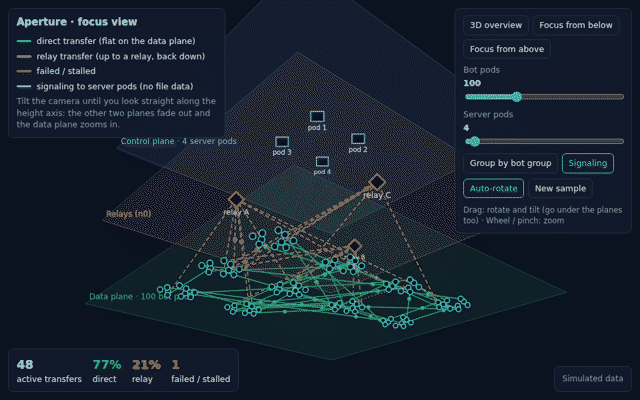
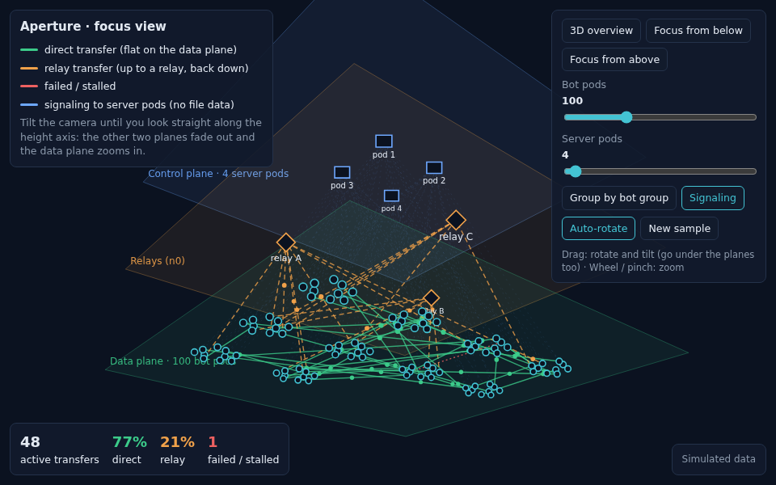
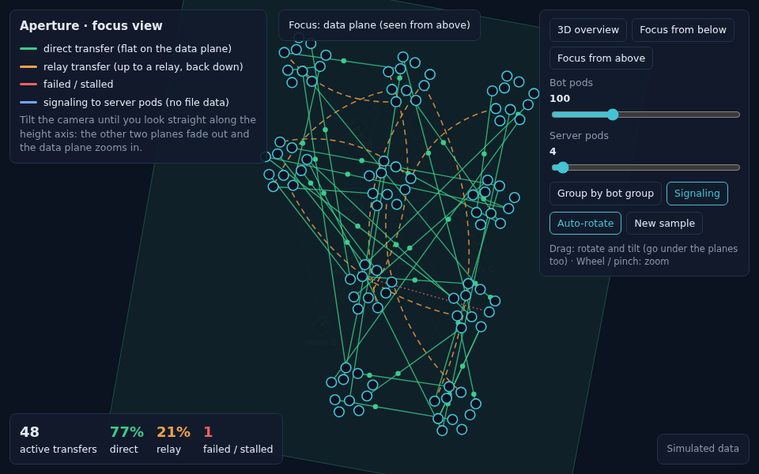

# Mesh 3D View: Layers + Data-Plane Focus

**Status: Idea, prototyped.** Planned for the dashboard phase (after Phase B).
**Decision:** keep **both** views: the 2D mesh for monitoring, the 3D mesh for understanding the architecture.
Related: [mesh evolution plan](mesh-evolution-plan.md), [Mesh v2](../fixes/mesh-v2.md), [architecture overview](../architecture/overview.md).



| 3D overview | Focus on the data plane |
|---|---|
|  |  |

**Try it live:** [interactive prototype](https://htmlpreview.github.io/?https://github.com/shobhit157/Aperture/blob/main/docs/Experiments/mesh-3d-focus.html) (simulated data; drag to rotate, wheel to zoom)

Prototypes in `docs/Experiments/` (all simulated data):

| File | Shows |
|---|---|
| `mesh-3d-layers.html` | first version: 3 layers, 8 peers |
| `mesh-3d-scale.html` | 10–300 bot pods, 1–100 server pods, group-by-bot-group |
| `mesh-3d-focus.html` | final version: camera can go under the planes; focus mode |

---

## 1. Idea

Show Aperture as **three stacked layers**, so the architecture is visible at a glance:

```
  y (height)
  ↑
  │   ┌────────────────────┐   y = +170   Control plane: signaling server pods
  │   ┌────────────────────┐   y =    0   Relays (n0)
  │   ┌────────────────────┐   y = −170   Data plane: peers and bots
  └──────────────→ x
 ╱
z        each layer is a flat floor spread over x and z
```

| What you see | Meaning |
|---|---|
| Line **flat on the bottom layer** (green) | **Direct** transfer, peer to peer |
| Line going **up to a relay and back down** (orange, dashed) | **Relay** transfer |
| Thin dotted line from a peer **up to a server pod** (blue) | **Signaling** only; file data never goes up there |
| Red line or red-edged group | Failed or stalled transfer |

**Why:** the 2D mesh is the **top view**, looking down the height axis. There, the "up to the relay" part of a relay transfer points straight at you and disappears, so relay can only be shown by colour. The 3D view shows it as real geometry, which makes the control plane / data plane split obvious.

## 2. Axis convention

- **y = height** (the layers); **x, z = the floor** of each layer.
- This follows three.js / WebGL (y is up). CAD tools and Blender use z-up instead; mind it when mixing tools.
- On screen, y grows **downwards** (canvas / SVG), so drawing code flips it: `screenY = H/2 − Y`.

## 3. Two views, one data feed

| | **2D mesh** (today) | **3D mesh** (new) |
|---|---|---|
| Main job | **Monitoring**: what's happening now, what's failing | **Understanding**: how the system is built; direct vs relay at a glance |
| Best for | daily use, quick checks, large numbers | demos, README, interviews, onboarding |
| Data | Mesh v2 WebSocket | **the same** Mesh v2 WebSocket |

Both are tabs on the same dashboard; no extra server work is needed to have both.

## 4. Camera modes (3D)

| Mode | Camera | Use |
|---|---|---|
| **3D overview** | tilted (~30°), slowly rotating | explain the architecture |
| **Focus from above** | looking straight down the y axis | monitoring inside the 3D tab (map orientation) |
| **Focus from below** | looking straight up the y axis | same, mirrored left/right |

### Focus mode: the data plane comes forward

As the camera approaches straight-on (`|sin(pitch)|` from 0.72 to 0.97):

1. **The other two planes fade out** (to ~4 % opacity, a faint ghost) together with their nodes and signaling lines.
2. **The camera centres on the data plane** and zooms in slightly.
3. **Relay transfers change shape:** the up-and-down hops fade, and a **curved, dashed orange line on the data plane** appears instead, so direct vs relay stays readable without height.
4. A badge shows "Focus: data plane (seen from above / below)".

Tilting back reverses it smoothly. Drag tilts the camera, including under the planes; the wheel zooms.

## 5. Scaling

Only the **data plane** grows; server pods and relays stay a handful.

| Bots | Data plane shows | Lines | Readable? |
|---|---|---|---|
| ≤ 30 | every bot with its name | every transfer | ✅ fully |
| 30–100 | every bot; names only when focused (≤ 50 bots) | every transfer | ✅ as a pattern |
| 100–500 | **islands per bot group** ("Group by bot group") | one line per group pair, width = number of transfers | ✅ |
| 500+ | one bubble per group, click to drill down | aggregated lines only | ✅ (WebGL needed for drawing) |

Prototype at 100 bots: ~160 lines drawn individually vs ~50 grouped.

## 6. Data needed (live version)

| Data | Source today | Missing? |
|---|---|---|
| Transfers: id, from, to, state, path, pct, reason | Mesh v2 WebSocket (`snapshot` / `update`) | no |
| Which server pod each user is connected to | Redis `client:<user>` → `instanceId` | send it to the page |
| List of server pods | Redis / Kubernetes | add to the snapshot |
| Which relay a peer uses | peer-app `EVENT:RELAY_READY` (relay URL) | report to server, store in Redis |
| Bot group | pod name / label | add a group field (e.g. from the StatefulSet) |

## 7. Build plan (dashboard phase)

| Step | What |
|---|---|
| 1 | Port the prototype to **three.js** (or `3d-force-graph`) for WebGL speed and proper depth |
| 2 | Feed it from the Mesh v2 WebSocket; add pod, relay and group fields on the server |
| 3 | Camera buttons: overview / focus above / focus below; remember the last view |
| 4 | Group mode automatically above ~100 bots; click a group to expand it |
| 5 | **Keep both views:** 2D mesh as the default monitoring tab, 3D as a second tab, both fed by the same Mesh v2 WebSocket |
| 6 | Record a new GIF from live data for the README |

## 8. Limits

- **3D hides things behind other things.** For "what's failing right now", the 2D tab or focus mode beats the tilted overview.
- **Viewing from below mirrors left and right.** "Focus from above" is the natural monitoring orientation.
- **Many individual bots become a cloud** in any view; grouping is required beyond ~100.

## 9. Related: ID-space views (simulations)

Two further prototypes show the **overlay**, peers placed by their 256-bit endpoint ID, with a **simulated Kademlia lookup**:

| File | Shows |
|---|---|
| `kademlia-id-ring.html` | 10 bots on an ID ring; lookup hops; shared ID bits per hop |
| `kademlia-3d-overlay.html` | ID ring (overlay) above the real network (underlay); the same lookup on both |

Aperture doesn't use Kademlia yet: peers are found through the signaling server and n0 discovery. These views become real only with an own DHT. Write-up: to do (DHT / finding-peers notes).
