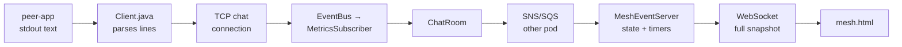
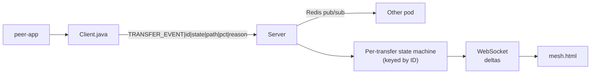
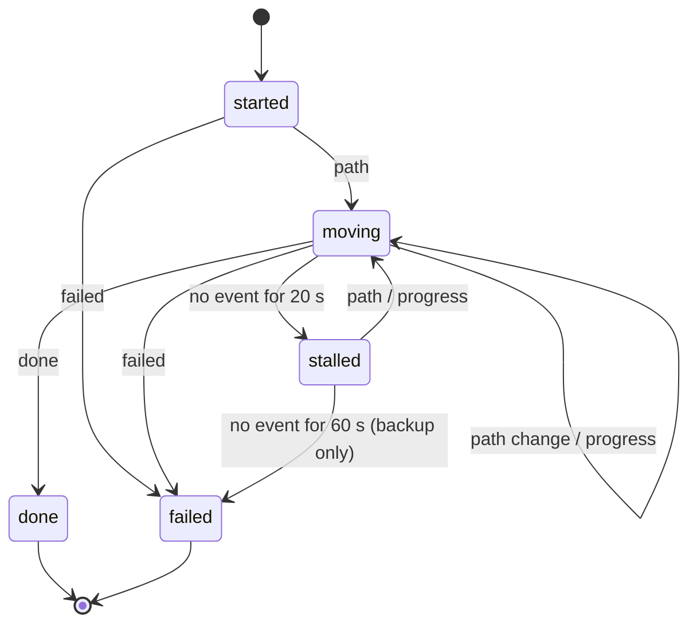
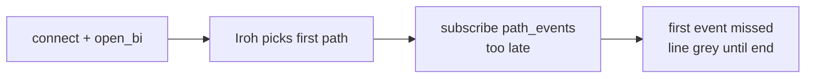
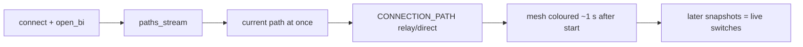

# Mesh v2: Transfer Events Redesign

> Plan. Status: **next after Phase A** (before Phase B). Events describe states only, so Phase B can reuse them.
> Today's small fix (live path at transfer start) is done separately — see "Step 0".

## Why

The mesh should show **how** a transfer is moving (direct / relay) from the
moment it starts, update live when Iroh switches path, and show the real
end result (done / failed). The current event chain works, but it is spread
across several message types, matches transfers loosely, and relies on the
server guessing failures with timers.

## Current design (v1)



| Weak spot | Effect |
|---|---|
| 4 message types (`FILE_ACCEPT` as start, `CONNECTION_PATH`, `TRANSFER_PROGRESS`, `TRANSFER_METRIC`) | Each has its own format and handling |
| `TRANSFER_METRIC` has no transfer ID; done/failed matched by user pair | Two transfers between the same pair can be mixed up |
| Server guesses with timers (20 s stalled, 40 s failed) | Slow but healthy transfers can show as failed |
| Cross-pod via SNS/SQS | Mesh on the other pod can lag by seconds |
| Full snapshot on every change | Wasteful as transfers grow |
| Finished line removed after 4 s | Fast (direct) transfers are barely visible |

## New design (v2)



### 1. One message type

```
TRANSFER_EVENT|<transferId>|<state>|<path>|<pct>|<reason>
```

| state | path | pct | reason | Sent by |
|---|---|---|---|---|
| `started` | | | | server (on FILE_ACCEPT) |
| `path` | `direct` / `relay` | | | sender and receiver (from `CONNECTION_PATH`) |
| `progress` | | `0–100` | | sender and receiver (throttled) |
| `done` | final path | `100` | | receiver only (from `TRANSFER_PATH`) |
| `failed` | | | short reason | whichever side knows (from `TRANSFER_FAILED`) |

Always carries the transfer ID. Empty fields stay empty (`||`).

### 2. State machine per transfer (server)



Rules:
- Keyed **only** by transfer ID.
- `done` and `failed` are final — later events for that ID are ignored.
- The last known path is remembered, so `stalled → moving` restores the colour.
- Timers are a **backup** for clients that vanish; normal outcomes come from the peers
  (Phase A made peer-app report every outcome exactly once).

### 3. Between pods: Redis pub/sub

- Channel: `mesh:events`. Each pod publishes the events it receives and applies
  events from the other pod to its own state machine.
- Redis is already running for presence; pub/sub takes milliseconds,
  compared with seconds for SNS → SQS polling.
- SNS/SQS stays for anything else that uses it.

### 4. To the browser: deltas

- On connect: one snapshot of all active transfers.
- After that: only changes, e.g. `{"id":"t1","state":"moving","path":"relay"}`.
- `mesh.html` keeps finished lines visible for ~10 s, so fast transfers can be seen.

## Example: one transfer

| Moment | v1 messages | v2 message |
|---|---|---|
| Accepted | `FILE_ACCEPT` | `TRANSFER_EVENT|t1|started` |
| Path known | `CONNECTION_PATH|t1|relay|bot` | `TRANSFER_EVENT|t1|path|relay` |
| Progress | `TRANSFER_PROGRESS|t1|42` | `TRANSFER_EVENT|t1|progress||42` |
| Path switch | `CONNECTION_PATH|t1|direct|bot` | `TRANSFER_EVENT|t1|path|direct` |
| Done | `TRANSFER_METRIC|direct|bot` (no ID) | `TRANSFER_EVENT|t1|done|direct|100` |
| Failed | `TRANSFER_METRIC|failed|bot|reason` (no ID) | `TRANSFER_EVENT|t1|failed|||reason` |

## Step 0: today's fix (before v2)

The live path never reached the mesh at transfer start because peer-app
subscribed to `path_events()` **after** `connect()`, when Iroh had already
picked the first path. Old vs new:





Step 0 changes:
- [ ] `main.rs`: `path_events()` → `paths_stream()`, print only when the selected path changes
- [ ] `Client.java`: add transfer ID to `TRANSFER_METRIC`
- [ ] `MeshEventServer.java`: match done/failed by ID (pair as fallback); remember `livePath`
- [ ] Test script: check `CONNECTION_PATH` appears at the start of each transfer

## Migration plan (v2)

| Step | Change | Old clients still work? |
|---|---|---|
| 1 | Server accepts `TRANSFER_EVENT` **and** old messages, feeding one state machine | ✅ |
| 2 | `Client.java` sends `TRANSFER_EVENT` only | ✅ (server understands both) |
| 3 | Redis pub/sub for mesh events between pods | ✅ |
| 4 | `MeshEventServer` sends deltas; `mesh.html` handles deltas, keeps finished lines ~10 s | needs new `mesh.html` |
| 5 | Remove old message handling once all clients are updated | ❌ old clients |

## How to test

- Unit tests for the state machine: allowed and ignored transitions, `done`/`failed` final, stalled → restore path.
- Two pods: start a transfer via pod A, watch the mesh on pod B — update within ~1 s.
- Two parallel transfers between the same pair — each shown and finished separately.
- Kill a client mid-transfer — backup timer marks it failed.

## Open questions

- Keep progress on the mesh at all, or only path + result?
- Should Prometheus metrics also be driven from the same state machine (one source of truth)?
- Later: should the mesh store recent history (e.g. last 50 transfers) in Redis?
