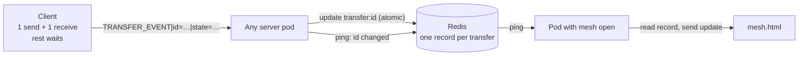
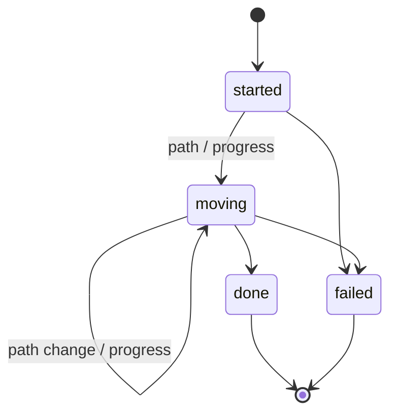

# Mesh v2: Live Transfer Tracking + Client Limits

> Plan. Status: **next after Phase A** (before Phase B).
> Replaces the earlier mesh v2 draft.

## Goals

1. **Each client: at most 1 sending + 1 receiving at the same time.**
   Extra transfers wait in a queue.
2. **The mesh shows every transfer correctly and live**, no matter how many
   users or server pods there are.

## Not now

- Swarm distribution (one file from many peers) — later, with Phase B.
- Autoscaling (HPA), moving chat off SNS/SQS — separate DevOps task.
- See "Future ideas" at the end.

## Problems today

| Problem | Effect |
|---|---|
| Path event fires before peer-app listens | Mesh line grey until the end |
| Client keeps pending sends **by username** | Two sends to the same user get mixed up |
| No limit on transfers per client | `!send all all` with 20 bots = 380 transfers at once |
| Done/failed have **no transfer ID**, matched by user pair | Two transfers between the same pair can be mixed up |
| Mesh state lives in **each pod's memory**, synced by SNS/SQS | Slow, and pods can disagree or lose state on restart |
| Server guesses failure with short timers | Slow but healthy transfers show "timed out" |

## Design



- **Transfer state lives in Redis**, one record per transfer ID. Pods keep no
  mesh state of their own — so any number of pods show the same thing.
- A pod that changes a transfer sends a small **ping** (Redis pub/sub,
  channel `mesh:changed`) with the ID.
- Pods with a mesh browser open read the record and send the update.
- **Safety net:** the mesh re-reads all active transfers every 10 s, so a lost
  ping can never leave it wrong for long.

### Event message (client → server)

```
TRANSFER_EVENT|id=<id>|state=<state>|path=<path>|pct=<0-100>|reason=<text>
```

`key=value` fields — order does not matter, unknown fields are ignored, so new
fields can be added later without breaking anything.

| state | Fields | Sent by |
|---|---|---|
| `started` | from, to | server (on FILE_ACCEPT) |
| `path` | path = direct / relay | sender and receiver |
| `progress` | pct | receiver only |
| `done` | path | receiver only |
| `failed` | reason | whichever side knows |

### Redis keys

| Key | Holds |
|---|---|
| `transfer:<id>` (hash) | from, to, state, path, pct, reason, updated_at |
| `transfers:active` (sorted set) | active IDs, scored by updated_at |
| `mesh:changed` (pub/sub channel) | "this ID changed" pings |

Finished transfers keep their record for ~10 s (so the mesh can show them),
then expire.

### State rules



- Keyed **only** by transfer ID.
- `done` and `failed` are **final** — checked inside one atomic Redis step (Lua),
  so it holds even when several pods write at once.
- **Counted once:** only the pod whose update makes the *first* `done` increments
  the Grafana counter.
- **Peer left:** when a user disconnects, their pod marks that user's active
  transfers `failed` ("peer left") at once.
- **Backup:** no event for 120 s → `failed` ("no response"). Any pod may run this
  check; the atomic step makes sure it happens only once.
- The mesh shows `stalled` (visual only) after 20 s of silence, keeping the
  last known path colour.

### Client limits (1 + 1)

| Situation | What the client does |
|---|---|
| Wants to send while already sending | Puts it in the **send queue**, starts it when the current send ends |
| Gets a file request while already receiving | Puts it in the **receive queue**, accepts it when the current receive ends |
| Any transfer ends (done or failed) | Starts the next one from that queue |

Everything inside the client is keyed by **transfer ID**, never by username.

## Steps

| Step | What | Files | Done when |
|---|---|---|---|
| **S1** | Path known at transfer start: `path_events()` → `paths_stream()` | `main.rs` | Script: `CONNECTION_PATH` appears before `FILE_RECEIVED` |
| **S2** | Client: track by ID, 1 + 1 limit with queues, send `TRANSFER_EVENT` | `Client.java` | Two sends to the same bot both arrive, one after the other |
| **S3** | Server: `TransferStore` (Redis + Lua), handle events, peer left, count once | new `TransferStore.java`, `ClientHandler.java`, `MetricsSubscriber.java` | Unit/manual checks: final states stay final, one count per transfer |
| **S4** | Mesh server: snapshot from Redis, live updates from pings, 10 s re-read, 120 s backup check | `MeshEventServer.java` | Mesh on two pods shows the same thing |
| **S5** | New `mesh.html`: live colours, finished lines stay ~10 s, failure reason in the log | `mesh.html` | Relay line orange at start, direct green |
| **S6** | Remove the old mesh messages (`CONNECTION_PATH`, `TRANSFER_PROGRESS`, `TRANSFER_METRIC`, `MESH|…` over SNS) | several | Build clean, all tests pass |

One step at a time: code → build → test → commit.

## Tests

| Test | Expect |
|---|---|
| Admin → bot, 30 MB (relay) | Line orange within ~1–2 s of start |
| Admin → admin2, 1–2 GB (direct) | Line green at start |
| Two files to the same bot quickly | Second waits, both arrive with correct hashes |
| Delete a bot pod mid-transfer | Line failed ("peer left") within seconds, not counted |
| 3 server pods, mesh open on each | All show the same transfers |
| 20 bots, `!send all all small` | 380 transfers flow through; each bot ≤ 1 send + 1 receive; none stuck; Grafana +380 |
| Delete a server pod mid-test | Clients reconnect; mesh recovers from Redis |

## Future ideas (not now)

- Swarm: a transfer with several **legs** (one per provider) and
  `providers:<hash>` in Redis — with Phase B.
- Redis Streams for an event log / replay.
- Autoscaling (HPA on connections per pod), graceful drain, chat via Redis
  instead of SNS/SQS.
- Mesh: one line with a count when many transfers share a pair.
