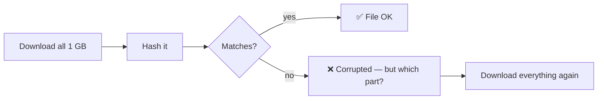
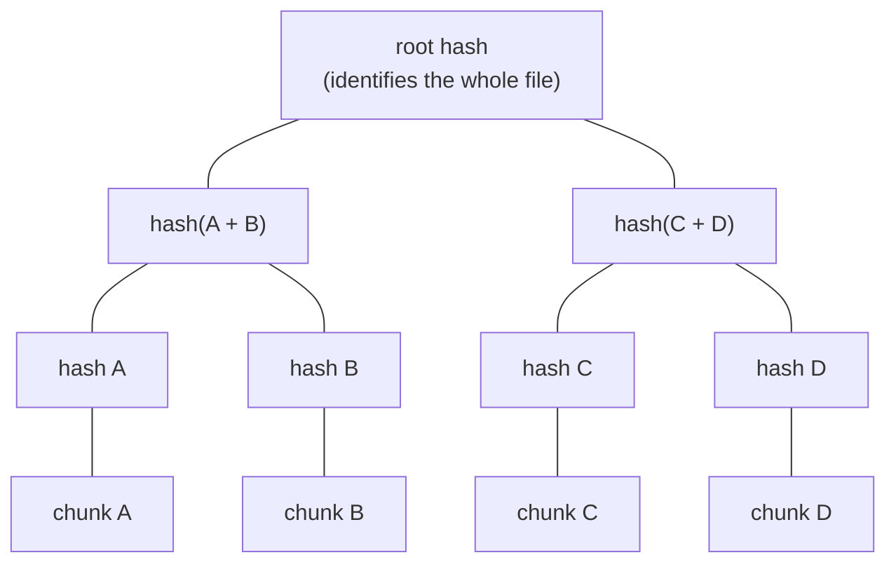
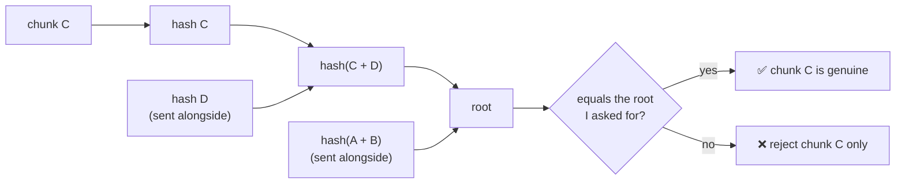
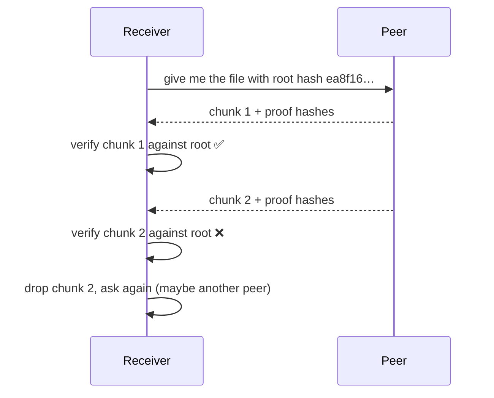

# Hashing, Merkle Trees and BLAKE3

Learning note. Not about Aperture's current code. These are the ideas behind content-addressed and swarm-style file transfer (networking roadmap, stages 4 and 5).

---

## 1. What a hash function is

A hash function turns any amount of data into a short, fixed-size **fingerprint**.

```text
"hello"           → ea8f163db386...  (32 bytes)
"hello!"          → 5d9e2bb2f5b8...  (completely different)
a 1 GB file       → 32-byte fingerprint
```

A **cryptographic** hash has these properties:

| Property | Meaning |
|---|---|
| Deterministic | Same input → same fingerprint, always |
| Avalanche effect | Change one bit → the fingerprint changes completely |
| One-way | You can't rebuild the data from the fingerprint |
| Collision-resistant | Practically impossible to find two different inputs with the same fingerprint |

**Main uses:** checking data wasn't corrupted or tampered with, giving data a unique ID, quickly checking "do I already have this?"

---

## 2. Where I've already used hashes

| Place | What's hashed |
|---|---|
| Aperture transfers | The received file is hashed and compared with the sender's hash ("hash-verified") |
| Docker / Kubernetes | Image digests: `sha256:…`, compared when checking pods run the new image |
| Git | Every commit, file and tree is identified by its hash (SHA-1, moving to SHA-256) |
| Downloads | `sha256sum file` to check an ISO or installer |

---

## 3. The problem with hashing a whole file

With a normal hash (e.g. SHA-256) over the whole file:



- You only find out **at the end**.
- You don't know **which part** is bad.
- You can't safely accept parts from **different peers**: one bad peer spoils the whole file.

---

## 4. Merkle trees: hashes of hashes

Split the data into chunks, hash each chunk, then hash pairs of hashes, up to a single **root hash**.



**Proving one chunk is genuine:** to check chunk C against the root, you only need C plus a few sibling hashes on the path up (here: `hash D` and `hash(A+B)`). This is called a **Merkle proof**. For a file with a million chunks, that's only about 20 hashes.



**Used by:** Git, BitTorrent v2, IPFS, certificate transparency logs, blockchains, and `iroh-blobs`.

---

## 5. BLAKE3

A cryptographic hash function released in 2020, from the BLAKE family.

- **Fast:** much faster than SHA-256 in software, and it can use all CPU cores at once.
- **Built as a Merkle tree internally:** data is split into small chunks (1 KiB) that are hashed and combined in a tree. That's what makes the speed (parallel chunks) and verified streaming possible.
- **Default output:** 32 bytes. Can produce longer output if needed.
- One algorithm for several jobs: plain hashing, keyed hashing (MAC), key derivation.

Command-line tool: `b3sum` (like `sha256sum`).

---

## 6. Verified streaming

Because BLAKE3 is a tree, a sender can stream a file **together with the tree hashes needed to verify it**. The receiver checks every chunk as it arrives against the root hash it asked for:



This gives:

- **Early detection:** a bad chunk is caught immediately, not after the whole download.
- **Resume:** chunks already received are already proven good; continue from there.
- **Fetching from many peers:** a piece from a stranger is safe, because it's checked against the root.
- **Ranges:** download just a part of a file and still verify it.

---

## 7. Content addressing

Identify data **by its hash**, not by its name or location.

| Location-addressed | Content-addressed |
|---|---|
| "give me `report.pdf` from server X" | "give me data with hash `ea8f16…`" |
| Content can change behind the name | The hash *is* the content; it can't change |
| Must trust server X | Anyone can provide it; you verify it yourself |
| Duplicates stored many times | Same content → same hash → stored once |

**Examples:** Docker images by digest, Git objects, IPFS, BitTorrent, `iroh-blobs`.

---

## 8. How this connects to Aperture

| Today | With content addressing (roadmap stage 4–5) |
|---|---|
| Whole file sent over one stream with a custom header | File identified by its BLAKE3 root hash |
| Hash checked only at the end | Each chunk verified as it arrives |
| Interrupted transfer starts over | Resume from the last verified chunk |
| One sender per file | Pieces from many peers, each verified (swarm) |

`iroh-blobs` (Iroh's blob transfer protocol) is built on BLAKE3 verified streaming, so stage 4 would likely start by evaluating it rather than building this from scratch.

---

## 9. Hands-on exercises

1. **Avalanche effect**
```bash
   echo "hello" | sha256sum
   echo "hello!" | sha256sum
```
2. **BLAKE3 vs SHA-256 speed** (install `b3sum`, e.g. `cargo install b3sum`)
```bash
   head -c 1G /dev/urandom > big.bin
   time sha256sum big.bin
   time b3sum big.bin
```
3. **Git is content-addressed**
```bash
   echo "hello" | git hash-object --stdin
   git cat-file -p HEAD
```
4. **Docker images are content-addressed**
```bash
   docker images --digests
```
5. **Build a tiny Merkle tree** in Rust or Java: split a file into 4 chunks, hash them, build the tree, then write a function that verifies one chunk using only its proof hashes.
6. **Read** how `iroh-blobs` requests and verifies ranges of a blob.

---

## 10. What to skip (for now)

- BLAKE3's internal math (compression function, rounds)
- Detailed comparisons between hash algorithms
- Writing my own cryptographic code (always use a library)

---

## 11. Questions to answer later

- How does `iroh-blobs` choose chunk group sizes, and why not verify every 1 KiB chunk individually?
- How big is the proof overhead per chunk in practice?
- In a swarm, how does a peer advertise which chunks it has?
- What happens if a peer keeps sending bad chunks? How do you detect and avoid it?

---

## Resources

- BLAKE3 specification and reference implementation (GitHub: `BLAKE3-team/BLAKE3`)
- `iroh-blobs` documentation (iroh.computer, docs.rs)
- *Designing Data-Intensive Applications*: background on hashing and replication
- BitTorrent v2 (BEP 52): Merkle trees per file

## Related documents

- `docs/future-plans/networking-roadmap.md`: stages 4 and 5
- `docs/future-plans/transfer-resume-plan.md`
- `docs/future-plans/swarm-distribution-plan.md`
