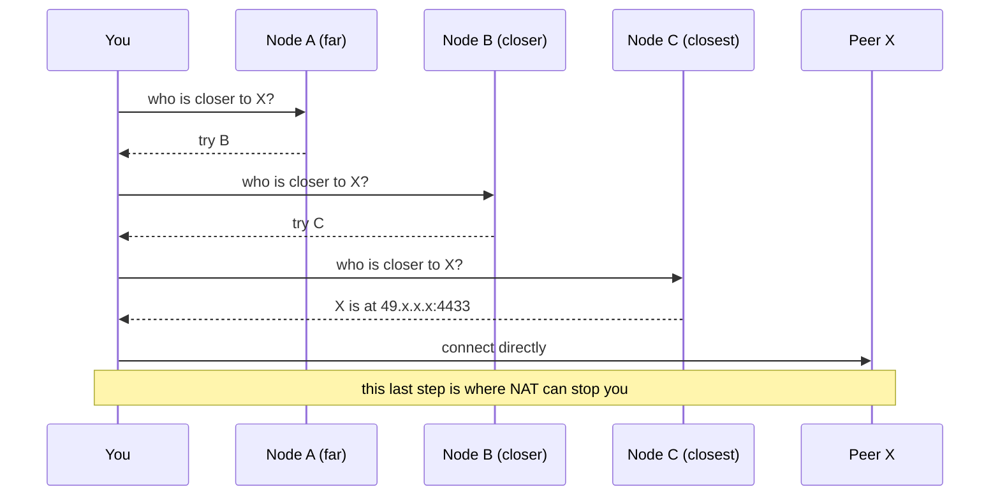
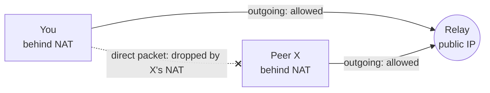
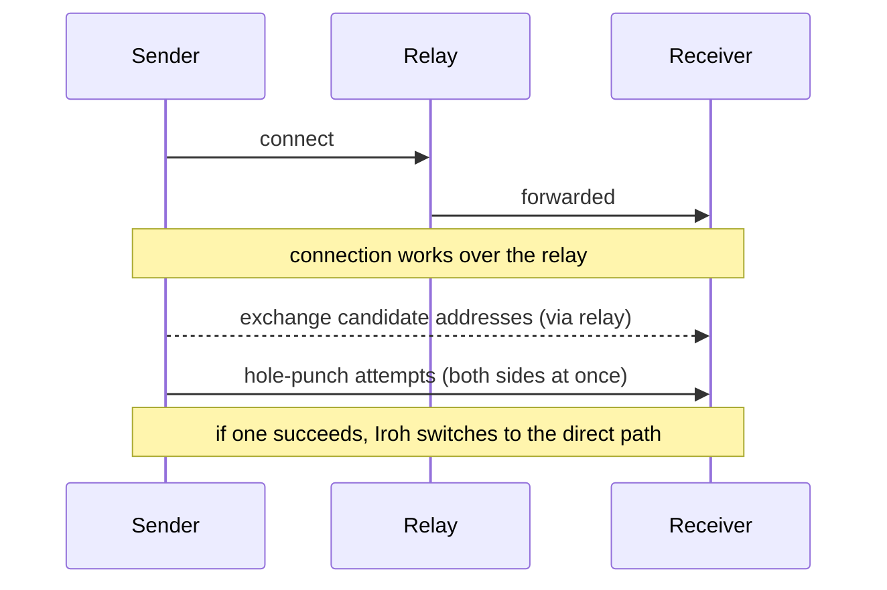

# Finding vs Reaching Peers: Kademlia, Relays and Hop-by-Hop Data

> Learning note. Written while working on Aperture's file transfer, after reading
> about the Kademlia routing algorithm and wondering why relays are needed if
> peers can always be found through other peers.

## The question

Kademlia lets a peer find any other peer by asking a few other peers
("hops"). So why does Iroh need relay servers at all? And could file
data travel through peers the same way IDs are looked up?

## Short answer

Peer-to-peer networking has two separate problems:

| Problem | Question | Solved by |
|---|---|---|
| **Finding** | "Peer X exists. What is its address right now?" | Kademlia / DHT, DNS, a signaling server |
| **Reaching** | "I know X's address. Can my packets actually get to it?" | Direct path, hole punching, relays |

Kademlia only solves **finding**. Relays solve **reaching**.

---

## 1. How Kademlia finds peers

- Each node has a random ID (160-bit in classic Kademlia, 256-bit public keys in Iroh).
  Two nodes getting the same ID is practically impossible, about as likely
  as guessing a private key.
- Distance is `ID_A XOR ID_B`. **This "map" is not geography.** Two close IDs
  can be on opposite sides of the world, so a lookup does not save physical
  distance.
- Hops are for **questions, not data**. Each answer points to nodes closer to
  the target, and the distance roughly halves at each step, so even a million-node
  network needs only about 20 steps.
- The lookup ends with X's IP and port. Then you connect to X **yourself**.

## 2. Why knowing the address is not enough: NAT

Most devices sit behind a NAT: a home router, the ISP's CGNAT, Docker, WSL.
A NAT has a simple rule:

- **Outgoing connections are allowed.** It remembers the connection and lets replies back in.
- **Unexpected incoming packets are dropped.**

So a DHT can tell you X's address, but X's NAT drops your packet because X
never contacted you. Real DHTs have this problem too: many nodes behind NAT
can ask questions but cannot answer them.

## 3. Why a relay works

A relay has a public IP, so **everyone can reach it**. Both peers make an
**outgoing** connection to it (which every NAT allows), and the relay passes
packets between them.

While connected through the relay, both peers exchange their public address
and port and send packets to each other at the same time. Each NAT sees what looks
like a reply to its own outgoing packet and lets it in. This is **hole punching**.

If hole punching fails (symmetric NAT, CGNAT), the relay keeps the connection working.

## 4. Could other peers be the relay?

Yes. libp2p (used by IPFS) has "circuit relay", where publicly reachable
peers relay for others. There are trade-offs:

| Peers as relays | Dedicated relays (Iroh's choice) |
|---|---|
| A peer must be publicly reachable, and most home devices are not | Always reachable |
| Peers come and go (churn), so a relay can vanish mid-transfer | Stable |
| Uses volunteers' bandwidth and battery | Run by n0 (or self-hosted) |
| Traffic passes a stranger's machine (encrypted, but metadata visible) | Known operator |
| No central point | A central point, though anyone can run their own |

---

## 5. What if file data travels through the ID space too?

This exists, in two versions.

### Version 1: forward the bytes hop by hop

If every node keeps long-lived connections to its neighbours, NAT no longer
blocks forwarding: those connections were made outward, so NAT already
allows them. **Yggdrasil** and **cjdns** work like this: the address comes
from the public key, and packets are routed hop by hop toward that key.

Costs:

| Cost | Why |
|---|---|
| Latency | XOR distance ignores geography, so 5 hops may mean 5 trips around the world |
| Bandwidth multiplied | Every hop carries the full file: 1 GB over 5 hops uses about 5 GB of network |
| Speed of the slowest link | One weak peer slows the whole chain |
| Churn | A peer leaving in the middle breaks the path |
| Trust | Middle peers see who talks to whom, so end-to-end encryption is required |

**Tor** uses deliberate hops for a different goal, anonymity: no single
node knows both the sender and the receiver. It is slow on purpose.

### Version 2: store the data in the ID space (content addressing)

Hash the file and treat the hash as an ID. The pieces are stored at, or
announced by, peers close to that hash. Anyone who knows the hash can fetch
the file, even if the original sender is offline.

- **Freenet / Hyphanet** stores data at the closest nodes.
- **IPFS** stores only "who has this" in the DHT, then fetches directly.
- **iroh-blobs** fetches by BLAKE3 hash from peers known to have the content.

You ask for **what** you want, not **who** has it.

## 6. When hop-by-hop is the right choice

| Situation | Best option |
|---|---|
| Normal internet, two peers | Direct path, with the relay as fallback (one hop) |
| Many peers want the same file | Swarm (BitTorrent, iroh-blobs) |
| Anonymity / censorship resistance | Deliberate hops (Tor, I2P) |
| No internet at all (disasters, remote areas) | Hop-by-hop mesh (Briar, Meshtastic) |
| Links that come and go (space, satellites) | Store-and-forward: Delay-Tolerant Networking (DTN), Bundle Protocol |

In disasters and space, a central server and a direct path are often not
available, so hop-by-hop forwarding is the main design, not a fallback.

---

## 7. How this maps to Aperture

| Job | In Aperture today | In a pure Kademlia network |
|---|---|---|
| Finding (ID to address) | Signaling server + Redis (`endpointId`, `relayUrl`) | DHT lookups through peers |
| Reaching (through NAT) | Iroh relay, then hole punching | Still needs relays or hole punching |

- The signaling server is a central version of what Kademlia does in a decentralized way.
  Replacing it with a DHT would remove the central server for finding, but
  relays would still be needed for reaching.
- Bot transfers that stayed on the relay most likely **found** each other
  fine. The likely problem is **reaching**: several NAT layers (pod → Docker/WSL VM →
  Windows → router), no hairpin NAT on the router, or ISP CGNAT. Still to be
  verified with pair-by-pair tests.
- A3 added a BLAKE3 hash to every transfer. That is the first step toward
  content addressing (Phase B: iroh-blobs).
- Possible Phase C experiment: **iroh-gossip**, where messages hop from peer to peer
  through an overlay network. Good for alerts and small updates, not for
  large files.

## Open questions to test

- [ ] Which pairs go direct and which stay on the relay: WSL ↔ pod, pod ↔ pod, laptop ↔ EC2
- [ ] What direct addresses does each peer know at startup (`EVENT:ENDPOINT_ADDRS`)?
- [ ] Does a large transfer switch from relay to direct after a few seconds?
- [ ] Does WSL mirrored networking or `hostNetwork: true` for bots change the result?

## Further reading

- Kademlia paper: Maymounkov & Mazières, "Kademlia: A Peer-to-peer Information System Based on the XOR Metric" (2002)
- Iroh docs: relays, hole punching and discovery (iroh.computer)
- libp2p: circuit relay v2 and DCUtR (hole punching)
- Yggdrasil network, cjdns
- Delay-Tolerant Networking / Bundle Protocol (RFC 9171)
