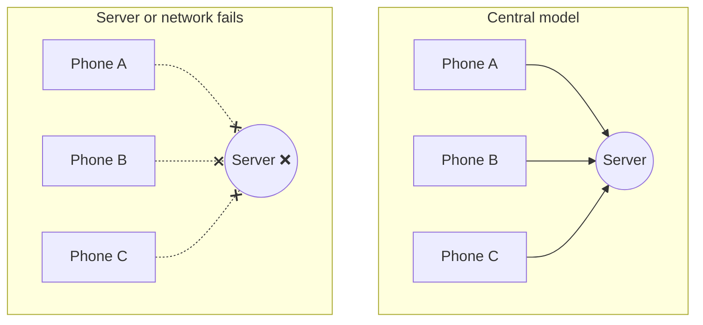

# My Learning Path

Status: **Personal notes.** Why I'm building Aperture, what I'd like to work on someday, and how I'm learning toward it. This will change as I learn more.

---

## What I'm interested in

I'd like to eventually work on systems that help in situations like:

- **Disasters:** earthquakes, tsunamis, floods. Early warnings, and communication that keeps working when networks go down.
- **Climate:** collecting and sharing environmental data reliably.
- **Space:** satellite networks and how satellites and ground stations coordinate.

These all seem to need the same thing underneath: **many separate parts working together reliably, even when some of them fail.** That's what distributed systems and networking are about, so that's what I'm trying to learn.

---

## When a central server fails

Most apps today depend on central servers. When those servers or the networks to them fail, everything that depends on them stops, even if the devices themselves are working fine.

Even if Phone A and Phone B are in the same room, they can't reach each other, because every message has to go through the server.

### Real examples

- **Big outages:** a single company's problem has taken down large parts of the internet at once, for example Facebook's 2021 outage (several hours), large cloud-region outages, and the 2024 CrowdStrike update that crashed computers worldwide.
- **Disasters:** after earthquakes, floods or cyclones, mobile towers and internet links often go down exactly when people most need to communicate.
- **Remote places:** ships, mountains, rural areas and space have weak or no connection to central servers.

### What helps

- **Devices talking directly** (peer-to-peer) when they can reach each other, for example over the same WiFi, a local network or a mesh.
- **Keep working offline, sync later** (local-first), instead of failing when the server is unreachable.
- **No single point of failure:** spread important pieces across several machines.
- **Central servers as helpers, not requirements:** use them when available, but don't stop working without them.

### Where Aperture stands today

Aperture is only partly there:

| Part | If the central server fails |
|---|---|
| File transfers already in progress | ✅ Keep going: the data flows peer-to-peer through Iroh, not through the server |
| Starting new chats or transfers | ❌ Stops: peers find each other through the central signaling server |
| Knowing who's online | ❌ Stops: presence lives in Redis on the server side |

Learning how to remove those ❌, so peers can still find each other and talk when the server is gone, is one of the main things I want to explore (networking roadmap, stage 6, and the "messaging when the server is down" project idea).

---

## What Aperture is teaching me

Aperture is a small project, but it has already shown me problems that seem to come up everywhere:

| Problem | What I ran into in Aperture | Where it shows up elsewhere |
|---|---|---|
| Things fail without telling you | A dead connection stayed "alive" on the server for 20+ minutes | Sensors or devices that stop responding |
| Networks are unreliable | WiFi drops, changing IPs, NAT | Damaged networks after a disaster, satellite links |
| Deciding who owns what | One session erasing another across server pods | Coordinating between different systems or teams |
| Knowing what's still online | Presence that has to expire on its own | Tracking which sensors or nodes are alive |
| Trusting data | Checking files with hashes (BLAKE3, planned) | Making sure a warning or reading is genuine |
| Working without a central server | P2P transfers through Iroh | Devices that must keep working when the cloud is unreachable |
| Reporting honestly | Showing real events, not guesses | Alerts that must be accurate |

---

## Plan

### 1. Now

- Finish and document the chat reconnect work.
- Fix file transfer bugs and try `iroh-blobs` (file transfer improvement plan).
- Learn DevOps basics properly: CI/CD, Terraform, monitoring and alerts (DevOps roadmap).
- Look for a first job in DevOps or backend. Companies in climate, energy, geospatial or space would be a bonus, but any good engineering team is fine.

### 2. Keep learning

Follow the networking roadmap step by step:

1. Measure direct vs relay connections on real networks
2. Build a simple hole-puncher to understand how it works
3. Try chat over QUIC / Iroh
4. Verified, resumable file transfer
5. Swarm-style sharing
6. Try removing central pieces: discovery, gossip, shared state
7. Study fundamentals: failure detection, Raft, CRDTs

### 3. Small projects with a direction

Ideas to try once the basics are solid:

- **Messaging when the server is down:** peers find each other on the local network and keep chatting, then sync later.
- **Delay-tolerant messaging:** nodes that are only connected sometimes (like satellites passing over a ground station), passing messages along when they can.
- **Satellite pass tracker:** use public orbit data to work out when satellites pass overhead.

### 4. Learn from others

Open-source projects I'd like to explore and maybe contribute to:

| Project | What it does |
|---|---|
| Iroh | The P2P library Aperture uses |
| Meshtastic | Off-grid mesh messaging with LoRa radios |
| SatNOGS | Open network of volunteer satellite ground stations |
| Humanitarian OpenStreetMap Team | Mapping to support disaster response |
| Raspberry Shake | Low-cost seismometers sharing data |

I'd also like to learn how real organizations do this work, for example earthquake and tsunami early warning centres such as INCOIS in India.

---

## Things to learn outside programming

- How earthquake and tsunami warnings work, and why a few seconds matter
- Basics of satellites: orbits, ground stations, how data gets down to Earth
- Space weather: how solar storms affect satellites and power grids
- Delay-tolerant networking (store-and-forward communication)

---

## Habits I want to keep

- Measure before claiming something works.
- Build a small version first to understand it.
- Write down problems and fixes in `docs/`.
- Be honest about what works and what doesn't.

---

## Reading list

- *Designing Data-Intensive Applications* — Martin Kleppmann
- Tailscale, "How NAT traversal works"
- Iroh documentation and the n0 blog
- MIT 6.5840 (Distributed Systems) lectures

---

## Related documents

- `docs/future-plans/Distributed_systems-Networking-roadmap.md`
- `docs/future-plans/Devops-roadmap.md`
- `docs/future-plans/file-transfer-improvement-plan.md`
