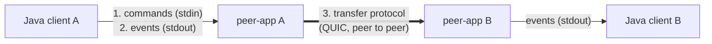
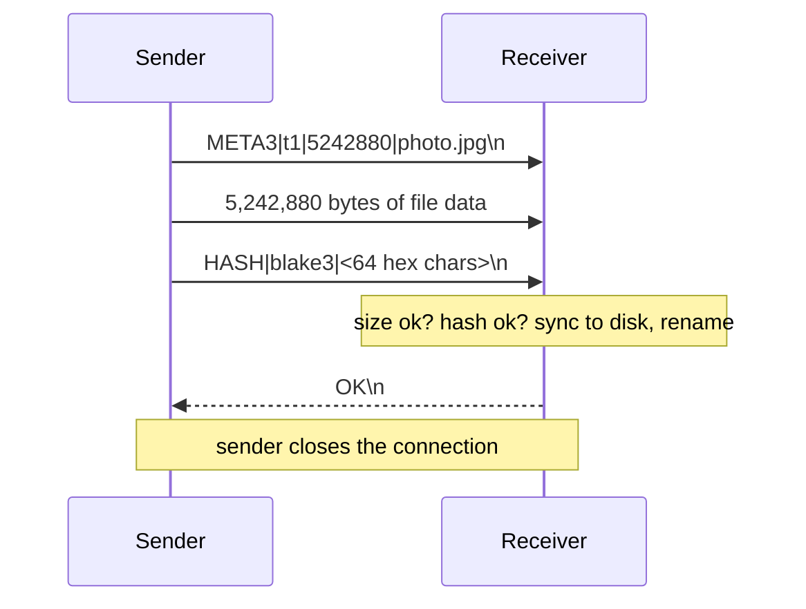
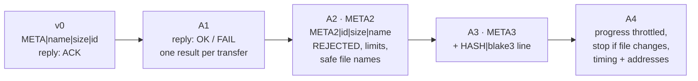

# peer-app Protocol

> How Aperture's peer-app talks — to the Java client, and to other peer-apps —
> and how it got this shape. Current version: **META3** (Phase A4).

## The big picture

peer-app is a small Rust program (built on Iroh) that moves files between
two computers. It never talks to the user directly. It speaks two "languages":

| Part | Between | How | Example |
|---|---|---|---|
| Commands | Java → peer-app | lines on stdin | `sendto t1 <id> <relay> /path/file` |
| Events | peer-app → Java | lines on stdout | `EVENT:FILE_RECEIVED:t1:…` |
| Transfer protocol | peer-app ↔ peer-app | bytes on a QUIC stream | `META3|t1|5242880|photo.jpg` … |

The signaling server never sees file data. It only helps two clients find
each other (endpoint ID + relay URL). The file goes peer to peer.

---

## Part 1: Commands (Java → peer-app)

| Command | Meaning |
|---|---|
| `sendto <transfer_id> <endpoint_id> <relay_url> <file_path>` | Send a file to that peer |
| `sendto <transfer_id> <endpoint_id> - <file_path>` | Same, without a relay hint (dial by ID only) |
| `quit` | Shut down |

- `transfer_id`: letters, digits, `-`, `_`, max 64 chars (Java uses UUIDs).
- `relay_url` is only a **hint** — Iroh's discovery finds the peer by its ID
  even if the URL is wrong (tested: bug 10).
- `file_path` may contain spaces (it is the last field).

## Part 2: Events (peer-app → Java)

Every line starts with `EVENT:`. Java reacts to the ones it knows and prints
or ignores the rest.

### At startup

| Event | Meaning |
|---|---|
| `EVENT:ENDPOINT_READY:<endpoint_id>` | My Iroh identity |
| `EVENT:RELAY_READY:<relay_url>` | My home relay |
| `EVENT:ENDPOINT_ADDRS:<ip:port,…>` | Direct addresses I know (local + public) — for debugging relay vs direct |
| `EVENT:CHUNK_SIZE:<bytes>` | Read/write chunk size in use |
| `EVENT:READY_FOR_COMMANDS:` | Ready for `sendto` |

### During a transfer

| Event | Side | Meaning |
|---|---|---|
| `EVENT:PROGRESS:sending\|<name>\|<pct>\|<bytes>\|<total>\|<id>` | sender | Progress (max ~100 lines per transfer) |
| `EVENT:PROGRESS:receiving\|…` | receiver | Same, receiving side |
| `EVENT:CONNECTION_PATH:<id>:<direct\|relay>` | both | Live path — at start and on every switch |
| `EVENT:FILE_HASH:<id>:blake3:<hex>` | both | Hash each side computed |

### Results — each transfer ends with exactly ONE result per side

| Event | Side | Meaning | Java does |
|---|---|---|---|
| `EVENT:FILE_RECEIVED:<id>:<saved_path>\|<bytes>` | receiver | Saved, hash OK | — |
| `EVENT:TRANSFER_PATH:<id>:<direct\|relay>` | receiver | Final path (only after success) | counts **one** success metric |
| `EVENT:TRANSFER_TIMING:<id>:data_ms=… sync_ms=…` | receiver | Where the time went | ignores |
| `EVENT:TRANSFER_FAILED:<id>:<reason>` | receiver | Receiver failed (incomplete, hash mismatch, disk…) | reports failure |
| `EVENT:FILE_SENT:<id>:<path>` | sender | Receiver confirmed OK | — |
| `EVENT:FILE_SEND_FAILED:<id>:<reason>` | sender | Receiver failed and **already reported it** | does not report again |
| `EVENT:TRANSFER_FAILED:<id>:sender: <reason>` | sender | Failure only the sender knows (can't connect, rejected, no reply) | reports failure |

### Other

| Event | Meaning |
|---|---|
| `EVENT:INCOMING_REJECTED:<reason>` | Someone connected but sent a bad header / handshake failed. No transfer ID yet |
| `EVENT:ERROR:<message>` | Bad command or startup problem (not tied to a transfer) |

**The golden rule (from A1):** every transfer is reported **once** —
success by the receiver, failure by whichever side knows about it.

---

## Part 3: Transfer protocol (peer-app ↔ peer-app)

One QUIC connection, ALPN `p2papp/file/0`, one bidirectional stream.

### Messages

| Message | Direction | Format | Limits |
|---|---|---|---|
| Header | S → R | `META3|<id>|<size>|<name>\n` | max 1 KB, whole line within 40 s |
| Data | S → R | exactly `<size>` raw bytes | stall > 40 s = fail |
| Hash | S → R | `HASH|blake3|<hex>\n` | max 100 bytes, within 10 s |
| Reply | R → S | `OK\n` · `FAIL|<reason>\n` · `REJECTED|<reason>\n` | sender waits max 60 s |

| Reply | Meaning | Sender prints |
|---|---|---|
| `OK` | File saved and verified | `FILE_SENT` |
| `FAIL|reason` | Receiver failed, already reported | `FILE_SEND_FAILED` |
| `REJECTED|reason` | Header refused — receiver has no valid ID to report with | `TRANSFER_FAILED … receiver rejected` |

### What the receiver checks

- Header starts with `META3|` — otherwise *"different header version"*.
- Valid transfer ID, valid size; name is **cleaned** (no `../`, no `| : ? *`, max 100 chars).
- Reads **exactly** `size` bytes — never more.
- Hash line matches its own BLAKE3 of what it wrote — otherwise *"hash mismatch"*.
- Nothing after the hash line.
- `flush` + `sync_all` before the file gets its final name.

### Files on the receiver

| File | When |
|---|---|
| `received_<id>.partial` | while receiving (created "new only" — two transfers never share it) |
| `received_<first 8 of id>_<name>` | after success (`_2`, `_3` … if the name exists — never overwrites) |
| — | partial deleted on any failure |

### Example failures

| What happened | Receiver | Sender |
|---|---|---|
| File shrinks while sending | `TRANSFER_FAILED:… read error` (stream reset) | `FILE_SEND_FAILED:… file changed while sending` |
| One byte corrupted | `TRANSFER_FAILED:… hash mismatch` | `FILE_SEND_FAILED:… hash mismatch` |
| Receiver offline | — | `TRANSFER_FAILED:… sender: timed out` |
| Old peer-app on one side | `INCOMING_REJECTED: different header version` | `TRANSFER_FAILED:… receiver rejected` |

---

## How it got this shape

Each version fixed something we **measured first** with
`tools/peer_bug_check.py` (evidence in `docs/problems/evidence/`).

| Version | Problem (bug #) | Change | Why this way |
|---|---|---|---|
| **v0** | — | `META|name|size|id`, raw data, receiver replies `ACK` | Simplest thing that works |
| **A1** | Sender said "sent" even when receiver failed (1); path reported after failure (2); one transfer counted twice (3); sender errors invisible to Java (4) | Receiver replies `OK` or `FAIL|reason`; only the receiver reports success; sender failures become `TRANSFER_FAILED` | The receiver is the only side that knows if the file is really saved. One reporter = no double counting |
| **A2** | Same name from two senders corrupted the file (5); no sync before rename (6); `|` in a name broke the header (8); unlimited header (12) | New header **META2** with the **name last**; per-transfer `.partial`; names cleaned; 1 KB header limit; `REJECTED` reply | Name last → `splitn(3)` keeps `|` inside the name. Version tag → mismatched builds fail clearly instead of silently |
| **A3** | No integrity check (7) | **META3** + `HASH|blake3|…` **after** the data | Hash while streaming → file read only once. BLAKE3 is fast and is what iroh-blobs uses |
| **A4** | 16,000 progress lines per 500 MB (11); file changing mid-send produced confusing errors | Progress max ~100 lines; sender sends exactly `size` bytes and stops if the file shrinks; `TRANSFER_TIMING`, `ENDPOINT_ADDRS` | Less noise for Java; clear reason; data to explain relay vs direct |

### Design rules that came out of this

1. **One result per transfer per side, reported once.**
2. **The receiver is the judge** of success — it holds the file.
3. **Never trust the other side**: limit sizes, clean names, verify the hash.
4. **Version the header** — mismatched builds must fail loudly.
5. **Measure before and after** every change.

## Compatibility

- Both peers must run the **same header version** (META3). An older peer
  gets `REJECTED: different header version`.
- After building, update **both** copies: `peer-binary/peer` (bot image) and
  `~/peer-app/target/release/peer` (admin client), or set `PEER_BINARY_PATH`.

## What comes next

- **Step 0 (mesh):** `CONNECTION_PATH` from `paths_stream()` so the path is
  known at the start of a transfer.
- **Phase B (iroh-blobs):** Part 3 is replaced by "share, then fetch": the
  sender shares a hash + ticket, the receiver fetches and verifies chunk by
  chunk, with resume. Parts 1 and 2 stay, with new commands (`share`, `fetch`).
  See `docs/future-plans/file-transfer-improvement-plan.md`.
