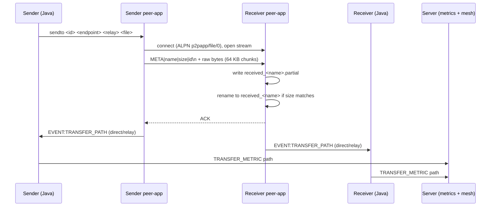

# File Transfer Bugs (found by code review)

Status: **Open.** Found by reading `peer-app/src/main.rs` and the Java event handling (`Client.java`, `MetricsSubscriber.java`). **Not yet reproduced** — each bug below lists how to confirm it before fixing.

Fix plan: [`docs/future-plans/file-transfer-improvement-plan.md`](../future-plans/file-transfer-improvement-plan.md)

---

## How a transfer works today

---

## Correctness bugs

### 1. Receiver sends `ACK` even when the transfer failed

- **Where:** `handle_incoming` — `ACK` is written whenever the connection is still alive, including after "stalled" or "incomplete".
- **Effect:** the sender treats every reply as success and prints `EVENT:FILE_SENT`.
- **Confirm:** start a large transfer, pause the receiver's network for 40+ s so it reports `stalled`, restore it; check whether the sender prints `FILE_SENT`.

### 2. Path reported after a failure

- **Where:** end of `handle_incoming` — `report_path_from_conn` runs after both success and failure.
- **Effect:** the Java client sends a failure metric and then a success metric (`TRANSFER_METRIC|direct`). The failed transfer is counted as direct/relay, and the mesh may flip from failed to complete.
- **Confirm:** cause a failed transfer; check Prometheus `chat_file_transfers_direct_total` / `relay_total` and the mesh.

### 3. Every successful transfer counted twice

- **Where:** both `send_file` and `handle_incoming` call `report_path_from_conn`; each side's Java client turns `TRANSFER_PATH` into a `TRANSFER_METRIC`; `MetricsSubscriber` increments the counter for each.
- **Effect:** direct/relay totals are about 2× the real number.
- **Confirm:** send one file; check the counter increases by 2.

### 4. Sender-side failures never reach the mesh

- **Where:** `send_file` errors are printed as `EVENT:ERROR:<id>:<error>`. `Client.java` only handles `EVENT:TRANSFER_FAILED`, so this line is just printed.
- **Effect:** if the receiver is unreachable, the transfer stays "in progress" on the mesh forever and no failure is counted.
- **Confirm:** send to a bot whose `peer-app` is stopped; watch the mesh.

### 5. Same filename from two senders → corrupted file

- **Where:** `handle_incoming` writes to `received_<name>.partial`; `File::create` truncates an existing file.
- **Effect:** with `!send all all`, several bots send `bot_small.txt` to the same receiver at once. Two tasks write the same partial file; the result can be garbage that still passes the size check.
- **Confirm:** run `!send all all medium` with 3+ bots; compare hashes of the received file with the original (`sha256sum`).

### 6. File not flushed before rename

- **Where:** `handle_incoming` renames `.partial` and prints `FILE_RECEIVED` without `flush()` / `sync_all()`. `tokio::fs::File` completes writes in the background.
- **Effect:** the file reported as complete may briefly be missing its last chunk; the "atomic write" guarantee is weaker than documented.

### 7. No end-to-end integrity check

- **Where:** the protocol only compares byte counts; no hash is sent or checked.
- **Effect:** a wrong file of the right size is accepted. The README's "hash-verified" came from manual `sha256sum` checks, not the protocol.

---

## Robustness and security issues

| # | Issue | Effect |
|---|---|---|
| 8 | Filename from the sender is trusted (`received_{filename}`) | `/`, `..`, `\|` or newlines can write outside the folder or break header parsing |
| 9 | Any peer that knows the endpoint ID can push files | No check that the sender was introduced by the server |
| 10 | Sender dials using only the relay URL stored in Redis | A stale relay URL can make the connection fail (see `relay-fallback.md`) |
| 11 | One progress line per 64 KB chunk | ~16,000 lines per side for a 1 GB file; wasted CPU in `peer-app` and Java |
| 12 | Header read byte by byte with no size limit | A bad peer can send an endless header |
| 13 | No resume | Any failure discards everything received |

---

## Related finding: the "authentication failed" errors

The accept loop prints `EVENT:ERROR:{e}` **without a transfer ID** when an incoming connection fails during the handshake (`incoming.await?`). The "authentication failed" lines therefore come from **incoming connection attempts that fail before any transfer starts**, not from transfers. See `peer-app-authentication-failed.md`.

---

## Priority

| Priority | Bugs | Why |
|---|---|---|
| High | 2, 3, 4 | Metrics and mesh are wrong; every direct-vs-relay measurement depends on them |
| High | 5, 6, 7 | Received files can be corrupt or incomplete |
| Medium | 1, 8, 10, 11 | Wrong sender status, safety, reliability, performance |
| Later | 9, 12, 13 | Solved naturally by moving to `iroh-blobs` |
