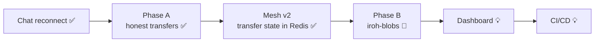

# Aperture Roadmap

> One place for all phases, in order. Details live in the linked docs.
> Update the status here whenever a step finishes.

**Legend:** ✅ done · 🔄 in progress · ⏳ next · 💡 planned · 💤 parked

## Overview

| # | Phase | Goal | Status | Details |
|---|---|---|---|---|
| 1 | Chat reconnect | Sessions survive drops; newest login wins; no zombies | ✅ | `docs/fixes/chat-reconnect/` |
| 2 | Phase A | File transfer is correct and honest about failures | ✅ PR #2 | `docs/future-plans/File-transfer-improvement-plan.md` |
| 3 | Mesh v2 | Transfer state in Redis, one event type per transfer ID, 1 send + 1 receive per client | ✅ PR #2 (scale tests in B4) | `docs/fixes/mesh-v2.md` |
| 4 | **Phase B** | iroh-blobs: verified chunks, resume, receiver fetches | 🔄 B1 done, **B0 next** | `File-transfer-improvement-plan.md` → Phase B |
| 5 | Dashboard | Online users, transfer stats, mesh views | 💡 | `docs/future-plans/Aperture-Dashboard.md` |
| 6 | CI/CD | Build + test on every push | 💡 | `docs/future-plans/CI-CD_plan.md` |

**Focus rule:** after Phase B, only the Dashboard and CI/CD. Everything else is parked (see the end of this file).

---

## 1. Chat reconnect ✅

- [x] Steps 1–5: session IDs, PING/PONG, timeouts, supersede (same pod + cross pod), Redis presence with TTL
- [x] Process ownership: SUPERSEDED → client exits, peer-app stopped

## 2. Phase A: honest file transfer ✅

Evidence: `docs/problems/evidence/` · Bugs: `docs/problems/File-transfer-bugs.md` · Protocol: `docs/peer-app-protocol.md`

- [x] **A1** one result per transfer; receiver replies OK/FAIL; sender errors visible (bugs 1–4)
- [x] **A2** safe saving: per-transfer files, sync before rename, clean names, header limit (5, 6, 8, 12)
- [x] **A3** BLAKE3 hash check (7)
- [x] **A4** progress throttled (11), stop if file changes, timing + addresses; bug 10 not a bug
- [x] Deployed (server + bots); admin ↔ bot (relay) and admin ↔ admin2 (direct) tested, hashes match
- [x] Live path on the mesh (done as part of Mesh v2)
- [x] Merged `file-transfer-phase-a` → `main` (PR #2)

## 3. Mesh v2: transfer state in Redis ✅

Details: `docs/fixes/mesh-v2.md`

- [x] One `TRANSFER_EVENT|id=…|state=…|path=…|pct=…|reason=…` message, always with the transfer ID
- [x] Per-transfer state in Redis (atomic Lua), `mesh:changed` pub/sub between pods
- [x] Updates to the browser batched every 250 ms; full re-read every 10 s; finished lines fade after ~10 s
- [x] Grafana counts each transfer once (only when it becomes final)
- [x] Client limits: at most 1 sending + 1 receiving; extras wait in a queue
- [x] S6: old v1 mesh path removed
- [ ] Pending tests → done in **B4**: two files to the same peer, admin → bot, delete bot mid-transfer, 3 server pods, 20 bots `!send all all`, delete a server pod

## 4. Phase B: iroh-blobs 🔄

Details: `docs/future-plans/File-transfer-improvement-plan.md` → Phase B

- [x] **B1** spike: share, fetch, resume, path, allow-list, speed → `docs/Experiments/iroh-blobs-phase-b1-spike.md`
- [ ] **B0** persistent identity (key file in a data folder) + `Router` serving META3 — branch `phase-b0-identity`
- [ ] **B2** peer-app `share` / `allow` / `fetch` + saved offers and pending fetches; clean shutdown on SIGTERM and Ctrl+C
- [ ] **B3** Java: hash in the offer, allow on `PEER_INFO`, receiver fetches and retries; mesh "waiting for sender"
- [ ] **B4** tests + bots as StatefulSet with volumes; kill/restart cases; 20-bot scale test (also closes the Mesh v2 tests)
- [ ] **B5** remove META3

## 5. Dashboard 💡

Details: `docs/future-plans/Aperture-Dashboard.md`

- [ ] Online users, transfer stats
- [ ] Optional view: 3D mesh (layers + data-plane focus) → `docs/future-plans/Mesh-3D-view-plan.md`
- [ ] Optional view: Kademlia ID space (overlay vs underlay, simulated) → `docs/future-plans/Kademlia-DHT-id-space-mesh.md`

## 6. CI/CD 💡

Details: `docs/future-plans/CI-CD_plan.md`

- [ ] Build + test on push

---

## Parked 💤

Not touched until Phase B, Dashboard and CI/CD are done.

| Item | Details |
|---|---|
| Phase C: retry with backoff, limits, richer metrics, iroh-gossip experiment | `File-transfer-improvement-plan.md` → Phase C |
| Phase D: iroh-docs shared incident log | `File-transfer-improvement-plan.md` → Phase D |
| Swarm distribution | `docs/future-plans/swarm-distribution-plan.md` |
| Own DHT (Kademlia) | `docs/future-plans/dht-future-plan.md` |
| Self-hosted relay | `docs/future-plans/self-hosted-relay-plan.md` |
| Chat session resumption | `docs/future-plans/Chat-reconnect/Chat-Session-resumption-plan.md` |
| Laptop ↔ EC2 peer test (real hole punching) | — |
| WSL mirrored networking / `hostNetwork` experiment | `docs/learning-notes/Kademlia-DHT_routing_algorithm/finding-vs-reaching-peers.md` |
| Elastic IP for EC2 | — |

Done side track: why bots use the relay (same public IP, no hairpin NAT) → explained in `finding-vs-reaching-peers.md`.

---

## How to use this file

- Start each session here: pick the first unchecked item.
- New idea → add it to **Parked** with details in its own doc (unless it belongs to the current phase).
- Finished → tick it, update the status icon, link the evidence.
